## 一，面试题

- TreeMap和HashMap的区别. 
- Arraylist和linkedlist的区别；
- ==和equals
- 深浅拷贝
-  ==重要==hashmap底层原理
- ==重要==cucrrentHashMap 底层
- sybchronized的实现原理
- 线程同步的方式
- 了解多线程吗?
- volatile的作用，什么是可见性和有序性


## 2.1,TreeMap和HashMap的区别

> 1. 底层实现机构
> 2. 查询，插入，删除 时间复杂度
> 3. 是否线程安全
> 4. 排序
> 5. 使用场景
>
> 
>
> treeMap 红黑树的实现（key 不能重复）

### **1. 底层数据结构**

- **HashMap**
  基于 **哈希表**（数组 + 链表/红黑树）实现。
  - Java 8 之前使用数组+链表，链表过长时退化为线性查找（时间复杂度 `O(n)`）。
  - Java 8 之后，当链表长度超过阈值（默认 8）时，链表会转换为红黑树（时间复杂度优化为 `O(log n)`）。
  - 依赖键的 `hashCode()` 和 `equals()` 方法进行数据存储和查找。
- **TreeMap**
  基于 **红黑树**（一种自平衡的二叉搜索树）实现。
  - 所有操作（插入、删除、查找）的时间复杂度为 `O(log n)`。
  - 依赖键的 **自然顺序** 或自定义的 `Comparator` 来维护键的有序性。

------

### **2. 有序性**

- **HashMap**
  - **不保证顺序**：插入和遍历的顺序可能不一致。
  - 扩容时（如哈希表大小变化），原有顺序可能被打乱。
  - 若需要有序性，可以使用 `LinkedHashMap`（保持插入顺序）。
- **TreeMap**
  - **保证键的有序性**：默认按键的 **自然顺序**（如字典序、数值大小）排序，或通过自定义 `Comparator` 指定顺序。
  - 遍历时按排序后的顺序输出键值对。

------

### **3. 性能对比**

|   **操作**    | **HashMap** |      **TreeMap**      |
| :-----------: | :---------: | :-------------------: |
| **插入/删除** | 平均 `O(1)` |      `O(log n)`       |
|   **查找**    | 平均 `O(1)` |      `O(log n)`       |
| **范围查询**  |   不支持    | 支持（如 `subMap()`） |

- **HashMap** 在哈希冲突较少时性能更高，适合高频的插入、删除和随机查找。
- **TreeMap** 适合需要有序遍历或范围查询的场景（如找最小/最大键、区间查询）。

------

### **4. 键（Key）的限制**

- **HashMap**
  - 允许键为 `null`。
  - 依赖 `hashCode()` 和 `equals()` 方法，需确保键的哈希值稳定且唯一。
- **TreeMap**
  - 键 **不能为 `null`**（若使用自然排序，`null` 无法比较）。
  - 若自定义 `Comparator` 允许 `null`，则可以支持，但需显式处理。
  - 键必须实现 `Comparable` 接口，或构造时提供 `Comparator`。

------

### **5. 内存占用**

- **HashMap**
  - 哈希表的负载因子（默认 0.75）影响内存使用。
  - 扩容时需重新哈希（耗时），但内存占用相对较低。
- **TreeMap**
  - 红黑树的每个节点需维护父节点、子节点和颜色信息，内存占用较高。

------

### **6. 典型应用场景**

- **HashMap**
  - 高频的插入、删除和随机查找。
  - 不关心键的顺序。
  - 例如：缓存、快速索引。
- **TreeMap**
  - 需要有序遍历键值对。
  - 需要范围查询（如找某个区间内的键）。
  - 例如：按时间戳排序的事件、字典序处理。


## 2.2,Arraylist和linkedlist的区别

> 共同点，相同点，底层实现结构，使用场景，不同场景下的推荐使用

`ArrayList` 和 `LinkedList` 是 Java 中 `List` 接口的两种不同实现，它们在底层数据结构、性能特性及适用场景上有显著区别。以下是两者的核心差异总结：

------

### **1. 底层数据结构**

|   **特性**   |           **ArrayList**           |             **LinkedList**             |
| :----------: | :-------------------------------: | :------------------------------------: |
| **数据结构** | 基于 **动态数组**（连续内存空间） |  基于 **双向链表**（非连续内存节点）   |
| **内存占用** |       仅存储元素，内存紧凑        | 每个节点额外存储前后指针，内存开销更大 |
| **扩容机制** | 初始容量默认10，按需扩容（1.5倍） |      无扩容机制，按需动态添加节点      |

------

### **2. 性能对比**

#### **(1) 随机访问（按索引操作）**

|     **操作**     |   **ArrayList**    |    **LinkedList**    |
| :--------------: | :----------------: | :------------------: |
| `get(int index)` | `O(1)`（直接定位） | `O(n)`（需遍历链表） |
| `set(int index)` |       `O(1)`       |        `O(n)`        |

**结论**：
ArrayList 的随机访问性能远优于 LinkedList。

------

#### **(2) 插入与删除**

|   **操作**   |        **ArrayList**        |        **LinkedList**        |
| :----------: | :-------------------------: | :--------------------------: |
| **尾部插入** | 平均 `O(1)`（可能触发扩容） | `O(1)`（直接修改尾节点指针） |
| **头部插入** |  `O(n)`（需移动所有元素）   | `O(1)`（直接修改头节点指针） |
| **中间插入** |  `O(n)`（需移动后续元素）   |  `O(n)`（需遍历到指定位置）  |
| **删除元素** |  `O(n)`（需移动后续元素）   |  `O(n)`（需遍历到指定位置）  |

**结论**：

- **尾部操作**：两者性能接近（ArrayList 可能因扩容略慢）。
- **头部/中间操作**：LinkedList 理论时间复杂度为 `O(n)`，但实际性能可能优于 ArrayList（无需移动元素）。
- **实际场景**：ArrayList 的连续内存特性对 CPU 缓存更友好，高频插入/删除时可能表现更好。

------

#### **(3) 遍历性能**

|  **遍历方式**  |   **ArrayList**    |    **LinkedList**    |
| :------------: | :----------------: | :------------------: |
| `for` 循环索引 | 快（直接内存访问） | 极慢（需逐节点遍历） |
| **迭代器遍历** |         快         |  快（直接指针跳转）  |

**结论**：

- LinkedList 必须使用迭代器遍历，避免索引遍历。
- ArrayList 的索引遍历和迭代器遍历性能接近。

------

### **3. 内存占用**

|    **特性**    |           **ArrayList**            |        **LinkedList**        |
| :------------: | :--------------------------------: | :--------------------------: |
| **内存连续性** |         连续内存，缓存友好         |    非连续内存，缓存不友好    |
|  **额外开销**  | 仅存储元素（扩容时可能有冗余空间） | 每个节点需存储前驱和后继指针 |

**示例**：

- 存储 1000 个Integer

  对象：

  - ArrayList：约占用 `1000 * 4字节`（假设压缩指针） + 数组头部开销。
  - LinkedList：约占用 `1000 * (4 * 3字节)`（节点含数据、前驱、后继指针） + 链表头部开销。

------

### **4. 线程安全性**

- **两者均非线程安全**：多线程环境下需自行同步（如使用 `Collections.synchronizedList`）。
- 替代方案：
  - 线程安全的动态数组：`CopyOnWriteArrayList`。
  - 线程安全的链表：无直接实现，需手动加锁。

------

### **5. 适用场景**

|        **场景**        | **推荐使用** |                           **原因**                           |
| :--------------------: | :----------: | :----------------------------------------------------------: |
|    **高频随机访问**    |  ArrayList   |            直接通过索引访问，时间复杂度 `O(1)`。             |
|   **尾部插入/删除**    |  ArrayList   |                 性能接近 `O(1)`，内存紧凑。                  |
| **头部/中间插入/删除** |  LinkedList  |         理论时间复杂度更低（实际需结合数据量测试）。         |
|    **内存敏感场景**    |  ArrayList   |               无额外指针开销，内存利用率更高。               |
|    **实现队列/栈**     |  LinkedList  | 直接支持 `Deque` 接口，提供 `addFirst()`, `removeLast()` 等方法。 |

------

### **总结**

|   **维度**   |         **ArrayList**         |               **LinkedList**               |
| :----------: | :---------------------------: | :----------------------------------------: |
| **核心优势** | 随机访问、内存紧凑、遍历高效  |      头部/中间插入删除、动态扩展灵活       |
| **核心劣势** | 插入/删除需移动元素、扩容开销 |           内存占用高、随机访问慢           |
| **选择建议** | 大多数场景优先选择 ArrayList  | 需要频繁在头部/中间操作或实现队列/栈时选择 |


## 2.3,==和equals（即基础又坑的）

> 直接地址对比， 地址内的值对比

在 Java 中，`==` 和 `equals()` 都用于比较操作，但它们的底层逻辑和适用场景有本质区别。以下是两者的核心差异和用法总结：

------

### **1. `==` 运算符**

#### **(1) 基本数据类型比较**

`==` 直接比较两个变量的 **值是否相等**（如 `int`、`char`、`boolean` 等）：

```java
int a = 5;
int b = 5;
System.out.println(a == b); // true（值相等）

char c1 = 'A';
char c2 = 'B';
System.out.println(c1 == c2); // false（值不等）
```

#### **(2) 对象引用比较**

`==` 比较两个对象的 **内存地址是否相同**（即是否指向同一个对象）：

```java
String s1 = new String("hello");
String s2 = new String("hello");
String s3 = s1;

System.out.println(s1 == s2); // false（不同对象）
System.out.println(s1 == s3); // true（同一对象）
```

------

### **2. `equals()` 方法**

#### **(1) 默认行为（未重写时）**

`Object` 类中的 `equals()` 默认使用 `==` 比较内存地址：

```java
public boolean equals(Object obj) {
    return (this == obj);
}
```

#### **(2) 重写后的行为**

大多数 Java 核心类（如 `String`、`Integer`、`Date`）已重写 `equals()`，改为比较 **对象内容是否逻辑相等**：

```java
String s1 = new String("hello");
String s2 = new String("hello");
System.out.println(s1.equals(s2)); // true（内容相同）

Integer a = 100;
Integer b = 100;
System.out.println(a.equals(b)); // true（值相等）
```

#### **(3) 自定义类的 `equals()`**

若需自定义类的对象按内容比较，需手动重写 `equals()`：

```java
class Person {
    String name;
    int age;

    @Override
    public boolean equals(Object obj) {
        if (this == obj) return true;
        if (obj == null || getClass() != obj.getClass()) return false;
        Person person = (Person) obj;
        return age == person.age && Objects.equals(name, person.name);
    }
}
```

------

### **3. 关键区别总结**

|   **维度**   |             **`==`**             |       **`equals()`**       |
| :----------: | :------------------------------: | :------------------------: |
| **比较对象** | 基本类型：值；对象类型：内存地址 |  对象内容（需重写后生效）  |
| **重写影响** |             无法重写             |      可自定义比较逻辑      |
|   **性能**   |         直接比较，速度快         | 可能涉及复杂逻辑，速度较慢 |
| **典型应用** |      判断对象是否为同一实例      |  判断对象内容是否逻辑相等  |

------

### **4. 常见误区与注意事项**

#### **(1) 字符串比较陷阱**

```java
String s1 = "hello";          // 字符串常量池中的对象
String s2 = new String("hello"); // 堆中的新对象

System.out.println(s1 == s2);           // false（内存地址不同）
System.out.println(s1.equals(s2));      // true（内容相同）
```

#### **(2) 包装类比较陷阱**

```java
Integer a = 127;
Integer b = 127;
System.out.println(a == b);      // true（-128~127 的 Integer 对象被缓存）

Integer c = 128;
Integer d = 128;
System.out.println(c == d);      // false（超出缓存范围，新建对象）
System.out.println(c.equals(d)); // true（值相等）
```

#### **(3) 重写 `equals()` 必须重写 `hashCode()`**

若两个对象 `equals()` 返回 `true`，它们的 `hashCode()` 必须相同：

```java
@Override
public int hashCode() {
    return Objects.hash(name, age); // 与 equals() 逻辑一致
}
```

------

### **5. 如何选择？**

- **基本数据类型**：使用 `==` 比较值。
- 对象引用：
  - 若需判断是否为同一对象 → `==`
  - 若需判断内容是否相等 → `equals()`（确保类已正确重写）
- **自定义类**：按需重写 `equals()` 和 `hashCode()`。

------

### **总结**

- `==` 是运算符，直接比较值或内存地址。
- `equals()` 是方法，默认比较地址，重写后可按需比较内容。
- 始终对对象使用 `equals()` 进行逻辑相等性判断（除非明确需要比较内存地址）。

## 2.4,深浅拷贝

在 Java 中，对象的拷贝分为 **浅拷贝（Shallow Copy）** 和 **深拷贝（Deep Copy）**，两者的核心区别在于对对象内部引用类型字段的处理方式。以下是详细对比和实现方法：

------

### **1. 浅拷贝（Shallow Copy）**

#### **定义**

- 仅复制对象本身（基本类型字段直接复制值，引用类型字段复制内存地址）。
- 原对象和拷贝对象 **共享内部引用对象**，修改其中一个会影响另一个。

#### **实现方式**

- 默认的clone()

  方法（需实现Cloneable接口）：

  ```java
  class Person implements Cloneable {
      String name;
      Address address; // 引用类型字段
  
      @Override
      public Person clone() throws CloneNotSupportedException {
          return (Person) super.clone(); // 默认浅拷贝
      }
  }
  ```

#### **示例**

```java
Person original = new Person("Alice", new Address("CityA"));
Person copy = original.clone();

// 修改拷贝对象的引用类型字段
copy.address.city = "CityB";

System.out.println(original.address.city); // 输出 "CityB"（原对象被影响）
```

------

### **2. 深拷贝（Deep Copy）**

#### **定义**

- 递归复制对象及其所有引用对象，生成完全独立的副本。
- 原对象和拷贝对象 **不共享任何引用对象**，修改互不影响。

#### **实现方式**

##### **(1) 手动重写 `clone()` 方法**

为每个引用类型字段调用其 `clone()` 方法：

```java
class Address implements Cloneable {
    String city;

    @Override
    public Address clone() throws CloneNotSupportedException {
        return (Address) super.clone();
    }
}

class Person implements Cloneable {
    String name;
    Address address;

    @Override
    public Person clone() throws CloneNotSupportedException {
        Person copy = (Person) super.clone();
        copy.address = this.address.clone(); // 深拷贝引用对象
        return copy;
    }
}
```

##### **(2) 序列化与反序列化**

通过对象流实现深拷贝（需所有对象实现 `Serializable` 接口）：

```java
import java.io.*;

public class DeepCopyUtil {
    public static <T> T deepCopy(T obj) throws IOException, ClassNotFoundException {
        ByteArrayOutputStream bos = new ByteArrayOutputStream();
        ObjectOutputStream oos = new ObjectOutputStream(bos);
        oos.writeObject(obj);

        ByteArrayInputStream bis = new ByteArrayInputStream(bos.toByteArray());
        ObjectInputStream ois = new ObjectInputStream(bis);
        return (T) ois.readObject();
    }
}

// 使用示例
Person original = new Person("Alice", new Address("CityA"));
Person copy = DeepCopyUtil.deepCopy(original);
```

##### **(3) 第三方库**

使用 Apache Commons Lang 的 `SerializationUtils` 或 Gson 等工具：

```java
// Apache Commons Lang
Person copy = SerializationUtils.clone(original);

// Gson
Gson gson = new Gson();
Person copy = gson.fromJson(gson.toJson(original), Person.class);
```

------

### **3. 对比总结**

|     **特性**     |             **浅拷贝**             |             **深拷贝**             |
| :--------------: | :--------------------------------: | :--------------------------------: |
| **引用类型字段** |    共享同一对象（内存地址相同）    |     创建新对象（内存地址不同）     |
|     **性能**     |         高效（仅复制一层）         |    较低（递归复制所有引用对象）    |
|  **实现复杂度**  |       简单（默认 `clone()`）       |   复杂（需手动处理所有引用对象）   |
|   **适用场景**   | 引用对象不可变或无需隔离修改的场景 | 引用对象可变且需完全隔离修改的场景 |

------

### **4. 注意事项**

1. **`Cloneable` 接口**：
   - 仅是一个标记接口，无方法定义。
   - 不实现 `Cloneable` 时调用 `clone()` 会抛出 `CloneNotSupportedException`。
2. **深拷贝的递归性**：
   - 需确保所有嵌套引用对象都支持拷贝（如实现 `clone()` 或可序列化）。
3. **不可变对象**：
   - 若引用对象是不可变的（如 `String`、`Integer`），浅拷贝是安全的。
4. **性能权衡**：
   - 深拷贝可能因递归复制和序列化导致性能下降，需根据场景选择。

------

### **5. 代码验证深拷贝**

```java
Person original = new Person("Alice", new Address("CityA"));
Person copy = original.clone();

// 修改拷贝对象的引用类型字段
copy.address.city = "CityB";

System.out.println(original.address.city); // 输出 "CityA"（原对象不受影响）
```

------

### **总结**

- **浅拷贝**：适用于引用对象不可变或无需隔离的场景，性能高。
- **深拷贝**：适用于引用对象可变且需完全隔离的场景，实现复杂但安全。
- 根据需求选择实现方式（手动 `clone()`、序列化、第三方库）。


## 2.5,hashmap底层

> 1. 数据结构：
> 2. hash 值的计算
> 3. index 寻找的计算
> 4. put 方法，如果hash 碰撞，无hash碰撞
> 5. 扩容 规则
> 6. 链表树化规则
> 7. 线程安全否

### HashMap 详解

#### 1. **数据结构**

- **Java 8 之前**：数组 + 链表。每个数组元素（桶）存储链表的头节点，用于解决哈希冲突。

- Java 8 及之后

  ：数组 + 链表/红黑树。当链表长度超过阈值（默认 8）且数组长度 ≥ 64 时，链表转换为红黑树；当树节点数 ≤ 6 时，退化为链表。

  - **Node**：普通链表节点，包含键、值、哈希值和下一节点的指针。
  - **TreeNode**：红黑树节点，继承自 Node，添加了树结构的父、左、右指针及颜色标记。

#### 2. **Hash 值计算**

- 扰动函数：对键的原始hashCode()进行二次处理，减少碰撞。

  ```java
  static final int hash(Object key) {
      int h;
      return (key == null) ? 0 : (h = key.hashCode()) ^ (h >>> 16);
  }
  ```

  - **作用**：将高 16 位与低 16 位异或，使高位信息参与后续索引计算，避免低位相同导致的冲突。

#### 3. **Index 计算**

- 公式：index = hash & (n - 1)（n为数组长度，且为 2 的幂）。
  - **原理**：当 `n` 是 2 的幂时，`n-1` 的二进制全为 1（如 `16 → 0b1111`），按位与操作等效于取模（`hash % n`），但效率更高。

#### 4. **put 方法**

- **无哈希碰撞**：直接插入新 Node 到数组对应位置。
- 哈希碰撞：
  - 链表处理：
    1. 遍历链表，若存在相同键（`equals` 为 true），更新值。
    2. 若无相同键，将新 Node 插入链表末尾（Java 8 改为尾插法，避免循环链表问题）。
  - **树处理**：按红黑树规则插入节点。
  - **插入后检查**：若链表长度 ≥ 8，触发树化检查（需数组长度 ≥ 64）。

#### 5. **扩容规则**

- **触发条件**：元素数量 > 容量 × 负载因子（默认 0.75）。
- 扩容过程：
  1. 新容量 = 旧容量 × 2，新阈值 = 新容量 × 负载因子。
  2. Rehash：遍历旧数组，重新计算每个元素的位置：
     - 新位置 = 原位置 或 原位置 + 旧容量（取决于哈希值高位是否为 1）。
     - 例如，旧容量 16（`0b10000`），元素哈希值为 `0b...1xxxx`，则新索引为原索引 + 16。
- **优化**：无需重新计算哈希值，仅需判断高位决定偏移。

#### 6. **链表树化规则**

- 树化条件：
  1. 链表长度 ≥ 8（`TREEIFY_THRESHOLD`）。
  2. 数组长度 ≥ 64（`MIN_TREEIFY_CAPACITY`），否则优先扩容。
- **退化条件**：树节点数 ≤ 6（`UNTREEIFY_THRESHOLD`），退化为链表。
- **目的**：在极端哈希冲突下，将查询时间复杂度从 O(n) 优化为 O(log n)。

------

### 关键点总结

|     问题     |                  核心机制                  |
| :----------: | :----------------------------------------: |
|   数据结构   | 数组 + 链表/红黑树（Java 8+ 优化冲突处理） |
| Hash 值计算  |       高 16 位异或低 16 位，减少碰撞       |
|  Index 计算  |      `hash & (n-1)`（位运算替代取模）      |
|   put 方法   |   尾插法插入链表，树化检查，相同键替换值   |
|   扩容规则   |  负载因子 0.75，容量翻倍，高位决定新位置   |
| 链表树化规则 |    长度 ≥8 且数组 ≥64 时树化，≤6 时退化    |

通过上述机制，HashMap 在大多数场景下实现了高效的增删改查操作（平均 O(1)），同时通过树化策略应对极端哈希冲突。


HashMap 在扩容时**无需重新计算哈希值**，而是通过**判断哈希值的高位是否为 1** 来确定新索引的位置。这一设计基于以下原理和优化逻辑：

------

### **1. 核心原理：哈希值与容量为 2 的幂次**

- **容量特性**：HashMap 的容量始终是 **2 的幂次**（如 16 → 32 → 64），因此 `n-1` 的二进制形式为全 1（例如 `16-1=15 → 0b1111`）。
- **索引计算**：元素的位置由 `hash & (n-1)` 决定，本质是取哈希值的低若干位（如容量 16 时取低 4 位）。

------

### **2. 扩容时的索引变化**

当容量从 `n` 扩容到 `2n` 时：

- **新容量**：`2n`，对应的 `n_new-1 = 2n-1`，二进制比原来多一位 1（例如 `32-1=31 → 0b11111`）。

- 索引规则：新索引由哈希值的

  新增高位

  决定：

  - **若新增高位为 0**：索引不变（`原位置`）。
  - **若新增高位为 1**：索引 = `原位置 + 原容量`（即 `原位置 + n`）。

#### **示例**：

- 原容量 `n=16`，索引计算取哈希值的低 4 位（`hash & 0b1111`）。
- 扩容后容量2n=32，索引计算取哈希值的低 5 位（hash & 0b11111）。
  - 若哈希值的第 5 位（从右往左数）为 0：新索引 = 原索引（低 4 位）。
  - 若哈希值的第 5 位为 1：新索引 = 原索引 + 16（低 4 位 + 16）。

------

### **3. 为什么无需重新计算哈希值？**

- **哈希值已包含高位信息**：
  HashMap 在计算哈希值时，通过**扰动函数**（如 `hash = key.hashCode() ^ (h >>> 16)`）将原始哈希码的高位信息混合到低位中。因此，哈希值本身已包含足够的高位信息，无需重新计算。
- **直接判断高位**：
  扩容时只需检查哈希值中**对应新增容量的高位是否为 1**（例如容量从 16 到 32 时，检查第 5 位），即可确定新索引位置。

------

### **4. 具体实现（以 Java 8 为例）**

在扩容迁移数据时，HashMap 通过以下代码确定新索引：

```java
// 原容量为 oldCap
if ((e.hash & oldCap) == 0) {
    // 新索引 = 原索引
} else {
    // 新索引 = 原索引 + 原容量
}
```

- `e.hash & oldCap`：判断哈希值的对应高位是否为 1。
  - 例如，原容量 `oldCap=16`（二进制 `0b10000`），`e.hash & 16` 的结果为 0 或 16，直接决定偏移量。

------

### **5. 优势**

1. **性能优化**：
   避免重新计算哈希值，减少 CPU 计算开销。
2. **效率提升**：
   位运算（`&`）的效率远高于重新计算哈希值和取模操作。
3. **兼容性**：
   依赖哈希值的扰动函数设计，确保高位信息已混合到低位中。

------

### **总结**

|      步骤      |           操作           |                目的                 |
| :------------: | :----------------------: | :---------------------------------: |
|   哈希值计算   |    扰动函数混合高低位    |        使哈希值包含高位信息         |
| 扩容时索引计算 | 判断哈希值的高位是否为 1 | 确定新索引（原位置或原位置+原容量） |
|    性能优化    |    避免重新计算哈希值    |            提升扩容效率             |

通过这种设计，HashMap 在扩容时既能保持高效的索引分配，又无需重复计算哈希值，完美平衡了性能与哈希分布的均匀性。


## 2.6,cucrrentHashMap 底层

> 通过 **CAS 无锁化操作**、**细粒度锁** 和 **多线程协同扩容**，ConcurrentHashMap 在保证线程安全的同时，实现了接近 HashMap 的性能，是高并发场景下的首选 Map 实现

### **ConcurrentHashMap 中的桶（节点）类型**

在 **Java 8+** 的 `ConcurrentHashMap` 中，桶（即哈希表中的每个槽位）可能包含以下类型的节点，每种类型对应不同的场景和功能：

------

#### **1. 普通链表节点（Node）**

- **作用**：存储键值对，构成链表结构。
- 特征：
  - 包含 `key`, `value`, `hash`, `next` 字段。
  - 哈希值为正数（通过 `spread()` 方法计算）。
- **场景**：哈希冲突时，以链表形式存储多个键值对。

------

#### **2. 红黑树节点（TreeNode）**

- **作用**：当链表长度超过阈值（默认 8）且数组长度 ≥64 时，链表转换为红黑树，提升查询效率。
- 特征：
  - 继承自 `Node`，额外包含父节点、左子节点、右子节点和颜色标记。
  - 哈希值为负数（`-2`，表示树根）。
- **场景**：高哈希冲突时，替代链表存储键值对。

------

#### **3. 转移节点（ForwardingNode）**

- **作用**：标记当前桶已迁移完成，协助多线程扩容。
- 特征：
  - 哈希值为 `-1`（特殊标记）。
  - 包含指向新数组的引用 `nextTable`。
- **场景**：扩容过程中，旧数组的某个桶迁移完成后，用 `ForwardingNode` 占位。其他线程访问时，会协助迁移或跳转到新数组。

------

#### **4. 保留节点（ReservationNode）**

- **作用**：占位或临时锁定桶，用于某些原子操作（如 `computeIfAbsent`）。
- 特征：
  - 哈希值为 `-3`（特殊标记）。
  - 不存储实际键值对。
- **场景**：在计算型操作（如 `compute`）中，临时锁定桶以防止并发修改。

------

#### **5. 空节点（null）**

- **作用**：表示当前桶未存储任何数据。
- **场景**：初始化时或哈希未冲突时，桶为空。

------

### **不同类型节点的协作流程**

1. **插入数据**：
   - 若桶为空（`null`），直接插入 `Node`。
   - 若桶为 `ForwardingNode`，协助扩容后再插入。
   - 若桶为 `ReservationNode`，等待计算完成后再操作。
2. **扩容迁移**：
   - 迁移完成后，旧桶替换为 `ForwardingNode`，指向新数组。
3. **并发访问**：
   - 读操作直接访问 `Node` 或 `TreeNode`（无锁）。
   - 写操作对桶头节点加 `synchronized` 锁。


## 2.7,Synchronized的实现原理--（最装x）

在 Java 中，`synchronized` 是实现线程同步的核心机制，其底层通过 **对象监视器（Monitor）** 和 **锁升级机制** 实现。以下是 `synchronized` 的实现原理详解：

------

### **1. 基本作用**

`synchronized` 用于在多线程环境下保证 **原子性**、**可见性** 和 **有序性**，具体表现为：

- **修饰代码块**：锁定指定对象。
- **修饰实例方法**：锁定当前实例对象（`this`）。
- **修饰静态方法**：锁定当前类的 `Class` 对象。

------

### **2. 底层实现：对象头与 Monitor**

#### **(1) 对象头（Object Header）**

每个 Java 对象在内存中分为三部分：

- **Mark Word**：存储对象的哈希码、锁状态、GC 分代年龄等。
- **Klass Pointer**：指向对象所属类的元数据。
- **数组长度**（仅数组对象有）。

**Mark Word 结构**（以 64 位 JVM 为例）：

| **锁状态** |              **存储内容**               |
| :--------: | :-------------------------------------: |
|    无锁    |     哈希码、分代年龄、偏向模式（0）     |
|   偏向锁   | 线程 ID、Epoch、分代年龄、偏向模式（1） |
|  轻量级锁  |   指向栈中锁记录的指针（Lock Record）   |
|  重量级锁  |         指向 Monitor 对象的指针         |
|  GC 标记   |           空（用于垃圾回收）            |

------

#### **(2) Monitor（监视器锁）**

- 本质：一个由 C++ 实现的

   ObjectMonitor结构体，包含以下关键字段：

  ```cpp
  _owner：指向持有锁的线程。
  _EntryList：等待锁的线程队列（阻塞状态）。
  _WaitSet：调用 wait() 的线程队列（等待状态）。
  _count：锁的重入次数。
  ```

- 工作流程：

  1. 线程尝试通过 CAS 操作获取锁（修改 Mark Word）。
  2. 成功则成为 Monitor 的 Owner。
  3. 失败则进入 EntryList 阻塞等待。

------

### **3. 锁升级机制**

JVM 为优化 `synchronized` 性能，设计了 **锁膨胀（Lock Inflation）** 过程，按竞争激烈程度逐步升级：

#### **(1) 偏向锁（Biased Locking）**

- **目的**：减少无竞争时的同步开销。
- **触发条件**：对象未被任何线程锁定。
- 实现：
  - 将 Mark Word 中的线程 ID 设为当前线程。
  - 后续同一线程进入同步代码时无需 CAS 操作。
- **撤销**：当其他线程尝试获取锁时，升级为轻量级锁。

#### **(2) 轻量级锁（Lightweight Locking）**

- **目的**：减少多线程交替执行时的锁开销。
- **触发条件**：锁竞争不激烈（无线程阻塞）。
- 实现：
  - 线程在栈帧中创建 Lock Record，拷贝对象 Mark Word。
  - 通过 CAS 将对象头指向 Lock Record。
  - 成功则获取锁，失败则自旋重试（自适应自旋）。
- **升级**：自旋超过阈值或竞争加剧时，升级为重量级锁。

#### **(3) 重量级锁（Heavyweight Locking）**

- **目的**：处理高竞争场景。
- 实现：
  - 对象头指向 Monitor 对象。
  - 未获取锁的线程进入 EntryList 阻塞等待。
- **特点**：依赖操作系统互斥量（Mutex），上下文切换开销大。

------

### **4. 锁的存储位置**

- **偏向锁/轻量级锁**：信息直接存储在对象头的 Mark Word 中。
- **重量级锁**：对象头存储指向 Monitor 的指针，Monitor 存在于堆内存。

------

### **5. 锁的重入性**

`synchronized` 是 **可重入锁**，同一线程可多次获取同一锁：

- 每次获取锁时，Monitor 的 `_count` 计数器 +1。
- 释放锁时 `_count` -1，直到为 0 时完全释放。

------

### **6. 优化技术**

#### **(1) 自旋锁与适应性自旋**

- **自旋锁**：线程在竞争锁时执行忙循环（自旋），避免直接阻塞。
- **适应性自旋**：JVM 根据历史自旋成功率动态调整自旋时间。

#### **(2) 锁消除（Lock Elimination）**

JIT 编译器通过逃逸分析，移除不可能存在共享资源竞争的锁。

```java
// 示例：StringBuffer 的 append 方法是同步的，但此处 sb 未逃逸出方法
public String localLock() {
    StringBuffer sb = new StringBuffer();
    sb.append("hello");
    return sb.toString();
}
```

#### **(3) 锁粗化（Lock Coarsening）**

将相邻的同步代码块合并，减少锁的获取/释放次数。

```java
// 优化前
synchronized (obj) { doA(); }
synchronized (obj) { doB(); }

// 优化后
synchronized (obj) {
    doA();
    doB();
}
```

------

### **7. 性能对比**

| **锁类型** |      **适用场景**      |    **开销**    |
| :--------: | :--------------------: | :------------: |
|   偏向锁   |       单线程访问       | 极低（仅 CAS） |
|  轻量级锁  | 多线程交替执行，低竞争 |   低（自旋）   |
|  重量级锁  |   高竞争，长时间阻塞   | 高（系统调用） |

------

### **8. 总结**

- **核心机制**：通过对象头和 Monitor 实现锁状态管理。
- **锁升级**：从偏向锁 → 轻量级锁 → 重量级锁，逐步适应竞争强度。
- **优化手段**：自旋、锁消除、锁粗化等减少同步开销。
- **适用场景**：低竞争时性能接近无锁，高竞争时依赖操作系统调度。

理解 `synchronized` 的底层原理有助于编写高效的多线程代码，并在必要时选择更合适的并发工具（如 `ReentrantLock`）。

## 2.8,线程同步的方式

> java 体现实现线程同步方式很多，但是最核心可以分为三类，有三大基础，
>
> 1. synchronized
> 2. cas
> 3. lock- api


## 2.9,多线程，线程池


## 2.10,volatile的作用,什么是可见性和有序性


# Java

下载 oracle openjdk1.7 / oracle-openjdk-23


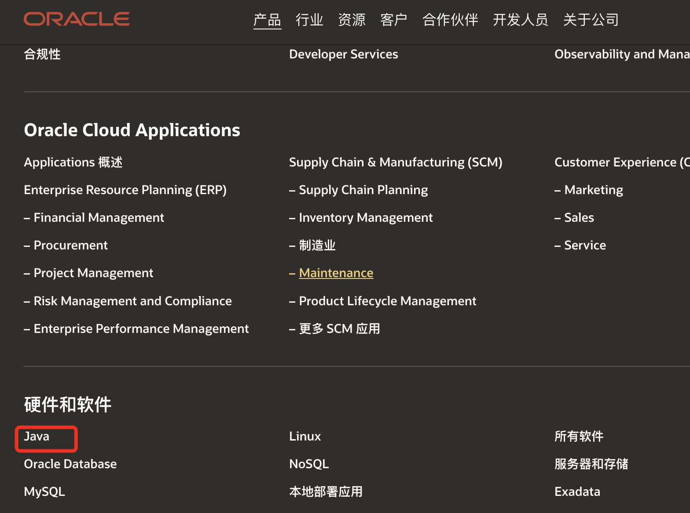


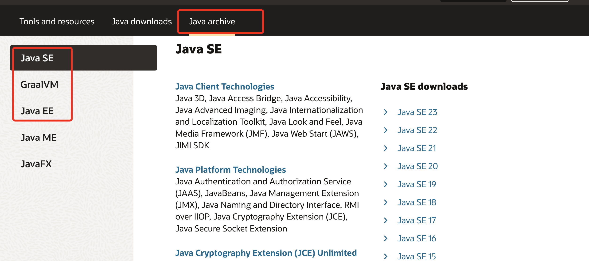

把安装的 1.7 本地加载上来

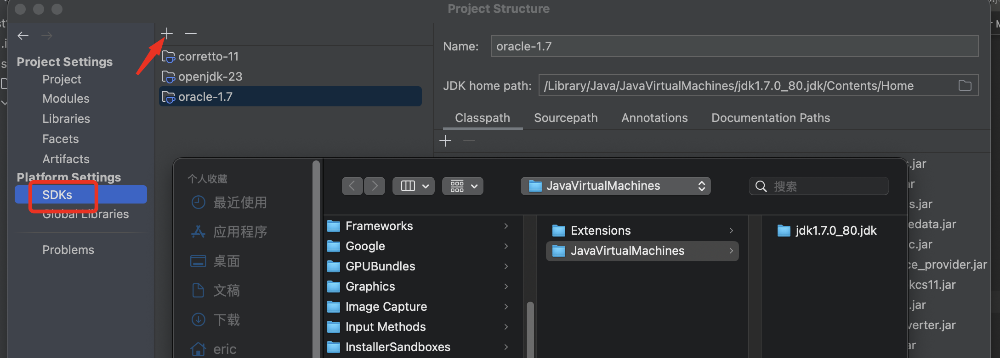

## 一，数据结构

> 数组：array，链表：linkedList； 树：tree； 队列：queue； 栈：stact；； 字典：dict（map）

Openjdk  / OracleJdk 稍微有点不一样

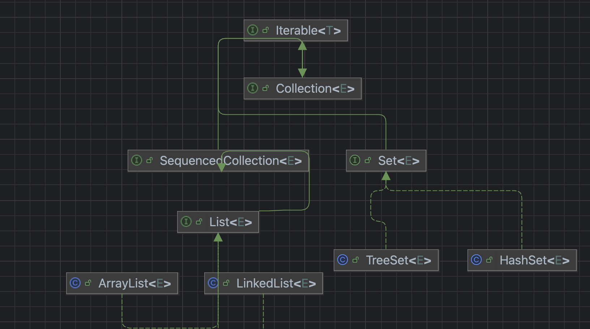


#### List： 

1. 元素可以重复
2. 元素顺序存储
3. 可以索引访问

#### Set：

1. 不可重复
2. 元素不保证顺序
3. 不可索引访问

### Map：

1.  key， value 形式
2. 底层 采用 数组+链表或者tree 实现


### 1,`HashMap`

> 待手写一遍

> https://www.bilibili.com/video/BV1b84y1G7o5/?spm_id_from=333.337.search-card.all.click&vd_source=90371f8b7d79625f67fcdcfff3dee01f

1. node结构： hash，key，value，next

2. 底层实现： 数组+单链表/树 ； 链表长度超过 一个值

3. index：数组寻址： key -  hash值- mod（右移动） 上数组长度 得到index `newTab[e.hash & (newCap - 1)] = e;`  

4. hash：hash 函数 哈希扰动

   > ```
   > 两个结果一样，只不过 & 运算更快
   > newTab[e.hash & (newCap - 1)] = e;` 和 `newTab[e.hash % newCap] = e;
   > ```

5. 扩容机制：超过一个yuzhi 负载因； `newCap = oldCap << 1`2两倍。* 2 效果一样；

6. Put添加元素：计算index，如果没有碰撞直接赋值；如果碰撞：插入到链表的尾部； 如果链表超过  tree 预值；进行数化； 当如有值的时候还要判断是否相等；如果相同的 后续还要判断是否替换， 尾插法

7. resize：遍历整个数组，如果数组中的元素的 next 为空 就直接重新计算哈希 赋值到新的位置； 如果元素是树，那么就进树的相应操作，如果next不为空 这里有个小技巧 计算每一个

8. remove：

9. ==为什么不使用头插法==：

10. ==手写一遍==：

### 2,`CurrentHashMap`

oracle openjdk1.7 / Jdk1.8 


### hashtable

1. 对于 对外提供的 接口方法上 统统 加了 synchronized； 锁住整个实列-整个hashtable
1. 线程安全，简单粗暴，并发性能低

### 1.7 currentHashMap

1. 16 个segments； 分段锁-提高一定的性能
2. 一个segment 继承 ReentrantLock，里面有 事数组+链表形式

==注意== ReentrantLock ，push 是所在单给segment， 

==缺点==  锁主每个桶，每个桶中一个数组+链表； 如果很多线程同时往一个桶写，即使他们没有哈希碰撞，也被锁住； 1.8 干脆直接锁住数组的第一个每个元素，也不需要分段了

#### 2.1 CAS  比较并且交换

> 通过比较内存中的值 是否与提供的期望值是否相等，相等就更新，否者失败； 具体实现一般由cpu 来具体实现

**优点**：

- 是一种原子操作，
- 是一种高效的多线程同步，无锁算法，也叫乐观锁
- 适合**高并发低竞争**场景，

**缺点：**

- ABA 问题 ；解决办法同步**锁**，添加**版本号**
- 添加字段来表示锁的标识位
- 失败从新试：也叫自旋； 高竞争下会导致大量失败，然后尝试 对cpu 资源是一种浪费，多也是对性能的有影响

**应用：**

- 常用于`AtomicInteger`、`AtomicReference`等原子类。

  

#### 2.2  synchroinzed

- 它是java语言中封装的锁，锁存储在对象头中
- JVM内置的**监视器锁（Monitor）**通过`monitorenter`和`monitorexit`字节码实现
- 同步锁，通过线程阻塞，线程等待，线程通知 来控制线程的执行顺序；
- 线程的上下文切换，阻塞，资源消耗大；
- 隐式加锁/释放，自动管理。

**优点：**

- **简单易用**：语法简洁，无需手动释放锁。
- **JVM优化**：锁升级机制适应不同场景。（太偏知道就行）
- **可重入**：同一线程可重复获取锁。

**缺点：**

- 功能简单： 不支持中断，超时（需要配合线程中的一些功能），不支持公平，非公平
- **非公平锁**：默认抢占式，可能导致线程饥饿。
- 重量级：线程的上下文切换，阻塞，资源消耗大；

**应用：**

- 常常配合 object.notify(), object.wait() 等
- 代块，方法，静态方法，可以锁类，对象


#### 2.2, **`ReentrantLock`** api

基于**AQS（AbstractQueuedSynchronizer）**框架，内部通过`CAS`和双向队列（CLH）管理线程阻塞。内部使用 LockSport 本地方法来阻塞线程，和唤醒线程，提供更灵活的控制，适合复杂并发需求。

优点：

- **功能丰富**：支持超时（`tryLock`）、可中断（`lockInterruptibly`）、公平性选择。
- **条件变量灵活**：可绑定多个`Condition`，分组控制线程唤醒。
- 高竞争下表现优秀。

缺点：

- **使用复杂**：需手动释放锁，易遗漏（推荐在`finally`中释放）

**应用：**

- 线程池、资源池


#### 2.3 ，Volatile，告诉jvm，此变量直接从内存读取，保证可见性  cpu 的行为

内存中的数据被称为主内存，然后每个线程都有自己的一小块内存区域，称为工作内存； 一个变量都会 在线程中会被考呗一个副本， cpu 一级高速缓存，二级高速缓存；工作内存拿到的某个数据不一定是最新； Volatile 高速cpu 此值必须冲主内存中取，不要优化，也不要缓存它 

#### CAS API：

```java
U = sun.misc.Unsafe.getUnsafe();
Class<?> k = ConcurrentHashMap.class;
//获取 sizeCtl 内存便宜量
SIZECTL = U.objectFieldOffset(k.getDeclaredField("sizeCtl"));
# 
public native boolean compareAndSwapInt(Object obj, long offset, int expected, int update);
```


一，hash 值的计算

> & 01111,1111,1111,1111 防止为负数

```java
 static final int spread(int h) {
        return (h ^ (h >>> 16)) & HASH_BITS;
    }
```


#### 一，initTable  使用cas

使用一个字段作为标识位，-1:是否有线程正在初始化

```java
if ((sc = sizeCtl) < 0)
     Thread.yield(); // lost initialization race; just spin
U.compareAndSwapInt(this, SIZECTL, sc, -1)
```

#### 二，没有哈希碰撞的插入： hashtable 数组中index 位置 赋值 cas 

```java
casTabAt(tab, i, null, new Node<K,V>(hash, key, value, null))
```

#### 三，有hash碰撞的插入  ，尾部插入，或者树插入

1. 使用 synchorized 对 链表的头，或者树的root 节点 加锁  （比较费时的用）

   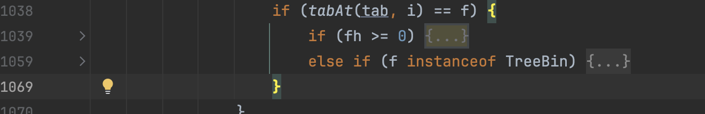

#### 四，扩容

```java
    /** Secondary seed isolated from public ThreadLocalRandom sequence */
    @sun.misc.Contended("tlr")
    int threadLocalRandomSecondarySeed;


    UNSAFE = sun.misc.Unsafe.getUnsafe();
    Class<?> tk = Thread.class;
    SEED = UNSAFE.objectFieldOffset
            (tk.getDeclaredField("threadLocalRandomSeed"));
    PROBE = UNSAFE.objectFieldOffset
            (tk.getDeclaredField("threadLocalRandomProbe"));
    SECONDARY = UNSAFE.objectFieldOffset
            (tk.getDeclaredField("threadLocalRandomSecondarySeed"));


    public native int getInt(Object var1, long var2);

    public native void putInt(Object var1, long var2, int var4);
       
```

#### 五，扩容& 迁移 （==核心难点==） -多线程扩容，扩容时增删改？

https://blog.csdn.net/m0_37550986/article/details/125230667

> 对添加，删除  锁住的这个 数组上当元素，后序操作很好理解； 如果对整个 数组扩容 又该如何做呢？

- 多线程环境下触发扩容条件之后，如何保证只有一个线程去新建新数组？
- 在数据迁移过程中如果有数据的添加，删除，查询该怎么处理？
- 在**ConcurrentHashMap**中是多个线程同时扩容的，那么如何协调多个线程同时扩容；
- 如何确保数据全部迁移完成？

1. 每个线程负责 一部分？ 如何分配的。 每个线程 竞争 区间； 使用标识位来表示当前是否扩容完成；
2. 数据迁移时，难道就不怕多个  线程 的数据都迁移到一个 节点上；  扩容 n的二次方，也就是扩容后，要么在原理的位置，要么在 原理位置+原来的长度位置；
3. 如果这个节点正在迁移，当前又来一个插入到当前节点上，move 标签来表示当前正在迁移，插入的线程 进入协助扩容；扩容完成，继续回到 之前的 for 寻还
4. 删除一样，也是进入死循环，如果遇到在扩容就 辅助扩容；
5. 获取，没有锁 则使用 锁
6. 对于元素的赋值，

==死循环==

```java
for (int[] tab = table;;)
```

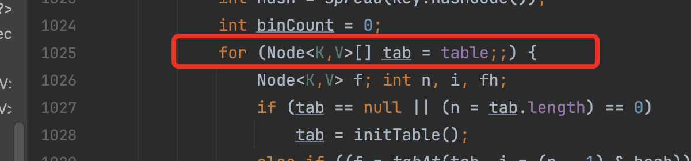

```java
    public static void main(String[] args){
        int count=0;
        int[] table={1,2,3,4,5};
        //这是一个死循环
        for (int[] tab = table;;) {
            System.out.println(  );
            count++;
            if(count>100){
                break;
            }
        }
    }
```


### Unsafe 的使用 设计到 classloader

```java
public static Unsafe getUnsafe() {    
Class<?> caller = Reflection.getCallerClass();    
if (!VM.isSystemDomainLoader(caller.getClassLoader()))      
      throw new SecurityException("Unsafe");   
return theUnsafe;}
```


> 直接使用 会报错

```java
package org.example;

import sun.misc.Unsafe;

public class ClassloaderTest {
    public static void main(String[] args) {
        Unsafe unsafe = Unsafe.getUnsafe();
        System.out.println(unsafe);
    }
}

```

```java
  Field field = Unsafe.class.getDeclaredField("theUnsafe");
  field.setAccessible(true);
  Unsafe unsafe = (Unsafe) field.get(null);
  System.out.println(unsafe);
```


### 3, `TreeMap`

> avl 树 的平衡差1， 红黑树 的平衡最大差 1倍； 平衡条件相对宽松

1. Tree，平衡二叉树，红黑树
2. key value，key 排序，不能重复
3. 每个 节点 要么红，要么黑；
4. root 必须黑节点，两条路径上黑点相同 （最大差一倍内-  ）
5. 叶子几点 黑点，新插入的是红几点
6. 连续两个节点不能为红，黑色可以

==avl 树== 手写

==红黑树== 手写


### 3,`ArrayList`

1. 底层实现：数组
2. 扩容机制 ： 默认 1.5倍，创建新的内存，复制原来的
3. 增删改查的时间复杂度  get ，set O(1);  delete，add 尾部O(1) 其他为 n； 查找 n； 
4. 线程安全：不安全
5. ==随机性能==：遍列查询，由于连续内存，往往会被高速缓存 一级缓存二级缓存，命中率高；
6. 内存：使用率高

### 4.`LinkedArrayList` 、`LinkedList`

1. 底层实现：双向链表， 存储 head，tail 节点
2. 扩容：动态的数据结构，理论无限大
3. 时间复杂度：添加 头尾：1； index： n； get by index :n; 搜索：n； remove ：n
4. 线程不安全： 不安全
5. 随机访问：慢， 插入删除头尾 块；
6. 内存：使用率差

### 5,`HashSet`  

1. 底层使用率hashmap 实现，所有的value 都是同一一个 object； 

   ```java
   private static final Object PRESENT = new Object();
   
   public boolean add(E e) {
           return map.put(e, PRESENT)==null;
   }
   public boolean remove(Object o) {
           return map.remove(o)==PRESENT;
   }
   ```

### 6, `TreeSet`

1. 底层使用 TreeMap, 只用了 key ， value 是一个固定的值

   ```java
   private static final Object PRESENT = new Object();
   
   public boolean add(E e) {
           return m.put(e, PRESENT)==null;
       }
   public boolean remove(Object o) {
           return m.remove(o)==PRESENT;
       }    
   ```

   

## 二，线程并发

> 并发问题，线程死锁，力度太大

### 1,`Thread`

https://juejin.cn/post/7379921204754300962?searchId=2024120809391080CB9CE89CBCEFA67BF2

##### 1.1 线程状态

> 1. New  ：new Thread 时的状态，被创建但是没被执行
> 2. Runnable/Running ： 调用start 方法时，准备好执行，但是还未获得cpu 时间； 已经在执行
> 3. Bolcked：线程阻塞状态，线程未获取 synchorized 同步代码的锁； 未获得锁叫阻塞
> 4. watting： 等待， object.wait()  当前获得锁的等待;  threadA.join() 当前线程等待 threadA； lockSupport.part(); 
> 5. wating_time:超时等待. obj.wait(timeout). threadA.join(timeout); lockSuport(), thread.sleep(timeout)
> 6. 终止状态：正常退出，或者没有捕获异常而退出


1.2 线程之间的通信

1. 注意 object.wait()/ object.notify()  只能配合   synchionzed 同步块中使用
2. interrupt： 也可以唤醒正常 等待的线程+超时等待

```java
  Thread threadA = new Thread("threadA"){
            @Override
            public void run() {

                   System.out.println("threadA is running ");
                    try {
                        Thread.sleep(1000000);
                    } catch (InterruptedException e) {

                    }
                    System.out.println( "threadA state:" + Thread.currentThread().getState());
            }
        };

        threadA.start();
        System.out.println( "threadA state:" + threadA.getState());
        Thread.sleep(500);
        System.out.println( "threadA state:" + threadA.getState());
        Thread.sleep(100);
        threadA.interrupt();
```

```java
package org.example.thread;
import lombok.SneakyThrows;
public class  TwoThreadDemo{
    public static volatile  int sum=0;
    public static final Object lock=new Object();
    @SneakyThrows
    public static void main(String[] args){

        Thread threadA= new Thread(TwoThreadDemo::add);
        Thread threadB= new Thread(TwoThreadDemo::add);
        threadA.start();
        threadB.start();
        Thread.sleep(5000);
    }
    @SneakyThrows
    public static void add(){
        for(int i=0;i<10; i++){

            synchronized (lock){
                TwoThreadDemo.sum++; System.out.println("thread:"+Thread.currentThread().getName()+" sum:"+sum);
                lock.notify();
                lock.wait(50);
            }
        }
    }
}
```

1. 实现 Runnable 接口，继承 Thread类，使用线程池
2. ==interrupt 难点==

### 2,`ThreadLocal`

1. 实现原理
2. 使用场景

### 3,`ExecutorService`

https://juejin.cn/post/6844904078728757261

```java
//c 初始的值= -536870912
int wc = workerCountOf(c);
     if (wc >= CAPACITY || wc >= (core ? corePoolSize : maximumPoolSize))
                    return false;
// CAPACITY 是一个 64位 全部为1的，值= 2^29-1； 也是最大线程数量
// 如果是核心线程，不能超过 核心，如果不是核心，不能超过 最大线程  
  


```

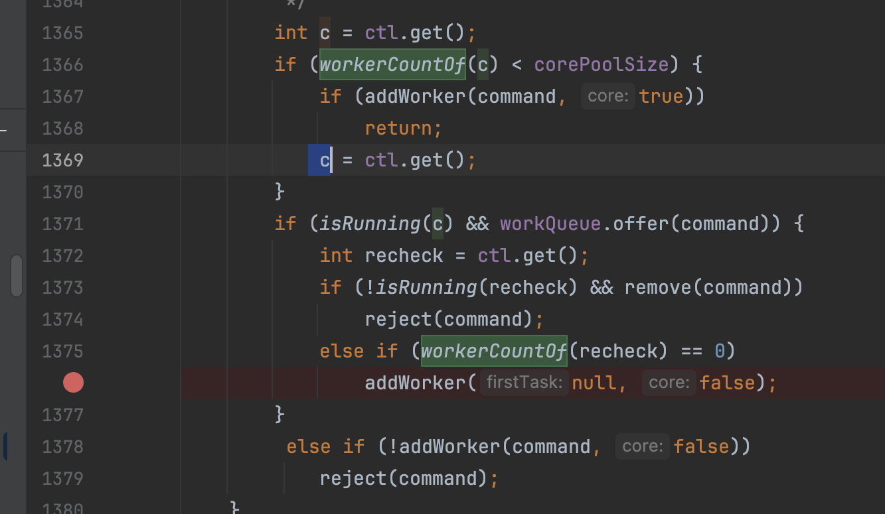

- [x] 如何区分核心线程，非核心线程？ ：没有区分

- [x] 阻塞队列满了后的？各种拒绝策略？：自定义拒绝策略

- [x] 阻塞队列？： 使用  ReentrantLock  实现， 如果集合为null ，要么等待，要么==阻塞？aqs相关代码==

- [x] 任务 是如何交给 worker 的？ ：创建线程时直接给，要么队列中等待

- [x] 如何判断线程执行还是空闲的？ 如何体现 ==超时时间==呢？：已经解决

  1. 每个线程执行任务都会做一些后续工作
  2. 比如：检测当前线程池是否可以终止，剪掉正在worker 的个数
  3. 把当前线程从 工作线程中移除，判断是否异常结束
  4. 如果中间有 线程失败 挂掉，还会补 新创建线程-维持核心线程数

  ```java
  private void interruptIdleWorkers(boolean onlyOne) {
          final ReentrantLock mainLock = this.mainLock;
          mainLock.lock();
          try {
              for (Worker w : workers) {
                  Thread t = w.thread;
                  if (!t.isInterrupted() && w.tryLock()) {
                      try {
                         // 只会中断一个等待中的线程，也就是没有运行的  
                          t.interrupt();
                      } catch (SecurityException ignore) {
                      } finally {
                          w.unlock();
                      }
                  }
                  if (onlyOne)
                      break;
              }
          } finally {
              mainLock.unlock();
          }
      }
  
  
  boolean timed = allowCoreThreadTimeOut || wc > corePoolSize;
  ```

  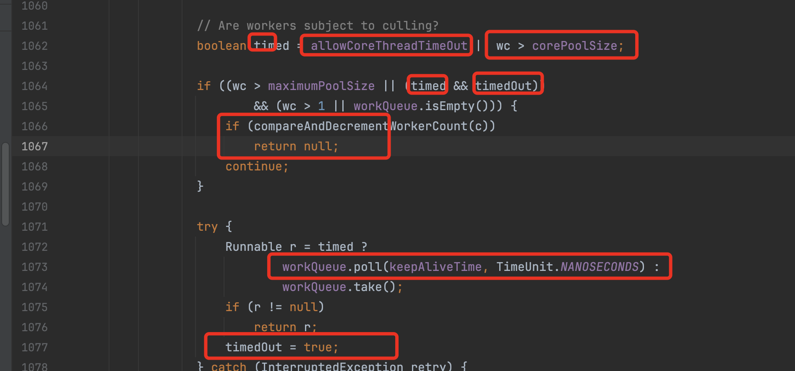

  

  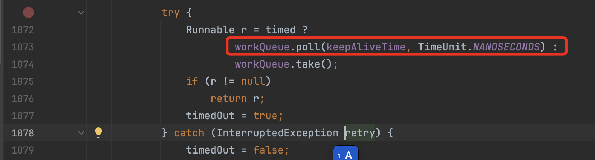

- [x] 几个常用参数： corePoolSize，maximumPoolSize；keepAliveTime；workQueue，threadFactory；RejectedExecutionHandler

- [x] 内部实现原理：

- [x] > 1. 创建的时候不会创建 线程
  > 2. 提交任务时，判断核心线程，小于核心就开启新的线程，并没有去==判断有没有空闲==线程，直接把当前任务给新创建的线程
  > 3. 如果核心线程已经满，那就把任务添加到队列；如果核心线程数量 设置0 那么就创建 线程执行
  > 4. 如果核心线程满：队列也满，就拒绝
  > 5. 如果线程处于空闲状态，通过超时获取任务，没有获取到超时，返回null 结束空闲线程

- [x] 使用注意事项

  1. 防止大量任务排队，做好拒绝策略
  2. 在多线程 上下线程切换时，对需要把线程私有的变量 转交给下一个线程
  3. 使用完毕手动关闭 线程池
  4. 可以设置 核心线程，也会超时，保障没有任务不必占用资源
  5. 也可以提交一些待返回值的 任务

- [x] 使用返回值的 callable<E>. 返回类型 e

  ```java
  Future<Integer> submit = threadPooll.submit(() -> 100);
  ```

  

- [x] ==考察点，值得借鉴的地方==


### **一、线程池核心参数与工作流程**

Java 线程池通过 `ThreadPoolExecutor` 实现，其核心参数如下：

```java
ThreadPoolExecutor(
    int corePoolSize,      // 核心线程数
    int maximumPoolSize,   // 最大线程数
    long keepAliveTime,    // 非核心线程空闲存活时间
    TimeUnit unit,         // 时间单位
    BlockingQueue<Runnable> workQueue, // 任务队列
    RejectedExecutionHandler handler   // 拒绝策略
)
```

**工作流程**：

1. 提交任务时，优先使用核心线程处理。
2. 核心线程满后，任务进入队列等待。
3. 队列满后，创建非核心线程（直到达到最大线程数）。
4. 所有线程和队列均满时，触发拒绝策略。

------

### **二、核心线程数（corePoolSize）设置原则**

#### **1. 任务类型决定线程数**

- CPU 密集型任务（如计算、逻辑处理）：
  - 线程数 ≈ CPU 核心数 + 1（防止线程阻塞浪费资源）。
  - 示例：4 核 CPU → `corePoolSize = 5`。
- IO 密集型任务（如网络请求、文件读写）：
  - 线程数 ≈ 2 * CPU 核心数（利用线程等待 IO 的空闲时间）。
  - 示例：4 核 CPU → `corePoolSize = 8`。

#### **2. 动态调整**

- 使用 `setCorePoolSize()` 方法动态调整核心线程数（如根据业务高峰/低谷）。
- 默认情况下，核心线程即使空闲也不会被回收（需设置 `allowCoreThreadTimeOut(true)` 改变行为）。

------

### **三、最大线程数（maximumPoolSize）设置原则**

- **公式**：`maximumPoolSize = corePoolSize + 弹性扩展余量`。
- 场景示例：
  - **突发流量**：若任务量可能突然激增，可设置较大的 `maximumPoolSize`（如 `corePoolSize * 2`）。
  - **资源敏感型系统**：若服务器资源有限，需严格控制最大线程数，避免 OOM。
- **注意**：线程数过多会导致频繁上下文切换，反而降低性能。

------

### **四、任务队列（workQueue）选择**

| **队列类型**                              | **特点**                                                     | **适用场景**                       |
| ----------------------------------------- | ------------------------------------------------------------ | ---------------------------------- |
| **无界队列**（如 `LinkedBlockingQueue`）  | 队列无限增长，可能导致 OOM                                   | 任务量可控且拒绝策略要求不高的场景 |
| **有界队列**（如 `ArrayBlockingQueue`）   | 队列满后触发创建非核心线程                                   | 需要限制资源使用的场景             |
| **同步移交队列**（`SynchronousQueue`）    | 不存储任务，直接移交线程执行（需配合较大的 `maximumPoolSize`） | 高吞吐、短任务场景                 |
| **优先级队列**（`PriorityBlockingQueue`） | 按优先级处理任务                                             | 需要任务优先级的场景               |
| **DelayedWorkQueue** 延迟周期             |                                                              |                                    |

------

### **五、拒绝策略（RejectedExecutionHandler）**

| **策略**                | **行为**                                               |
| ----------------------- | ------------------------------------------------------ |
| **AbortPolicy**（默认） | 直接抛出 `RejectedExecutionException`，                |
| **CallerRunsPolicy**    | 由提交任务的线程直接执行任务（降低提交速度，避免雪崩） |
| **DiscardPolicy**       | 静默丢弃新任务                                         |
| **DiscardOldestPolicy** | 丢弃队列中最旧的任务，重新提交新任务                   |

------

### **六、最佳实践与示例**

#### **1. 通用配置模板**

```java
int cpuCores = Runtime.getRuntime().availableProcessors();

ThreadPoolExecutor executor = new ThreadPoolExecutor(
    cpuCores + 1,                   // corePoolSize
    cpuCores * 2,                   // maximumPoolSize
    60, TimeUnit.SECONDS,           // keepAliveTime
    new LinkedBlockingQueue<>(1000),// 有界队列（容量1000）
    new ThreadFactoryBuilder().setNameFormat("task-pool-%d").build(), // 自定义线程名
    new CallerRunsPolicy()          // 拒绝策略
);
```

#### **2. 场景优化**

- Web 服务器请求处理（IO 密集型）：

  ```java
  corePoolSize = 2 * cpuCores;
  maximumPoolSize = 4 * cpuCores;
  workQueue = new LinkedBlockingQueue<>(2000);
  ```

- 批量数据处理（CPU 密集型）：

  ```java
  corePoolSize = cpuCores + 1;
  maximumPoolSize = cpuCores + 1; // 严格限制线程数
  workQueue = new SynchronousQueue<>(); // 无缓冲，直接执行
  ```

------

### **七、注意事项**

1. **避免无界队列**：防止任务堆积导致内存溢出（OOM）。

2. 监控线程池状态：

   ```java
   // 获取活跃线程数
   executor.getActiveCount();
   // 获取队列积压任务数
   executor.getQueue().size();
   ```

3. 优雅关闭线程池：

   ```java
   executor.shutdown();          // 停止接收新任务，等待已有任务完成
   executor.shutdownNow();       // 尝试立即终止所有任务（慎用）
   ```

4. **线程池隔离**：不同业务使用独立线程池，避免互相影响。

------

### 八，补充常用功能

在web应用中，通常还要出来，线程池中，上下两个线程任务交接情况；： 一个请求，过来使用线程池中的线程 来处理任务，请求线程返回情况； ==threadlocal== 数据获取和释放问题。


### **八、总结**

- **核心线程数**：由任务类型（CPU/IO 密集型）和 CPU 核心数决定。
- **最大线程数**：根据系统负载和资源限制动态调整。
- **队列选择**：优先使用有界队列，结合拒绝策略保护系统稳定性。
- **拒绝策略**：推荐 `CallerRunsPolicy` 或自定义策略，避免直接丢弃任务。

通过合理配置线程池参数，可以在高并发场景下实现资源高效利用与系统稳定性的平衡。


==备注==：在IO密集型任务中，推荐线程数约为CPU核心数的两倍，主要基于以下原因：

1. **利用IO等待时间**：
   - **阻塞期间CPU空闲**：当线程执行IO操作（如读写文件、网络请求）时，会进入阻塞状态，此时CPU可执行其他线程的任务。
   - **提高吞吐量**：通过增加线程数，CPU在等待一个线程的IO完成时，可切换到其他线程执行计算任务，减少空闲时间。
2. **经验公式与平衡点**：
   - **2倍核心数的由来**：假设线程有约50%的时间在等待IO，则双倍线程可让CPU在等待期间处理另一线程的任务，保持高利用率。
   - **避免过度切换**：过多的线程会增加上下文切换开销，两倍核心数是平衡利用率和切换成本的经验值。
3. **实际场景调整**：
   - **IO等待时间差异**：若IO延迟更高（如远程API调用），可适当增加线程数；若IO较快（如本地SSD），可减少线程数。
   - **系统资源限制**：需考虑内存、文件描述符等资源，避免因线程过多导致OOM或资源竞争。

**示例**：

- 4核CPU处理网络请求：
  - 设置8个线程，每个线程在等待响应时，CPU处理其他请求，提升并发能力。
- 调整依据：
  - 监控CPU利用率：若长期低于70%，可增加线程；若过高（>90%）或上下文切换频繁，则减少线程。

**总结**：两倍核心数是平衡IO等待和CPU利用的经验起点，实际需根据任务特性和系统监控动态调整。

-----

Redis 出现卡顿（延迟高、响应慢）通常由多种原因引起，需要结合具体场景排查。以下是常见原因及对应的解决方案：


### 3,同步：`Synchronied ` vs `CAS`

1. 使用场景，同步代码块，对可以锁在 类型上，也可以锁在对象上，可以在方法上，也可以在方法内部；一种悲观锁，没有获得锁的线程处于 blocked 状态，如果在线程多线程通信配合objec.wat()/object.notify()； 一般情况暂用的资源较多，不支持 ==中断操作==
2. 对其比其他 锁，cas:  对比和交换，通过对比对期望值，如果相等，就更新，无锁，也是一种乐观锁，在高并发下 提供跟好的一种性能，； 如果更新比较频繁 大量重试也会是一种浪费； 会出现 aba 问题； 采用多版本号记录； 底层具体一般有 cpu 来实现。
3. 对比 lock 接口： 对锁的范围力度更细， 它实现了 Synchronied全部功能，添加添加，类似 object.wait(),object.notify() 相关功能； 并且支持 ==中断==。`lock.lockInterruptibly()`

### 4, `valitale` 可见性，防重排序

1. 作用原理，又cpu 实现，每个线程执行时会拷贝一份数据到自己线程空间中去，比如高速缓存，和主内存的拷贝，不允许拷贝。

### 5, `AQS` QueuedSynchronizer

： 构建锁和同步器的基础框架，基于队列的同步器，时 juc  包的核心，它使使用 先进先出的队列 实现，实现队列使用的是 双向链表，而不是 数组； 线程通过队列来等待资源；


> 对于线程的 阻塞，唤醒 通过 LockSupport 来实现

```java
//唤醒某个线程
LockSupport.unpark(node.thread);
 //挂起当前的线程，会响应中断
 LockSupport.park(this);

// 返回是否被中断，并且把中断标识位设置为 false
return Thread.interrupted();
```


tryAcqurie 在具体子内中使用

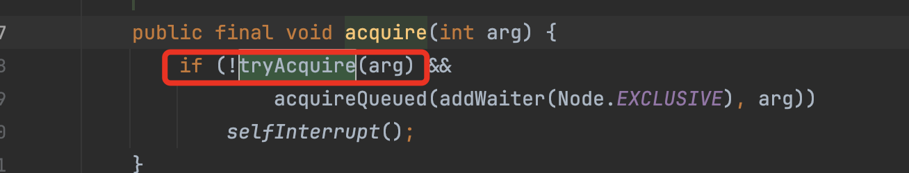

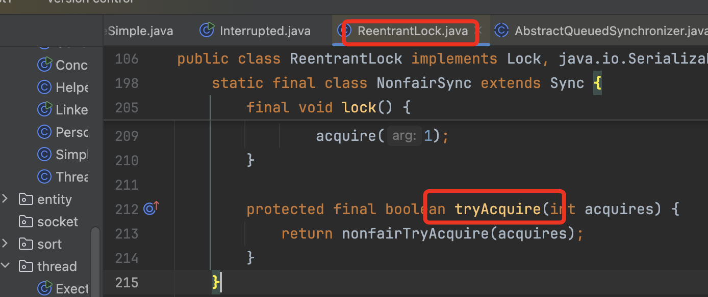

未抢到锁的添加到尾部

```java
  private Node addWaiter(Node mode) {
        Node node = new Node(Thread.currentThread(), mode);
        // Try the fast path of enq; backup to full enq on failure
        Node pred = tail;
        if (pred != null) {
            node.prev = pred;
            if (compareAndSetTail(pred, node)) {
                pred.next = node;
                return node;
            }
        }
        enq(node);
        return node;
    }
```

以 ReentrantLock：为列：

3. 如何被阻塞？

   cas 更加 state 值 来抢占锁，如果成功继续执行，没有就把当前线程 加入到等待队列 等待尾不；

4. 公平和不公平： 当前线程执行完毕后 去排队还是不回去排队问题。

5. 如何被唤醒？：正常唤醒，又前一个已经节点唤醒后一个节点；1. 第二种通过中断唤醒：

6. 如何不能被响应中断？ 通过中断标识位

7. 如何能被响应中断？：


### 6， final ： 

> 表示应用的地址初始后地址不能再变动，但是内部的值可以变动

```java
private final AtomicInteger ctl = new AtomicInteger(ctlOf(RUNNING, 0));
```


1. 内部实现原理

### 6, 同步：`Lock`  ：`ReentrantReadWriteLock`；`ReentrantLock`

1. 锁的可重入性

2. 公平锁与非公平锁, Synchronied 不能够控制 随机的获取

3. 锁的尝试获取（`tryLock()`）

4. ==中断响应== 

   ```java
   lock.lock();  // 无法响应中断
   lock.lockInterruptibly();  // 支持中断的锁请求
   ```

   

5. 条件变量 (`Condition`)

6. 性能与吞吐量

对读共享，对写排斥：多并发下多读 少写炒作有性能上的提


### 7,Atomic***

1. 并发的一些原则操作类，底层多采用 cas 实现

### 8，了解 **`CopyOnWriteArrayList`**、**`BlockingQueue`**

1. 内部原理

==待手写aqs==


## 三，JVM


> https://github.com/openjdk/jdk
>
> https://blog.csdn.net/twotwo22222/article/details/127890270
>
> https://www.cnblogs.com/hjcenry/p/17937034
>
> 官方文档：
>
> pdf：https://docs.oracle.com/javase/specs/
>
> https://docs.oracle.com/javase/specs/jvms/se8/html/jvms-2.html#jvms-2.6

Javac. 如何编译 .java 的？

Java 如何运行 .class 的？


```java
public class Hello{
    public static void main(String[] args){
        System.out.println("Hello World");
    }
}
```

```shell
javac Hello.java
java Hello
// java 启动jvm 实列 java.exe 调用 jvm.dll
// jvm 调用。sun.launcher.LauncherHelper 获取 main 类和 方法 其中就 初始化了 加载器
```

jdk 代码入口 / github 下载源代码

> Java.c  中的 JavaMain 方法

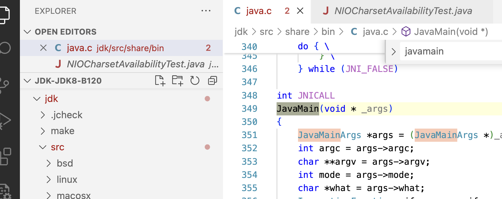

其中有个变量 ：mainClass，执行main 方法

```c
mainClass = LoadMainClass(env, mode, what);

 /* Invoke main method. */
(*env)->CallStaticVoidMethod(env, mainClass, mainID, mainArgs);
```

```c

static jclass LoadMainClass(JNIEnv *env, int mode, char *name)
{
    jmethodID mid;
    jstring str;
    jobject result;
    jlong start, end;
    //获取java 中的  sun.launcher.LauncherHelper
    jclass cls = GetLauncherHelperClass(env);
    NULL_CHECK0(cls);
    if (JLI_IsTraceLauncher()) {
        start = CounterGet();
    }
    //checkAndLoadMain
    NULL_CHECK0(mid = (*env)->GetStaticMethodID(env, cls,
                "checkAndLoadMain",
                "(ZILjava/lang/String;)Ljava/lang/Class;"));

    str = NewPlatformString(env, name);
    result = (*env)->CallStaticObjectMethod(env, cls, mid, USE_STDERR, mode, str);

    if (JLI_IsTraceLauncher()) {
        end   = CounterGet();
        printf("%ld micro seconds to load main class\n",
               (long)(jint)Counter2Micros(end-start));
        printf("----%s----\n", JLDEBUG_ENV_ENTRY);
    }

    return (jclass)result;
}
```

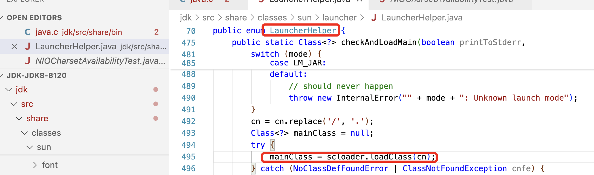

```
private static final ClassLoader scloader = ClassLoader.getSystemClassLoader();
```

==不是很确定==helperClass是否已经实列化，并且  scloader已经赋值

```c
jclass
GetLauncherHelperClass(JNIEnv *env)
{
    if (helperClass == NULL) {
        NULL_CHECK0(helperClass = FindBootStrapClass(env,
                "sun/launcher/LauncherHelper"));
    }
    return helperClass;
}
```


Java 可以运行 是如何加载 类的？

```java
//由jvm 启动时调用，首先初始化， boot， ext 两个 ClassLoader
sun.misc.Launcher launcher = sun.misc.Launcher.getLauncher();
```

### 1, 类的加载

把二进制变成一个类型

```java
 protected final Class<?> defineClass(String name, byte[] b, int off, int len,
                                         ProtectionDomain protectionDomain)
```


```java
myClassLoader.getParent().getParent().getParent()
```

**Bootstrap ClassLoader**

1. 由虚拟机实现，c++代码编写

2. 核心包的加载 

3. ```shell
   String boot = System.getProperty("sun.boot.class.path");
   // 可以 指定参数 替换 核心路径 -Xbootclasspath:your_path
   ```

**Extention ClassLoader**

1. 由 java 代码编写，但是由jvm 来实列化

2. 加载 扩展包

3. ```java
    String property = System.getProperty("java.ext.dirs");
   ```

**AppClassLoader**:应用类加载器

1. 由java代码编写，但是由jvm来实列化

2. 加载自己写的代码，或者一些第三方引用包，指定：classpath

3. ```
   java.class.path
   ```

```java
String boot = System.getProperty("sun.boot.class.path");
for(String item:boot.split(":")){
    System.out.println(item);
}
String ext = System.getProperty("java.ext.dirs");
for(String item:ext.split(":")){
    System.out.println(item);
}
String app = System.getProperty("java.class.path");
for(String item:app.split(":")){
    System.out.println(item);
}
```


```java
package org.example;

public class ClassLoaderSimple2 {

    public static void main(String[] args) {
        // 创建一个自定义的类加载器
        MyClassLoaderA myClassLoader1 = new MyClassLoaderA();
        MyClassLoaderB myClassLoader2 = new MyClassLoaderB();
        // 使用自定义加载器加载类
        String basePath = "/Users/eric/Users/eric/code/simple/target/classes/"; // 本地类文件的路径
        MyClassLoaderC myClassLoader3 = new MyClassLoaderC(basePath);

        try {
            // 使用自定义的类加载器加载MyClass类
            Class<?> clazz1 = myClassLoader1.loadClass("com.example.MyClass");
            Class<?> clazz2 = myClassLoader2.loadClass("com.example.MyClass");
            Class<?> clazz3 = myClassLoader3.loadClass("com.example.MyClass");
//
            System.out.println(clazz2==clazz1 );
            // 两个是不一样
            System.out.println(clazz2==clazz3 );

            // 创建 MyClass 实例并调用方法
            Object instance1 = null;
            Object instance2 = null;
            try {
                instance1 = clazz1.getDeclaredConstructor().newInstance();
                clazz1.getMethod("hello").invoke(instance1);
                instance2 = clazz1.getDeclaredConstructor().newInstance();
                clazz1.getMethod("hello").invoke(instance2);
                System.out.println(instance1.equals(instance2));

            }  catch (Exception e) {
                throw new RuntimeException(e);
            }
//            System.out.println("Class loaded: " + clazz1.getName());
        } catch (ClassNotFoundException e) {
            e.printStackTrace();
        }
    }
}

```

```java
package org.example;

import java.io.File;
import java.io.FileInputStream;
import java.io.IOException;

public class MyClassLoaderC extends ClassLoader {
    private String basePath;
    public MyClassLoaderC(String basePath) {
        this.basePath = basePath;
    }

    @Override
    public Class<?> loadClass(String name) throws ClassNotFoundException {
//        使用当前的加载
        if(name.equals("com.example.MyClass")){
            return this.findClass(name);
        }
//       父类加载
        return super.loadClass(name);
    }
    @Override
    protected Class<?> findClass(String name) throws ClassNotFoundException {
        // 转换类名为文件路径
        String filePath = basePath + name.replace('.', '/') + ".class";
        File classFile = new File(filePath);
        // 如果文件不存在，抛出 ClassNotFoundException
        if (!classFile.exists()) {
            throw new ClassNotFoundException("Class not found: " + name);
        }
        // 读取文件中的字节
        try (FileInputStream fis = new FileInputStream(classFile)) {
            byte[] classData = new byte[(int) classFile.length()];
            fis.read(classData);
            // 使用 defineClass 将字节数组转换为 Class 对象
            return defineClass(name, classData, 0, classData.length);
        } catch (IOException e) {
            e.printStackTrace();
            throw new ClassNotFoundException("Error loading class: " + name, e);
        }
    }

    public static void main(String[] args) {
        try {
            // 使用自定义加载器加载类
            String basePath = "/Users/eric/code/simple/target/classes"; // 本地类文件的路径
            MyClassLoaderC loaderA = new MyClassLoaderC(basePath);
            // 加载类
            Class<?> clazz = loaderA.loadClass("com.example.MyClass");
            // 输出类的全名
            System.out.println("Class loaded: " + clazz.getName());
            // 创建类的实例
            Object instance = clazz.getDeclaredConstructor().newInstance();
            // 调用方法（假设 MyClass 有一个 hello() 方法）
            clazz.getMethod("hello").invoke(instance);

        } catch (Exception e) {
            e.printStackTrace();
        }
    }
}
```


### 2,Java 类加载器 `ClassLoader` 双亲委派

- 从 appclassloader 的缓存中找有没有 blue.class 文件

- 没有找到，交给extclassloader去缓存查询

  ```c
  //findLoadedClass0  ：缓存是一个 本地方法，
  ```

- 还没有找到，交给bootstrapclassloader去缓存查询。

- 还没有找到，就从boostrap的路径去找，

- 任然没有找到，就交给下一级ext去他的路径找，

- 还没有，就交给appclassloader的路径去找。

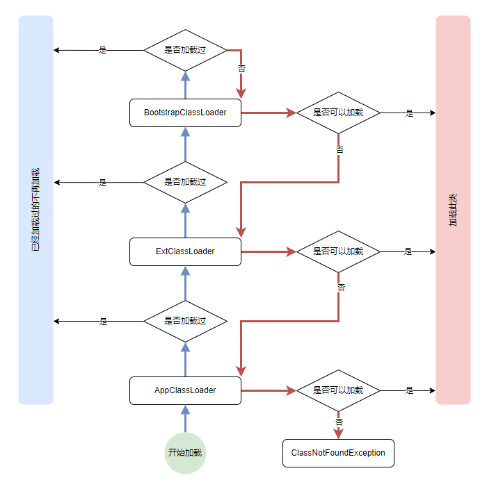

```c
//JVM中的一种宏定义写法，它用来包裹本地方法（native method）的实现
JVM_ENTRY(jclass, JVM_FindLoadedClass(JNIEnv *env, jobject loader, jstring name))
  JVMWrapper("JVM_FindLoadedClass");
  ResourceMark rm(THREAD);

  Handle h_name (THREAD, JNIHandles::resolve_non_null(name));
  Handle string = java_lang_String::internalize_classname(h_name, CHECK_NULL);

  const char* str   = java_lang_String::as_utf8_string(string());
  // Sanity check, don't expect null
  if (str == NULL) return NULL;

  const int str_len = (int)strlen(str);
  if (str_len > Symbol::max_length()) {
    // It's impossible to create this class;  the name cannot fit
    // into the constant pool.
    return NULL;
  }
  TempNewSymbol klass_name = SymbolTable::new_symbol(str, str_len, CHECK_NULL);

  // Security Note:
  //   The Java level wrapper will perform the necessary security check allowing
  //   us to pass the NULL as the initiating class loader.
  Handle h_loader(THREAD, JNIHandles::resolve(loader));
  if (UsePerfData) {
    is_lock_held_by_thread(h_loader,
                           ClassLoader::sync_JVMFindLoadedClassLockFreeCounter(),
                           THREAD);
  }

  Klass* k = SystemDictionary::find_instance_or_array_klass(klass_name,
                                                              h_loader,
                                                              Handle(),
                                                              CHECK_NULL);

  return (k == NULL) ? NULL :
            (jclass) JNIHandles::make_local(env, k->java_mirror());
JVM_END
```

**双亲委派的意义：**

1. 避免类的重复加载
2. 避免核心api 被篡改

2. jav

### 2，java jvm模型

java 虚拟机规范： https://docs.oracle.com/javase/specs/jvms/se8/html/jvms-5.html

1. 载器，连接，初始化， 
2. 运行时，
3. 执行引擎，
4. 本地方法运行的接口


==基于 hotsport 自己写一个语言==

==如何写一个自己的虚拟机==


### 3,jvm内存模型

官方文档：https://docs.oracle.com/javase/specs/jvms/se8/html/jvms-2.html#jvms-2.5

1. 程序计数器：(program counter）
2. java 虚拟机栈： 存放每个线程执行的栈帧
3. 堆：主要的内存区域存放，由所有 Java 虚拟机线程共享。堆是运行时数据区域，所有类实例和数组的内存都从中分配， 回收管理 垃圾垃圾搜集区， yung （伊甸园，两个幸存区）, old
4. 本地方法栈：存放本地方法 执行的
5. 方法区（一个规范）：存储每个类的结构，例如运行时常量池、字段和方法数据以及方法和构造函数的代码，包括在类和实例初始化以及接口初始化中使用的特殊方法;   它的==实现==：每个版本叫法不一样，==元数据区==，==永久代==


1. 类型如何被初始化
2. 类型 如何被赋值
3. 内存区域划分
4. jvm 代码？

1. class 字节字节码的加载
2. 字节码的连接：验证，准备，连接

### 4,垃圾回收机制

https://www.cnblogs.com/hjcenry/p/17938808

官方文档： https://docs.oracle.com/javase/8/docs/technotes/guides/vm/gctuning/

1. 哪些需要清理？ CG Root： 被栈，本地方法的应用，方法区常量，上的直接或者间接应用

   1. 应用计数器：简单的（python） 无法解决循环应用
   2. Java采用 可达性分析，从 CG Root 出发 遍历对象。

2. 如果从 new 的对象-Eden伊甸园区到，幸存者，再到老年代？

   1.  在Survivor中 每次都在复制，超过 年年龄 6的对象 会迁移到 old 区
   2. 如果一个大对象，直接存在 old 区，如：大数组
   3. old 区满了后 fullgl- 触发stop-the-word； 采用标记整理算法/标记清理

3. 有哪些清理算法： 

   1. 标记，然后删除，标记清理算法：内存碎片
   2. 标记整理：每个整理都要迁移：代价大
   3. 复制清理：直接复制：代价就是两倍内存； young GC （Minor gc）

4. 最常用的，垃圾搜集器，

   java8 默认的垃圾回收器- ParallelGC

   ```java
   eric@mac bin % ./java -XX:+PrintGCDetails -version
   java version "1.8.0_421"
   Java(TM) SE Runtime Environment (build 1.8.0_421-b09)
   Java HotSpot(TM) 64-Bit Server VM (build 25.421-b09, mixed mode)
   Heap
    PSYoungGen total 114688K, used 3932K 
     eden space 98304K, 4% used 
     from space 16384K, 0% used 
     to   space 16384K, 0% used 
    ParOldGen       total 262144K, used 0K 
     object space 262144K, 0% used 
    Metaspace       used 2326K, capacity 4480K, committed 4480K, reserved 1056768K
     class space    used 255K, capacity 384K, committed 384K, reserved 1048576K
   ```

   ```shell
   ./java -XX:+PrintCommandLineFlags -version
   -XX:InitialHeapSize=402653184 
   -XX:MaxHeapSize=6442450944 
   -XX:+PrintCommandLineFlags 
   -XX:+UseCompressedClassPointers 
   -XX:+UseCompressedOops 
   -XX:+UseParallelGC
   java version "1.8.0_421"
   Java(TM) SE Runtime Environment (build 1.8.0_421-b09)
   Java HotSpot(TM) 64-Bit Server VM (build 25.421-b09, mixed mode)
   ```

   

5. GC 性能优化-*自动动态内存管理算法*

   1. 过对象的创建后销毁
   2. 不使用的对象设置null 帮助gc
   3. 合理设置堆的大小，减少 Full gc 的频率
   4. 选择适合的垃圾回收器：

```

```

==源代码查看==。 hotspot 代码

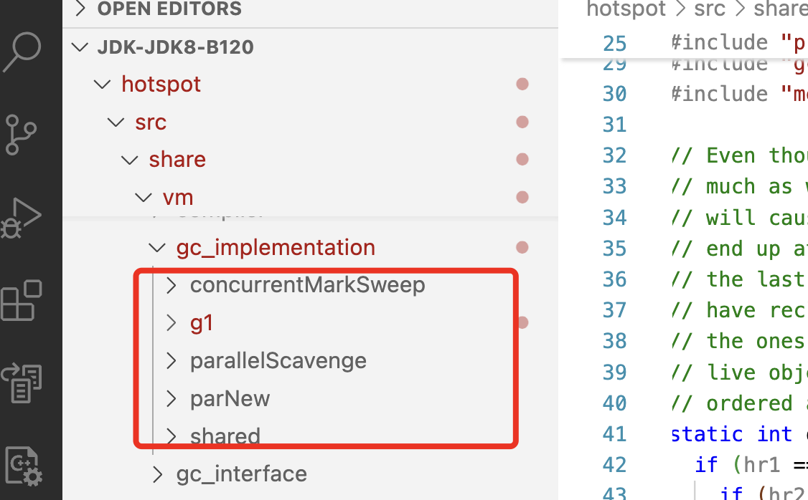

### G1

1. 划分为 region 小块后，是否还区分 ，yung，old 区域还存在在吗

   > 每一个 region 可以是 yung，old，survier 区； 也有代的概念？

2. 添加了什么，大对象区，怎么做的

3. 具体细节

把整个堆空间 划分位多个小块 region，

> java -XX:+PrintGCDetails -version

```shell
eric@mac ~ % java -XX:+PrintGCDetails -version
[0.006s][warning][gc] -XX:+PrintGCDetails is deprecated. Will use -Xlog:gc* instead.
[0.013s][info   ][gc,init] CardTable entry size: 512
[0.013s][info   ][gc     ] Using G1
[0.014s][info   ][gc,init] Version: 23.0.1+11-39 (release)
[0.014s][info   ][gc,init] CPUs: 8 total, 8 available
[0.014s][info   ][gc,init] Memory: 24576M
[0.014s][info   ][gc,init] Large Page Support: Disabled
[0.014s][info   ][gc,init] NUMA Support: Disabled
[0.014s][info   ][gc,init] Compressed Oops: Enabled (Zero based)
[0.014s][info   ][gc,init] Heap Region Size: 4M
[0.014s][info   ][gc,init] Heap Min Capacity: 8M
[0.014s][info   ][gc,init] Heap Initial Capacity: 384M
[0.014s][info   ][gc,init] Heap Max Capacity: 6G
[0.014s][info   ][gc,init] Pre-touch: Disabled
[0.014s][info   ][gc,init] Parallel Workers: 8
[0.014s][info   ][gc,init] Concurrent Workers: 2
[0.014s][info   ][gc,init] Concurrent Refinement Workers: 8
[0.014s][info   ][gc,init] Periodic GC: Disabled
.....
openjdk version "23.0.1" 2024-10-15
OpenJDK Runtime Environment (build 23.0.1+11-39)
....
```

1. 每个region 的大小，
2. 多少个

### 5, `stop-the-word`，调优参数`jstack` `jmap` 工具等

