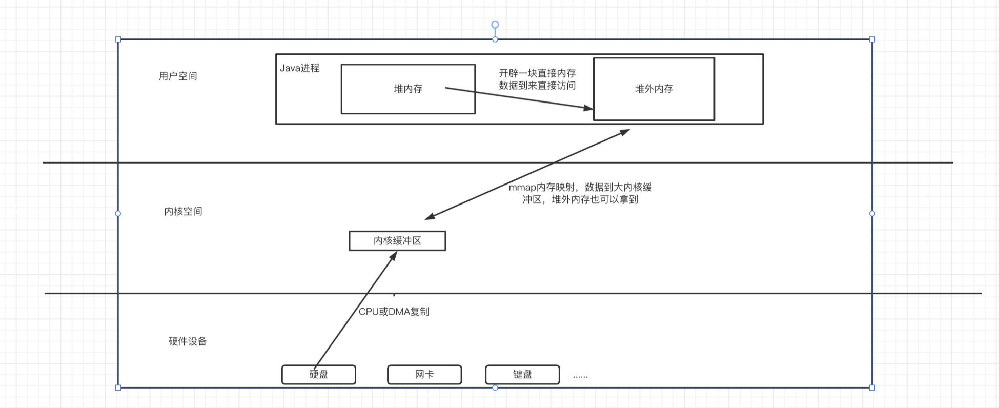

1. Java NIO
2. 事件驱动
3. Java NIO，令拷贝，内存文件映射
4. 多路复用
5. Netty内部使用EventLoopGroup管理线程
6. Netty提供了丰富的编解码器和工具类
7. epoll 比如缓冲区管理、事件循环实现，如Nginx、Redis
8. Linux用epoll，Mac用kqueue，windows  select
9. 堆外内存（DirectBuffer）


## Java NIO

是 Java 提供的一套用于高效处理 I/O 操作的 API，它从 Java 1.4 开始引入，旨在解决传统 Java IO 的一些性能瓶颈问题。NIO 提供了**非阻塞 I/O**、**通道（Channel）**、**缓冲区（Buffer）**和选择器（**Selector**）等核心概念，适用于高并发场景下的网络通信和文件操作。

### **. Java NIO 的核心概念**

#### **(1) Buffer（缓冲区）**

- 缓冲区是数据的容器，所有的数据读写都通过缓冲区完成。
- 常见的缓冲区类型包括 `ByteBuffer`、`CharBuffer`、`IntBuffer` 等。
- 缓冲区的核心属性：
  - `capacity`：缓冲区的最大容量。
  - `position`：当前读写位置。
  - `limit`：可读写的边界。
  - `mark`：标记位置，用于回退。

#### **(2) Channel（通道）**

- 通道是数据传输的媒介，类似于流（Stream），但支持双向读写。
- 常见的通道类型：
  - `FileChannel`：用于文件 I/O。
  - `SocketChannel` 和 `ServerSocketChannel`：用于网络通信。
  - `DatagramChannel`：用于 UDP 数据报通信。
- 通道的操作通常需要与缓冲区配合使用。

#### **(3) Selector（选择器）**

- 选择器用于监控多个通道的事件（如连接、读、写等），从而实现多路复用。
- 它允许单个线程管理多个通道，避免为每个通道创建单独的线程。
- 常见的事件类型：
  - `OP_ACCEPT`：服务器接受客户端连接。
  - `OP_CONNECT`：客户端连接到服务器。
  - `OP_READ`：通道可读。
  - `OP_WRITE`：通道可写。

------

### **2. Java NIO 的使用示例**

以下是一个简单的基于 Java NIO 的非阻塞服务器实现：

```
import java.io.IOException;
import java.net.InetSocketAddress;
import java.nio.ByteBuffer;
import java.nio.channels.SelectionKey;
import java.nio.channels.Selector;
import java.nio.channels.ServerSocketChannel;
import java.nio.channels.SocketChannel;
import java.util.Iterator;

public class NioServer {
    public static void main(String[] args) throws IOException {
        // 创建选择器
        Selector selector = Selector.open();

        // 打开服务器通道
        ServerSocketChannel serverSocketChannel = ServerSocketChannel.open();
        serverSocketChannel.bind(new InetSocketAddress(8080));
        serverSocketChannel.configureBlocking(false); // 设置为非阻塞模式

        // 注册通道到选择器，监听 OP_ACCEPT 事件
        serverSocketChannel.register(selector, SelectionKey.OP_ACCEPT);

        System.out.println("Server started on port 8080");

        while (true) {
            // 阻塞等待事件发生
            selector.select();

            // 获取已就绪的键集合
            Iterator<SelectionKey> keys = selector.selectedKeys().iterator();

            while (keys.hasNext()) {
                SelectionKey key = keys.next();
                keys.remove();

                if (key.isAcceptable()) {
                    // 处理客户端连接请求
                    ServerSocketChannel server = (ServerSocketChannel) key.channel();
                    SocketChannel client = server.accept();
                    client.configureBlocking(false);
                    client.register(selector, SelectionKey.OP_READ);
                    System.out.println("Client connected: " + client.getRemoteAddress());
                } else if (key.isReadable()) {
                    // 处理读取事件
                    SocketChannel client = (SocketChannel) key.channel();
                    ByteBuffer buffer = ByteBuffer.allocate(1024);
                    int bytesRead = client.read(buffer);

                    if (bytesRead == -1) {
                        client.close();
                        System.out.println("Client disconnected");
                    } else {
                        buffer.flip();
                        System.out.println("Received: " + new String(buffer.array(), 0, buffer.limit()));
                    }
                }
            }
        }
    }
}
```

------

### **3. Java NIO 的底层实现**

Java NIO 的底层依赖于操作系统的 I/O 多路复用机制，不同操作系统有不同的实现方式：

#### **(1) Linux 中的 `epoll`**

- 在 Linux 系统中，Java NIO 使用 `epoll` 实现高效的 I/O 多路复用。
- epoll 是一种改进的 I/O 多路复用机制，相比传统的 select和 poll，具有以下优势：
  - 支持大规模并发连接。
  - 采用事件驱动模型，只通知有事件发生的文件描述符，避免遍历所有文件描述符。
- Java NIO 的 `Selector` 底层会调用 `epoll_create`、`epoll_ctl` 和 `epoll_wait` 等系统调用来管理文件描述符和事件。

#### **(2) Windows 中的 `IOCP `** 或者 select

- 在 Windows 系统中，Java NIO 使用 `IOCP`（I/O Completion Ports）实现异步 I/O。
- `IOCP`  或者 select 是一种高效的异步 I/O 机制，特别适合高并发场景。
- Java NIO 的 `Selector` 底层会调用 Windows 提供的异步 I/O API 来实现类似的功能。

#### **(3) 其他操作系统**

- 在其他操作系统（如 macOS 或 Solaris）中，Java NIO 可能使用 `kqueue` 或其他类似的 I/O 多路复用机制。
- Java 的跨平台特性使得开发者无需关心底层的具体实现，只需使用统一的 NIO API。

------

### **4. Java NIO 的优点与局限性**

#### **优点**

- **高性能** ：通过非阻塞 I/O 和多路复用机制，能够高效处理大量并发连接。
- **灵活性** ：支持双向通道和多种缓冲区类型，满足复杂的数据处理需求。
- **跨平台** ：屏蔽了底层操作系统的差异，提供了统一的 API。

#### **局限性**

- **复杂性** ：相比传统的阻塞 I/O，NIO 的编程模型更复杂，容易出错。
- **调试困难** ：由于是非阻塞模式，调试和排查问题可能更加困难。
- **适用场景有限** ：对于低并发或简单 I/O 场景，传统 IO 可能更合适。


## 三，JAVA NIO  中的粘包和拆包

在 Java NIO 中，处理 **粘包** 和 **拆包** 是网络编程中常见的问题。所谓 **粘包** ，是指在网络通信中，发送方发送的多个数据包被接收方合并成一个数据包接收；而 **拆包** 则是指一个完整的数据包被接收方分成多次接收。

### **1. 粘包和拆包的原因**

- **TCP 是面向流的协议** ：TCP 不保证消息边界，发送方发送的多个小数据包可能会被合并成一个大数据包（粘包），或者一个大数据包可能会被拆分成多个小数据包（拆包）。
- **网络传输特性** ：由于网络延迟、缓冲区大小限制等原因，数据包可能在传输过程中被重新组合或分割。

### **2. 解决粘包和拆包的方法**

为了解决粘包和拆包问题，通常需要在应用层设计一种协议来明确消息的边界。以下是几种常见的解决方法：

#### **(1) 固定长度的消息**

- 每条消息都使用固定的长度（例如 1024 字节）。如果消息不足固定长度，则用填充字符补齐。
- 接收方每次读取固定长度的数据即可。

**优点** ：实现简单，无需额外的解析逻辑。

**缺点** ：浪费带宽，尤其是当消息内容较短时。

#### **(2) 使用分隔符**

- 在每条消息之间添加一个特殊的分隔符（例如 `\n` 或自定义的特殊字符）。
- 接收方根据分隔符将数据拆分为独立的消息。

**优点** ：实现相对简单。

**缺点** ：分隔符不能出现在消息内容中，否则需要转义，增加了复杂性。

#### **(3) 消息头 + 消息体**

- 在每条消息前添加一个固定长度的消息头，用于描述消息体的长度。
- 接收方先读取消息头，解析出消息体的长度，然后读取消息体。

**优点** ：高效且灵活，适合大多数场景。

**缺点** ：实现稍微复杂，需要解析消息头。


```java 
import java.io.IOException;
import java.net.InetSocketAddress;
import java.nio.ByteBuffer;
import java.nio.channels.SelectionKey;
import java.nio.channels.Selector;
import java.nio.channels.ServerSocketChannel;
import java.nio.channels.SocketChannel;
import java.util.Iterator;
import java.util.Map;
import java.util.concurrent.ConcurrentHashMap;

public class NioServer {
    private static final int PORT = 8080;
    private static final int HEADER_SIZE = 4; // 消息头长度（存储消息体长度）
    private static Map<SocketChannel, byte[]> pendingData = new ConcurrentHashMap<>();

    public static void main(String[] args) throws IOException {
        Selector selector = Selector.open();
        ServerSocketChannel serverSocketChannel = ServerSocketChannel.open();
        serverSocketChannel.bind(new InetSocketAddress(PORT));
        serverSocketChannel.configureBlocking(false);
        serverSocketChannel.register(selector, SelectionKey.OP_ACCEPT);

        System.out.println("Server started on port " + PORT);

        while (true) {
            selector.select();
            Iterator<SelectionKey> keys = selector.selectedKeys().iterator();

            while (keys.hasNext()) {
                SelectionKey key = keys.next();
                keys.remove();

                if (key.isAcceptable()) {
                    handleAccept(key);
                } else if (key.isReadable()) {
                    handleRead(key);
                }
            }
        }
    }

    private static void handleAccept(SelectionKey key) throws IOException {
        ServerSocketChannel serverSocketChannel = (ServerSocketChannel) key.channel();
        SocketChannel clientChannel = serverSocketChannel.accept();
        clientChannel.configureBlocking(false);
        clientChannel.register(key.selector(), SelectionKey.OP_READ);
        System.out.println("Client connected: " + clientChannel.getRemoteAddress());
    }

    private static void handleRead(SelectionKey key) throws IOException {
        SocketChannel clientChannel = (SocketChannel) key.channel();
        ByteBuffer buffer = ByteBuffer.allocate(1024);
        int bytesRead = clientChannel.read(buffer);

        if (bytesRead == -1) {
            clientChannel.close();
            System.out.println("Client disconnected");
            return;
        }

        byte[] data = new byte[bytesRead];
        System.arraycopy(buffer.array(), 0, data, 0, bytesRead);

        // 将新接收到的数据追加到 pendingData 中
        byte[] existingData = pendingData.getOrDefault(clientChannel, new byte[0]);
        byte[] combinedData = new byte[existingData.length + data.length];
        System.arraycopy(existingData, 0, combinedData, 0, existingData.length);
        System.arraycopy(data, 0, combinedData, existingData.length, data.length);
        pendingData.put(clientChannel, combinedData);

        // 处理完整的消息
        processMessages(clientChannel);
    }

    private static void processMessages(SocketChannel clientChannel) throws IOException {
        byte[] data = pendingData.get(clientChannel);

        while (data.length >= HEADER_SIZE) {
            // 读取消息头，获取消息体长度
            int bodyLength = ByteBuffer.wrap(data, 0, HEADER_SIZE).getInt();

            // 检查是否有完整的消息
            if (data.length >= HEADER_SIZE + bodyLength) {
                // 提取消息体
                byte[] messageBody = new byte[bodyLength];
                System.arraycopy(data, HEADER_SIZE, messageBody, 0, bodyLength);

                // 打印消息
                System.out.println("Received message: " + new String(messageBody));

                // 移除已处理的消息
                byte[] remainingData = new byte[data.length - (HEADER_SIZE + bodyLength)];
                System.arraycopy(data, HEADER_SIZE + bodyLength, remainingData, 0, remainingData.length);
                data = remainingData;
            } else {
                break; // 数据不完整，等待更多数据
            }
        }
        // 更新剩余未处理的数据
        pendingData.put(clientChannel, data);
    }
}
```


## 四，JAVA NIO 中的其他问题

1. **粘包和拆包** ：通过协议设计解决。
2. **非阻塞读写的不完全性** ：需要循环处理。
3. **Selector 的空轮询问题** ：定期重建 `Selector`。
4. **线程模型设计** ：选择合适的模型以提高并发性能。
5. **内存管理** ：复用缓冲区，减少分配开销。
6. **异常处理** ：确保资源释放，避免泄漏。
7. **心跳机制** ：保持长连接活跃。
8. **性能优化** ：调整缓冲区大小，使用直接缓冲区。
9. **兼容性问题** ：避免依赖特定平台的特性。
10. **流量控制** ：防止服务器过载。


### 1. **复杂性高**

- **问题**：Java NIO 的 API 设计相对复杂，尤其是 `Selector`、`Channel` 和 `Buffer` 的使用需要更多的代码和逻辑。
- **原因**：NIO 是非阻塞的，需要开发者手动管理事件循环、缓冲区、通道状态等。
- **解决方案**：
  - 使用成熟的网络框架（如 Netty、Vert.x）来简化开发。
  - 封装工具类，减少重复代码。

------

### 2. **粘包和拆包问题**

- **问题**：TCP 是面向流的协议，没有消息边界，可能导致粘包（多个消息合并）和拆包（一个消息被拆分）。
- **原因**：NIO 的 `ByteBuffer` 是基于字节流的，无法自动区分消息边界。
- **解决方案**：
  - 使用固定长度消息。
  - 使用分隔符（如换行符 `\n`）。
  - 使用消息头 + 消息体的方式（在消息头中指定消息长度）。

------

### 3. **缓冲区管理复杂**

- **问题**：`ByteBuffer` 需要手动分配、释放和翻转（`flip()`），容易出错。
- **原因**：NIO 的缓冲区是直接与底层操作系统交互的，开发者需要手动管理缓冲区的状态。
- **解决方案**：
  - 使用工具类封装缓冲区的操作。
  - 使用堆外内存（DirectBuffer）时，注意内存泄漏问题。

------

### 4. **Selector 空轮询问题**

- **问题**：`Selector` 在某些情况下可能会进入空轮询状态，导致 CPU 占用率 100%。
- **原因**：这是 JDK 的一个已知 bug（在 Linux 内核中尤其常见），`Selector` 在没有事件的情况下仍然返回。
- **解决方案**：
  - 升级 JDK 版本（JDK 1.6 及以上版本已修复部分问题）。
  - 在代码中检测空轮询并重建 `Selector`。

------

### 5. **线程模型复杂**

- **问题**：NIO 的非阻塞特性需要开发者设计复杂的线程模型来处理事件。
- **原因**：`Selector` 是单线程的，但实际应用中可能需要多线程处理 I/O 事件。
- **解决方案**：
  - 使用主从 Reactor 模式（如 Netty 的线程模型）。
  - 将耗时的业务逻辑放到单独的线程池中处理。

------

### 6. **内存泄漏**

- **问题**：使用堆外内存（DirectBuffer）时，如果没有正确释放，可能导致内存泄漏。
- **原因**：DirectBuffer 不受 JVM 垃圾回收的直接管理，需要手动释放。
- **解决方案**：
  - 使用 `ByteBuffer.allocateDirect()` 时，确保在不再使用时调用 `Cleaner` 或显式释放内存。
  - 使用框架（如 Netty）提供的内存管理工具。

------

### 7. **性能调优困难**

- **问题**：NIO 的性能调优需要深入理解操作系统和网络协议。
- **原因**：NIO 的性能受限于操作系统、网络环境和代码实现。
- **解决方案**：
  - 调整缓冲区大小（`ByteBuffer` 的大小）。
  - 使用零拷贝技术（如 `FileChannel.transferTo()`）。
  - 优化线程模型和事件处理逻辑。

------

### 8. **跨平台兼容性问题**

- **问题**：NIO 在不同操作系统上的表现可能不一致。
- **原因**：不同操作系统对 I/O 多路复用的实现不同（如 Linux 的 `epoll` 和 Windows 的 `select`）。
- **解决方案**：
  - 使用框架（如 Netty）来屏蔽底层差异。
  - 针对不同平台进行测试和优化。

------

### 9. **调试和排查问题困难**

- **问题**：NIO 的非阻塞特性使得调试和排查问题更加困难。
- **原因**：事件驱动的编程模型使得代码的执行流程不如阻塞 I/O 直观。
- **解决方案**：
  - 使用日志记录关键事件和状态。
  - 使用调试工具（如 JVisualVM、Arthas）分析线程和内存状态。

------

### 10. **学习曲线陡峭**

- **问题**：NIO 的学习曲线较陡，初学者容易陷入误区。
- **原因**：NIO 涉及的概念较多，如通道、缓冲区、选择器、非阻塞等。
- **解决方案**：
  - 从简单的示例入手，逐步深入。
  - 阅读官方文档和源码。
  - 参考成熟的网络框架（如 Netty）的实现。

------

### 总结

Java NIO 提供了高性能的 I/O 操作，但也带来了复杂性、粘包拆包、缓冲区管理、线程模型等问题。为了解决这些问题，开发者可以：

1. 使用成熟的网络框架（如 Netty）。
2. 设计合理的协议和线程模型。
3. 注意内存管理和性能调优。
4. 深入理解操作系统和网络协议。

通过合理的设计和优化，可以充分发挥 Java NIO 的性能优势。


## JAVA NIO 下的 “零拷贝”和内存文件映射

### Java NIO 中的零拷贝实现

Java NIO 提供了以下两种主要的零拷贝机制：

#### 1. **`FileChannel.transferTo()` 和 `FileChannel.transferFrom()`**

- **作用**：这两个方法允许数据直接在文件通道和另一个通道（如 `SocketChannel`）之间传输，而无需经过用户空间的缓冲区。

- **适用场景**：文件传输（如将文件内容直接发送到网络）。

- **示例代码**：

  ```java
  FileChannel fileChannel = new FileInputStream("source.txt").getChannel();
  SocketChannel socketChannel = SocketChannel.open(new InetSocketAddress("localhost", 8080));
  
  long position = 0;
  long size = fileChannel.size();
  fileChannel.transferTo(position, size, socketChannel);
  
  fileChannel.close();
  socketChannel.close();
  ```

- **原理**：

  - 数据直接从文件系统缓存（内核空间）传输到网络缓冲区（内核空间），避免了用户空间的拷贝。

### 2. **将网络中的数据直接写入文件**

Java NIO 也支持将网络中的数据直接写入文件，使用 `FileChannel.transferFrom()` 方法可以将数据从网络通道（如 `SocketChannel`）直接传输到文件，而无需经过用户空间的缓冲区。

#### **示例代码**

```java
SocketChannel socketChannel = SocketChannel.open(new InetSocketAddress("localhost", 8080));
FileChannel fileChannel = new FileOutputStream("destination.txt").getChannel();

long position = 0;
long size = Long.MAX_VALUE; // 接收所有数据
fileChannel.transferFrom(socketChannel, position, size);

fileChannel.close();
socketChannel.close();
```

#### **适用场景**

- 文件上传服务。
- 日志收集系统（将网络中的日志数据直接写入文件）。

1. **文件到网络**：将文件内容直接发送到网络（如文件下载）。
2. **网络到文件**：将网络中的数据直接写入文件（如文件上传）。


Java NIO 的零拷贝功能依赖于操作系统的底层支持：

- 在 Linux 上，`transferTo()` 和 `transferFrom()` 使用了 `sendfile` 系统调用。


### 2. **`MappedByteBuffer` 与零拷贝的关系**

零拷贝的核心思想是减少数据在内核空间和用户空间之间的拷贝次数。`MappedByteBuffer` 通过内存映射文件的方式，实现了以下零拷贝的特性：

#### **减少数据拷贝**

- 传统文件 I/O：
  - 数据从磁**盘读取到内核缓冲区**。
  - 数据从内核缓冲区拷贝到用户空间缓冲区。
- `MappedByteBuffer`：
  - **文件内容直接映射到虚拟内存中，程序通过内存地址访问文件数据，避免了用户空间和内核空间之间的数据拷贝。**

#### **高效的文件读写**

- 对于大文件的读写操作，`MappedByteBuffer` 可以显著提高性能，因为它避免了频繁的系统调用和缓冲区拷贝。
- 操作系统会利用页缓存（Page Cache）来优化文件的加载和写入。

------

### 3. **`MappedByteBuffer` 的使用场景**

`MappedByteBuffer` 特别适合以下场景：

1. **大文件读写**：
   - 例如，处理大型日志文件、数据库文件等。
   - 通过内存映射，可以高效地随机访问文件的任意部分。
2. **共享内存**：
   - 多个进程可以通过内存映射文件共享数据。
3. **高性能数据处理**：
   - 例如，金融领域的高频交易系统，需要快速读取和处理大量数据。

------

### 4. **示例代码**

以下是一个使用 `MappedByteBuffer` 的简单示例：

```
import java.io.RandomAccessFile;
import java.nio.MappedByteBuffer;
import java.nio.channels.FileChannel;

public class MappedByteBufferExample {
    public static void main(String[] args) throws Exception {
        // 打开文件
        RandomAccessFile file = new RandomAccessFile("largefile.txt", "rw");
        FileChannel channel = file.getChannel();

        // 将文件映射到内存中
        MappedByteBuffer buffer = channel.map(FileChannel.MapMode.READ_WRITE, 0, channel.size());

        // 读取文件内容
        byte[] data = new byte[(int) channel.size()];
        buffer.get(data);
        System.out.println(new String(data));

        // 修改文件内容
        buffer.put(0, (byte) 'H');
        buffer.put(1, (byte) 'i');

        // 关闭资源
        channel.close();
        file.close();
    }
}
```

------

### 5. **`MappedByteBuffer` 的局限性**

尽管 `MappedByteBuffer` 提供了高效的文件访问方式，但它也有一些局限性：

1. **内存占用**：
   - 映射大文件时，会占用大量虚拟内存。
   - 如果物理内存不足，可能会导致频繁的页面交换（Swap），影响性能。
2. **文件大小限制**：
   - 文件大小不能超过 `Integer.MAX_VALUE`（2GB），否则需要分块映射。
3. **平台依赖性**：
   - 内存映射文件的实现依赖于底层操作系统，不同平台的行为可能有所不同。

### 6. **`MappedByteBuffer` 与传统”零拷贝“的区别**

- **`FileChannel.transferTo()`**：
  - 适用于文件到网络的数据传输。
  - 数据直接从文件系统缓存传输到网络缓冲区，避免了用户空间的拷贝。
- **`MappedByteBuffer`**：
  - 适用于文件的高效读写。
  - 数据通过内存映射直接访问，避免了用户空间和内核空间之间的拷贝。

### **传统 I/O 的数据流**

1. 数据从磁盘读取到内核空间的页缓存。
2. 数据从内核空间拷贝到用户空间的缓冲区。
3. 数据从用户空间缓冲区拷贝回内核空间（如发送到网络接口）。
4. 数据从内核空间发送到网络接口。

#### **(2) 文件内存映射的数据流**

1. 数据从磁盘读取到**内核空间的页缓存**。
2. 数据通过虚拟内存映射直接暴露给用进程。
3. 数据从页缓存直接发送到网络接口（无需经过用户空间缓冲区）。


## 五，堆外内存（jvm 源码带考证）



### **为什么 Java 堆内内存无法直接复制到内核空间？**

在 Java 中，堆内内存（Heap Memory）的数据**无法直接复制到操作系统的内核空间**，原因如下：

------

#### **1. JVM 堆内存的动态性**

- **GC 导致对象移动**：
  Java 堆内存由垃圾回收器（GC）管理，对象地址可能因 GC 的压缩（如标记-整理算法）或复制（如年轻代的 Survivor 区）而动态变化。
  ​**操作系统进行 I/O 操作时，必须访问固定的物理内存地址**。如果数据在 JVM 堆内，内核无法安全地直接访问，因为对象地址可能在 I/O 过程中被 GC 移动。
- **解决方案**：
  必须先将堆内数据拷贝到一块**固定地址的内存区域**​（如堆外内存，`DirectByteBuffer`），再由操作系统访问。

------

#### **2. 用户空间与内核空间的隔离**

- **内存保护机制**：
  操作系统通过虚拟内存管理机制，将用户空间和内核空间隔离，防止用户程序直接访问内核内存。
  ​**堆内内存属于用户空间**，内核无法直接访问，必须通过系统调用（如 `read()`/`write()`）将数据从用户空间拷贝到内核空间。
- **拷贝的必要性**：
  即使堆内内存地址固定，操作系统也无法绕过用户空间与内核空间的隔离机制，必须通过系统调用完成数据拷贝。

------

#### **3. Java 的 I/O 实现**

- **传统 I/O（BIO）**：
  在 Java 中，使用 `InputStream`/`OutputStream` 进行 I/O 操作时，数据会从堆内内存拷贝到 JVM 内部的临时缓冲区（如 `byte[]`），再通过系统调用拷贝到内核空间。
- **NIO 的优化**：
  Java NIO 引入了 `DirectByteBuffer`，允许直接在堆外内存分配固定地址的缓冲区，减少一次拷贝（堆内 → 堆外）。
  但即使使用 `DirectByteBuffer`，数据仍需从用户空间拷贝到内核空间。

------

#### **4. 零拷贝技术的限制**

- **零拷贝的适用场景**：
  零拷贝技术（如 `sendfile` 或 `FileChannel.transferTo()`）可以避免用户空间与内核空间之间的数据拷贝，但**仅适用于特定场景**：
  1. 文件到网络的传输（`sendfile`）。
  2. 文件到文件的传输（`copy_file_range`）。
- **堆内内存的限制**：
  零拷贝技术依赖内核直接访问数据源（如文件系统缓存，Page Cache），而堆内内存无法作为数据源，因此无法直接应用零拷贝。

------

### **5. 为什么需要堆外内存？**

堆外内存（`DirectByteBuffer`）通过本地方法（如 `malloc`）直接从操作系统分配内存，具有以下优势：

1. **固定地址**：
   堆外内存的物理地址固定，不会被 GC 移动，内核可以直接访问。
2. **减少拷贝**：
   使用堆外内存时，数据只需从用户空间拷贝到内核空间，无需额外的堆内 → 堆外拷贝。
3. **高效 I/O**：
   适合高性能网络通信（如 Netty）和文件映射（`MappedByteBuffer`）。

------

### **6. 示例：堆内与堆外内存的 I/O 对比**

#### **(1) 使用堆内内存（HeapByteBuffer）**

```java
// 分配堆内内存
ByteBuffer heapBuffer = ByteBuffer.allocate(1024);
heapBuffer.put("Hello, World!".getBytes());
heapBuffer.flip();

// 写入文件（隐含堆内 → 堆外 → 内核的拷贝）
FileChannel channel = new FileOutputStream("data.txt").getChannel();
channel.write(heapBuffer);
channel.close();
```

- 数据流向

  ```text
  堆内内存（HeapByteBuffer） 
      → 拷贝到堆外内存（临时 DirectByteBuffer） 
      → 内核缓冲区（Page Cache） 
      → 磁盘
  ```

#### **(2) 使用堆外内存（DirectByteBuffer）**

```java
// 分配堆外内存
ByteBuffer directBuffer = ByteBuffer.allocateDirect(1024);
directBuffer.put("Hello, World!".getBytes());
directBuffer.flip();

// 写入文件（仅堆外 → 内核的拷贝）
FileChannel channel = new FileOutputStream("data.txt").getChannel();
channel.write(directBuffer);
channel.close();
```

- 数据流向

  ```text
  堆外内存（DirectByteBuffer） 
      → 内核缓冲区（Page Cache） 
      → 磁盘
  ```

------

### **7. 总结**

|  **内存类型**  |             **特点**             |      **I/O 拷贝次数**      |
| :------------: | :------------------------------: | :------------------------: |
|  **堆内内存**  |     受 GC 管理，地址可能移动     | 2 次（堆内 → 堆外 → 内核） |
|  **堆外内存**  |      固定地址，不受 GC 管理      |    1 次（堆外 → 内核）     |
| **零拷贝技术** | 内核直接操作数据源（如文件缓存） |    0 次（全程内核操作）    |

**核心结论**：
Java 堆内内存无法直接复制到内核空间，必须通过堆外内存或零拷贝技术优化 I/O 性能。堆外内存通过固定地址和减少拷贝次数，成为高性能网络和文件处理的关键技术。


## 六，Netty

1. 解决 java nio 的问题
2. 核心特性
3. 核心组件
4. 流程,事件处理流程
5. 应用场景


## 七，Netty vs Epoll

Netty 的网络 I/O 模型和 Linux 的 `epoll` 本质上是不同层次的组件，它们的区别主要体现在设计定位、抽象层次和功能范围上。以下是关键区别：

------

### 1. **定位与抽象层次**

- **`epoll`**
  - **操作系统级机制**：`epoll` 是 Linux 内核提供的一种 **I/O 多路复用技术**，用于高效管理大量文件描述符（如 Socket）的 I/O 事件（如可读、可写）。
  - **直接与内核交互**：通过系统调用（`epoll_create`, `epoll_ctl`, `epoll_wait`）实现，开发者需要直接操作文件描述符和事件循环。
  - **仅适用于 Linux**：是 Linux 特有的机制，其他操作系统（如 Windows、macOS）使用不同的 I/O 多路复用技术（如 `kqueue`、`IOCP`）。
- **Netty 的 I/O 模型**
  - **应用层框架**：Netty 是构建在 Java NIO（或其他底层 I/O 库）之上的 **网络应用框架**，封装了底层 I/O 的复杂性。
  - **跨平台抽象**：Netty 的 I/O 模型（如 `NioEventLoop`、`EpollEventLoop`）可以透明地适配不同操作系统的底层机制（如在 Linux 下使用 `epoll`，在 macOS 下使用 `kqueue`）。
  - **高级抽象**：提供 `Channel`、`EventLoop`、`Pipeline` 等组件，开发者无需直接处理文件描述符或系统调用。

------

### 2. **功能范围**

- **`epoll` 的核心功能**
  - 监听多个文件描述符的 I/O 事件（如可读、可写）。
  - 通过事件通知机制（LT 水平触发或 ET 边缘触发）减少无效轮询。
  - 高效处理海量并发连接（C10K 问题）。
- **Netty 的核心功能**
  - **事件驱动架构**：基于 Reactor 模式（主从多线程模型），处理连接建立、数据读写、业务逻辑等全生命周期事件。
  - **线程模型**：通过 `EventLoopGroup` 和 `EventLoop` 实现线程池管理，将 I/O 事件与业务逻辑解耦。
  - **协议支持**：内置 HTTP、WebSocket、Protobuf 等协议编解码器。
  - **内存管理**：通过 `ByteBuf` 实现零拷贝、内存池化等优化。

------

### 3. **使用方式**

- **`epoll` 的使用**

  - 需要手动管理文件描述符集合、事件注册与注销。

  - 需要处理边缘触发（ET）模式下的非阻塞读写（需循环读写直到 `EAGAIN` 错误）。

  - 示例代码片段：

    ```c
    // 伪代码：epoll 基本流程
    int epoll_fd = epoll_create1(0);
    epoll_ctl(epoll_fd, EPOLL_CTL_ADD, socket_fd, &event);
    while (1) {
        int n = epoll_wait(epoll_fd, events, MAX_EVENTS, -1);
        for (每个就绪事件) {
            if (事件是可读) read(socket_fd, ...);
        }
    }
    ```

- **Netty 的使用**

  - 通过 `ChannelHandler` 处理事件（如 `channelRead()` 处理读事件）。

  - 无需关心底层是 `epoll` 还是其他机制，只需配置 `EventLoopGroup` 类型（如 `NioEventLoopGroup` 或 `EpollEventLoopGroup`）。

  - 示例代码片段：

    ```java
    // Netty 服务端初始化
    EventLoopGroup bossGroup = new EpollEventLoopGroup();
    EventLoopGroup workerGroup = new EpollEventLoopGroup();
    ServerBootstrap b = new ServerBootstrap();
    b.group(bossGroup, workerGroup)
     .channel(EpollServerSocketChannel.class)
     .childHandler(new ChannelInitializer<SocketChannel>() {
         @Override
         protected void initChannel(SocketChannel ch) {
             ch.pipeline().addLast(new MyHandler());
         }
     });
    ```

------

### 4. **性能对比**

- **`epoll` 的性能优势**
  - 内核级别的 O(1) 时间复杂度事件通知（对比 `select`/`poll` 的 O(n)）。
  - 边缘触发（ET）模式减少事件通知次数。
- **Netty 的性能优化**
  - 通过 `epoll` 的封装（`EpollEventLoop`）继承其高效性。
  - 零拷贝（如 `FileRegion`）、内存池化（`PooledByteBufAllocator`）等应用层优化。
  - 线程模型的优化（避免锁竞争、减少上下文切换）。

------

### 5. **总结：核心区别**

| **维度**       | **`epoll`**                            | **Netty I/O 模型**                   |
| :------------- | :------------------------------------- | :----------------------------------- |
| **定位**       | 操作系统级 I/O 多路复用机制            | 应用层网络框架                       |
| **抽象层次**   | 直接操作文件描述符和事件               | 封装底层 I/O，提供高级 API           |
| **跨平台性**   | 仅限 Linux                             | 支持多种底层机制（epoll、kqueue 等） |
| **功能范围**   | 事件通知机制                           | 事件处理、协议编解码、线程管理等     |
| **使用复杂度** | 需处理底层细节（如 ET 模式非阻塞读写） | 通过 `ChannelHandler` 简化开发       |

------

### 6. **关系与协作**

Netty 的 Linux 实现（如 `EpollEventLoop`）底层依赖 `epoll`，但 Netty 的抽象允许开发者无需直接调用 `epoll` 的 API。你可以将 Netty 视为在 `epoll` 等底层机制之上构建的、功能更全面的网络编程框架。


## EventLoopGroup


| 通用跨平台服务器   | `NioEventLoopGroup`      | 兼容性好，性能适中。          |
| ------------------ | ------------------------ | ----------------------------- |
| Linux 高性能服务器 | `EpollEventLoopGroup`    | 性能最优（需 Native 依赖）。  |
| macOS/BSD 系统     | `KQueueEventLoopGroup`   | 替代 NIO 以提升性能。         |
| JVM 内部通信       | `LocalEventLoopGroup`    | 轻量级进程内交互。            |
| 非 I/O 任务处理    | `DefaultEventLoopGroup`  | 隔离耗时任务，保护 I/O 线程。 |
| 单元测试           | `EmbeddedEventLoopGroup` | 无真实网络交互的测试。        |

