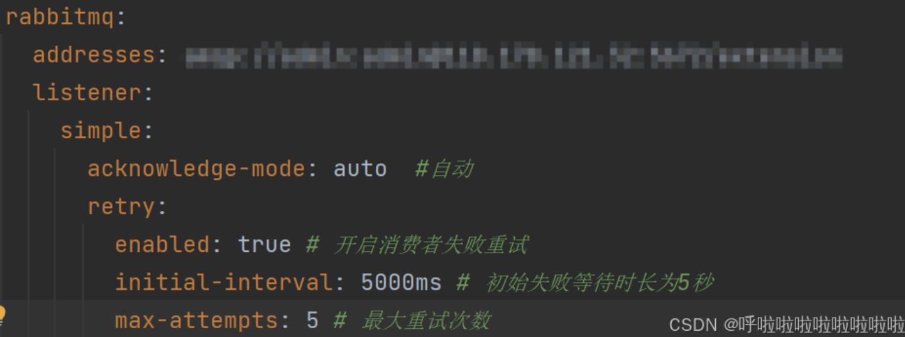

# RabbitMQ


## 一，20个面试题

**分类逻辑说明**

- **基础**：核心概念、基本组件、简单功能实现。
- **进阶**：可靠性保障、集群配置、监控与优化。
- **深入**：复杂场景设计、底层机制、系统级对比与调优。

### **一、基础问题（7 个）**

1. **RabbitMQ 的核心组件是什么？**
   （答案：Producer、Exchange、Queue、Consumer、Binding）

2. **四种交换机（Exchange）类型及用途？**
   （答案：Direct、Fanout、Topic、Headers）

3. **什么是死信队列（DLQ）？**
   （答案：消息因拒绝、TTL 过期、队列满时转入 DLQ）

4. **如何实现延迟队列？**
   （答案：TTL + 死信队列）

5. **什么是预取计数（Prefetch Count）？**
   （答案：`channel.basicQos` 限制未确认消息数量）

6. **如何防止重复消费？**
   （答案：消费者幂等性、消息 ID 去重）

7. **RabbitMQ 的流式队列（Quorum Queues）是什么？**
   （答案：基于 Raft 的高可用队列，`x-queue-type=quorum`）

8. 消息队列的作用和优点？

   (流量削峰，异步，解偶，顺序性（先进先出）)

------

### **二、进阶问题（7 个）**

1. **:star::star: :star: 如何保证消息不丢失？**
   （答案：生产者确认、持久化、手动 ACK）
2. **RabbitMQ 集群模式如何工作？**
   （答案：普通集群元数据同步 vs. 镜像队列消息同步）
3. **如何实现优先级队列？**
   （答案：队列设置 `x-max-priority`，消息设置 `priority`）
4. **RabbitMQ 如何实现高可用？**
   （答案：镜像队列 + HAProxy/Keepalived）
5. **如何监控 RabbitMQ 的性能？**
   （答案：`rabbitmq-management`、Prometheus、命令行工具）
6. **RabbitMQ 如何处理消息的 TTL（生存时间）？**
   （答案：队列级 `x-message-ttl` vs. 消息级 `expiration`）
7. **如何实现 RabbitMQ 的权限控制？**
   （答案：`rabbitmqctl set_permissions` 分配 configure/write/read 权限）

------

### **三、深入问题（6 个）**

1. **如何保证消息的顺序性？**
   （答案：单队列单消费者、消息分组路由）

1. **RabbitMQ 如何实现分布式事务？**
   （答案：生产者确认 + 消费者手动 ACK 替代 XA）
2. **RabbitMQ 的内存和磁盘使用机制是什么？**
   （答案：内存阈值持久化、持久化队列直接写磁盘）
3. **RabbitMQ 的插件机制有哪些实际应用？**
   （答案：延迟消息插件、消息追踪插件、分片插件）
4. **RabbitMQ 如何与 Kafka 对比？**
   （答案：AMQP 协议 vs. 发布-订阅模型，低延迟 vs. 高吞吐）
5. **如何设计一个高并发的 RabbitMQ 系统？**
   （答案：批量发送、多线程消费、镜像队列 + 集群分片）


### 最佳问题：

1. 如何保证消息不丢失？


## 二，面试题答案


### **一、基础问题（8 个）**

#### 1.1 **RabbitMQ 的核心组件是什么？**

（答案：Producer、Exchange、Queue、Consumer、Binding）

- **Producer**：消息生产者。
- **Exchange**：接收消息并根据路由规则分发到队列。
- **Queue**：存储消息的缓冲区。
- **Consumer**：消息消费者。
- **Binding**：定义 Exchange 和 Queue 的关联关系。


#### 1.2 **四种交换机（Exchange）类型及用途？**

（答案：Direct、Fanout、Topic、Headers）

- **Direct**：精确匹配 Routing Key。
- **Fanout**：广播到所有绑定队列。（不需要routing key）
- **Topic**：模糊匹配 Routing Key（支持通配符 `*` 和 `#`）。
- **Headers**：通过消息头匹配（不常用）。


#### 1.3 **什么是死信队列（DLQ）？**

（答案：消息因拒绝、TTL 过期、队列满时转入 DLQ）

当消息因以下原因无法被消费时，会进入死信队列：

1. 被拒绝并且不是重新入队列
2. 消息过期ttl 
3. 队列满后

#### 1.4 **如何实现延迟队列？**

（答案：TTL + 死信队列）

1. 消息过期+ 死信队列
2. **官方插件** -延迟队列插件

#### 1.5 **什么是预取计数（Prefetch Count）？**

（答案：`channel.basicQos` 限制未确认消息数量）

`channel.basicQos(prefetchCount)` 限制消费者未确认消息的最大数量，避免单个消费者过载。

#### 1.6 **如何防止重复消费？**

（答案：消费者幂等性、消息 ID 去重）

- 消费者实现幂等性（如数据库唯一约束、Redis 去重）。
- 业务逻辑中检查唯一消息 ID 是否已处理。

> **幂等性（Idempotence）** 是计算机领域的一个重要概念，表示 **对同一个操作的多次执行，结果与一次执行完全相同**

**产生的原因：**

消费端消费成功后：ack 未回复，或者服务器未收到，或者错误回复等，导致消息重回队列；

生产端：发送确认，未收到服务器的ack，或者网络断开导致消息从发。

#### 1.7 **RabbitMQ 的流式队列（Quorum Queues）是什么？**

（答案：基于 Raft 的高可用队列，`x-queue-type=quorum`）

#### 1.8 **消息队列的作用和优点？**

------

### **二、进阶问题（7 个）**

#### 2.1 **如何保证消息不丢失？**

（答案：生产者确认、持久化、手动 ACK）

> https://cloud.tencent.com/developer/article/2470707

​    这个问题，涉及到rabbitmq 中大量的流程和核心知识，要回答这个问题，要从 发送端确认，消息退回，发送端事务，生产者，服务器（交换机，消息队列，消息）都持久化；消费端-手动消费确认，消费失败从新尝试，死信队列，过期时间，分布式（缓存还未刷盘）；

**生产端：**

1. 生产者 发送确认： 由于网络可能无法到服务器（只能到）

    **Exchange,这个监听都会被执⾏,如果Exchange成功收到,ACK( Acknowledge character ,确认字符)为true,如果没收到消息,ACK就为false.**

2. 生产端开启消息会退： 绑定到一个错误的routtingkey 中； 能够发送到交换机，但是没有队列接受；（默认配置会被丢弃）

   ```java
   rabbitTemplate.setReturnsCallback(new RabbitTemplate.ReturnsCallback() {
               @Override
               public void returnedMessage(ReturnedMessage returnedMessage) {
                   System.out.println("消息退回:"+returnedMessage);
               }
           });
   ```

3. 事务：也可以达到发送确认-只能用于消费端


**无服务：三个持久化**

1. 交换机持久化： rabbitmq 重启，交换机没有了；

2. 消息持久化： 消息保持硬盘

3. 消息队列持久化：

   > ==消息==，或者消息队列没有持久化服务重启都将丢失

**消费端：**

1. **消费端手动确认**消费成功：消费失败或者异常重新回队列

   > 果消费者处理消息失败或者抛出异常，消息 **不会自动退回队列**，并且会被 **丢弃**。这是因为 RabbitMQ 默认使用的是 **自动确认**（auto-ack）机制，在消费者获取到消息时，RabbitMQ 就会认为消息已经被消费并自动确认。

   这里 有个最佳方案：

   1. 手动确认，消费失败重回队列/转延迟队列，多次失败-转死信队列（人工处理）
   2. 要避免消息堆积，设置合理的队列长度，过期时间，多次失败转死信队列

   ```java
   channel.basicConsume("queue", false, (consumerTag, delivery) -> {
       try {
           // 处理消息...
           processMessage(delivery.getBody());
           
           // 处理成功：显式 ACK
           channel.basicAck(delivery.getEnvelope().getDeliveryTag(), false);
       } catch (Exception e) {
           // 处理失败：检查重试次数
           int retryCount = getRetryCount(delivery.getProperties());
           if (retryCount < MAX_RETRIES) {
               // 重试：重新入队（或延迟队列）
               channel.basicNack(deliveryTag, false, true);
           } else {
               // 放弃：转死信队列
               channel.basicNack(deliveryTag, false, false);
           }
       }
   });
   ```

2. ==注意== rabbitmq 也提供了重试机制-允许消息处理失败重新发送（自动确认-默认配置）也能达到

   

```
# 应用配置示例
rabbitmq:
  retry:
    max_attempts: 5
    initial_interval: 3000  # 3 秒
    multiplier: 2           # 指数因子
    max_interval: 60000     # 最大间隔 60 秒
```

通过上面 发送确认，持久化，消费确认，死信队列，也不能达到百分百。问题在此久化-服务器并不是同步刷到磁盘-有缓存--- （集群-镜像队列了）


#### 2.2 **RabbitMQ 集群模式如何工作？**

（答案：普通集群元数据同步 vs. 镜像队列消息同步）

#### 2.3 **如何实现优先级队列？**

（答案：队列设置 `x-max-priority`，消息设置 `priority`）

### 一、优先级队列的实现原理

RabbitMQ 的优先级队列基于消息的 `priority` 属性，队列会优先投递高优先级的消息给消费者。其核心机制是：

1. **队列需声明支持优先级**（`x-max-priority` 参数）。
2. **消息需设置 `priority` 属性**（0-255，值越大优先级越高）。

二、实现步骤

#### 1. 声明优先级队列

在创建队列时，通过参数 `x-max-priority` 指定队列支持的最大优先级（建议值 1-255）：

```
channel.queue_declare(
    queue='priority_queue',
    arguments={'x-max-priority': 10}  # 允许优先级范围为 0-10
)
```

#### 2. 发送优先级消息

发布消息时，通过 `priority` 属性指定消息优先级：

```
channel.basic_publish(
    exchange='',
    routing_key='priority_queue',
    body='High Priority Message',
    properties=pika.BasicProperties(priority=10)  # 最高优先级
)
```

3. 消费者自动处理

消费者无需特殊配置。RabbitMQ 会自动按优先级顺序投递消息：

```
def callback(ch, method, properties, body):
    print(f"Received: {body} (Priority: {properties.priority})")

channel.basic_consume(queue='priority_queue', on_message_callback=callback)
channel.start_consuming()
```

三、==注意事项==

1. **优先级生效场景**：
   - 仅当消息堆积时，优先级才会体现（若队列为空，新消息会立即被消费）。
   - 消费者需处于空闲状态才能立即处理高优先级消息。
2. **内存与性能**：
   - 高优先级队列会增加内存和 CPU 开销（内部使用堆结构排序）。
3. **与其他插件兼容性**：
   - 优先级队列与 `消息TTL`、`队列长度限制` 等功能结合时，高优先级消息可能因过期或溢出被丢弃。

四、示例场景

假设一个订单处理系统：

```java
# 紧急订单（优先级=10）
channel.basic_publish(
    properties=pika.BasicProperties(priority=10),
    body='URGENT: Order #1234'
)

# 普通订单（优先级=1）
channel.basic_publish(
    properties=pika.BasicProperties(priority=1),
    body='Normal: Order #5678'
)
```

消费者会优先处理 `URGENT` 订单。

五、排查常见问题

- **优先级不生效**：检查队列是否设置了 `x-max-priority`。
- **优先级范围错误**：消息的 `priority` 值不可超过队列声明的最大值。
- **消费者预取限制**：若设置了 `channel.basic_qos(prefetch_count=1)`，需确保消费者及时确认消息。

通过合理配置优先级队列，可以实现关键任务优先处理的业务需求。


#### 2.4 **RabbitMQ 如何实现高可用？**

（答案：镜像队列 + HAProxy/Keepalived）

#### 2.5 **如何监控 RabbitMQ 的性能？**

（答案：`rabbitmq-management`、Prometheus、命令行工具）

#### 2.6 **RabbitMQ 如何处理消息的 TTL（生存时间）？**

（答案：队列级 `x-message-ttl` vs. 消息级 `expiration`）

#### 2.7 **如何实现 RabbitMQ 的权限控制？**

（答案：`rabbitmqctl set_permissions` 分配 configure/write/read 权限）

------

### **三、深入问题（6 个）**

1. **如何保证消息的顺序性？**
   （答案：单队列单消费者、消息分组路由）

   - **单消费者和单队列**是保证消息顺序性最简单且直接的方式。
   - 如果需要多个消费者或多个队列，可以通过合理的路由和消费者设计，确保每个消费者或每个队列内的顺序得到保障。

   **rabbitmq自身的特性：**

   本身是先近先出队列，在多消费者情况中，可能会打乱顺序。要么单一队列+单一消费线程；

   或者通过设置分组，**使用消息的标识来区分顺序**：在消息中增加一个序号或唯一标识符，消费者处理消息时

   

2. **RabbitMQ 如何实现分布式事务？**
   （答案：生产者确认 + 消费者手动 ACK 替代 XA）

3. **RabbitMQ 的内存和磁盘使用机制是什么？**
   （答案：内存阈值持久化、持久化队列直接写磁盘）

4. **RabbitMQ 的插件机制有哪些实际应用？**
   （答案：延迟消息插件、消息追踪插件、分片插件）

5. **RabbitMQ 如何与 Kafka 对比？**
   （答案：AMQP 协议 vs. 发布-订阅模型，低延迟 vs. 高吞吐）

6. **如何设计一个高并发的 RabbitMQ 系统？**
   （答案：批量发送、多线程消费、镜像队列 + 集群分片）


## 二，10个生产面临的问题

