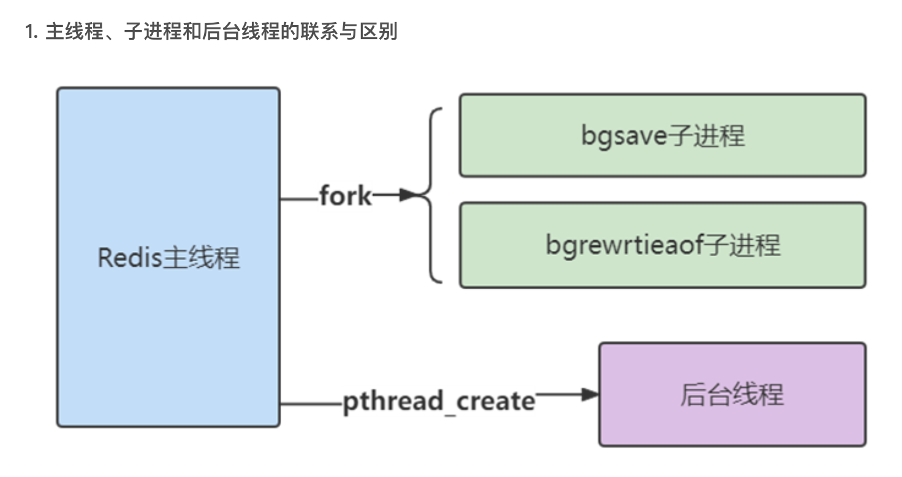
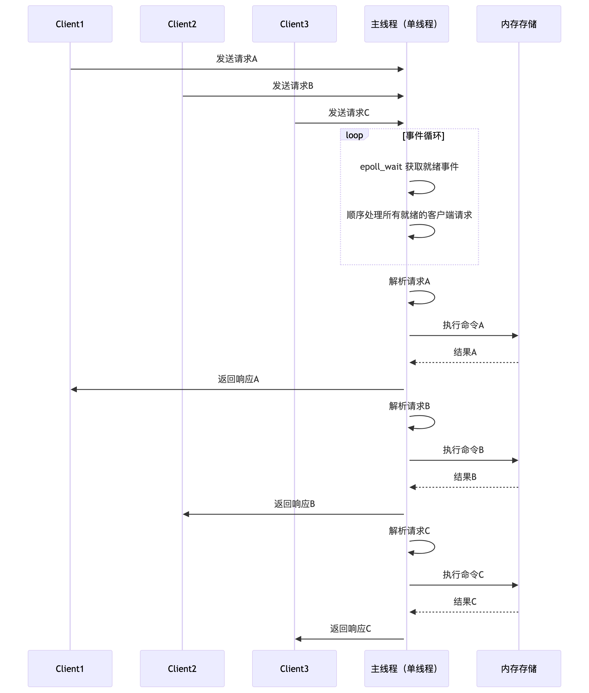
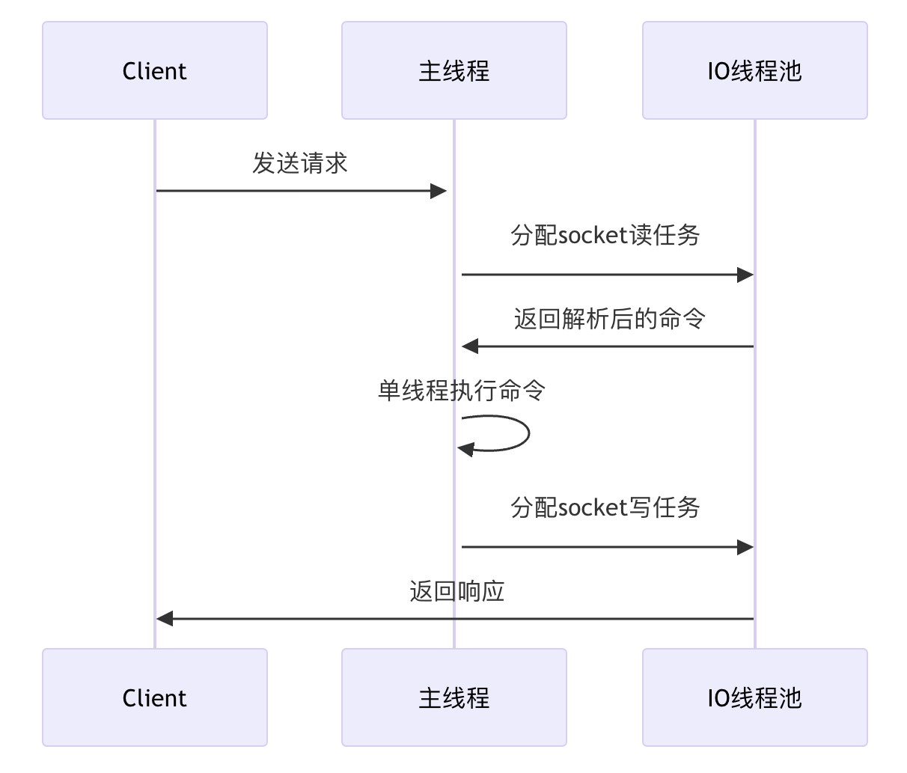

# redis 6.0 

 高的版本可以能有些编码的 名称已经改变


## 一，20个面试问题

涵盖了从基本概念、数据结构、持久化机制、复制与高可用、分布式架构到优化与高级应用等多个方面。

### 1，基础篇

- Redis是什么？解决什么问题？
- Redis支持哪些数据类型？分别举一个实际使用场景。
- Redis 提供哪两种主要的持久化机制？各有什么优缺点？
- 如何防止缓存穿透、缓存击穿和缓存雪崩问题？

### 2，进价

- Redis 如何实现高可用？
- **Redis的主从复制原理是什么？**
- Redis 哨兵原理是什么？
- **Redis Cluster的数据分片机制是什么？**
- **Redis的事务（MULTI/EXEC）能保证ACID吗？为什么？wacth 命令+事务**
- **Pipeline的作用是什么？与普通命令的区别？**
- Redis 如何使用 Lua 脚本？其优势有哪些？
- 如何保证Redis与数据库的数据一致性？

### 3，高级

- **Redis的内存淘汰策略有哪些？如何选择？**

- **Redis的底层数据结构是什么？举例说明。**

- **Redis如何处理大Key问题？**

- **如何用Redis实现分布式锁？有什么注意事项？**

- **Redis的发布订阅（Pub/Sub）和消息队列有什么区别？ 它的局限性是什么** 

- 如何对 Redis 进行性能优化？有哪些常见的优化策略？

- Redis 运行久了变得很慢？原因有那些？如何解决？

  

### 4，深度

- 一个秒杀系统，多个客户端高并发减库存，如何保证库存正确，请用redis中的多种方案？
- Redis的线程模型是什么？单线程模型如何保证高性能？
- **Redis 6.0的多线程模型是如何工作的？**

- Redis 中的大==key==,那些场景会产生,如何解决？(坑：这里的key 不是 字典中 key value 中的key,而是指 存储的value)
- Redis 中子进程，后台线程，主线程，多线程说他们的作用？


## 二，面试答案

### 1. 1，Redis是什么？解决什么问题？

答：

它是一个开源，它的key-value 型的内存数据库，称为 NoSQL 数据库。它支持多种数据类型，如字符串，列表，hash，set，zset，bitmap,gen地理空间索引。它常用用于高速缓存，实时统计，排名，电商，社交系统中。大幅提供系统的速度和吞吐率。

### 1.2，Redis支持哪些数据类型？分别举一个实际使用场景。

答：

> 1. string:  简单的key-value，可以用来 文本，计数，二进制等 缓存或者计数。
> 2. list: 有序的链表：支持 商都，插入和弹出
> 3. set： 无序的 集合， 交集，并集，差集，去重
> 4. zset：排行榜，在集合的基础上给每个元素添加分数，按照分数排名，场景排行榜，
> 5. Hash： 键和值都是字符串的映射，适合存储对象（如用户信息）的属性。
> 6. ....

- **字符串（String）：** 最简单的键值对存储，可存储文本、数字、二进制数据等；常用于缓存、计数器、简单的数据存取。
- **列表（List）：** 有序链表结构，支持从两端插入或弹出；适合实现消息队列、任务调度、时间线等。
- **集合（Set）：** 无序且唯一的元素集合，支持交、并、差集运算；适合去重、标签等需求。
- **有序集合（Sorted Set）：** 在集合的基础上为每个元素关联一个分数，元素按分数排序；常用于排行榜、延时队列。
- **哈希（Hash）：** 键和值都是字符串的映射，适合存储对象（如用户信息）的属性。
- **位图（Bitmap）：** 基于字符串的位操作，可用于实现用户签到、在线状态等布尔值集合的统计。
- **HyperLogLog：** 一种概率性数据结构，用于基数统计（如网站独立访客），内存占用固定且较小。
- **地理空间（Geospatial）：** 用于存储地理位置信息，支持半径查询等操作。

### 1.3，Redis 提供哪两种主要的持久化机制？各有什么优缺点？

答：

1. 快照： 全局快照存储，一个很重的炒作，费资源，快速恢复，丢失一定数据
2. aof-：命令追加： 当有数据改变时追加的是操作命令，数据完整性高，体积大，恢复慢
3. redis 4.0 混合：

实际生产中，可同时开启 RDB 和 AOF，利用 RDB 快速恢复，AOF 保证数据安全。

Redis 提供了两种主要的持久化机制：**RDB（Redis Database）** 和 **AOF（Append Only File）**。它们的核心区别在于数据持久化的实现方式和适用场景。


#### RDB（快照持久化）

#### **原理**

RDB 通过生成某个时间点的数据快照（Snapshot）保存到磁盘。触发方式可以是手动（`SAVE`/`BGSAVE`）或自动（配置定时任务）。

#### **优点**

- **高性能**：
  生成 RDB 文件时，Redis 会 fork 子进程处理持久化，主进程几乎不受影响（仅 fork 时有短暂阻塞）。
- **快速恢复**：
  RDB 是紧凑的二进制文件，恢复大数据集时速度远快于 AOF。
- **适合备份**：
  快照文件是单一文件，便于备份和灾难恢复。
- **节省资源**：
  相比 AOF，RDB 对磁盘和内存的占用更小。

#### **缺点**

- **数据丢失风险**：
  若 Redis 崩溃，最后一次快照后的数据会丢失（取决于配置的保存频率，如默认 5 分钟）。
- **大数据量时 fork 可能阻塞**：
  数据集较大时，fork 子进程可能导致主进程短暂阻塞（尤其在内存不足的机器上）。
- **实时性低**：
  无法做到秒级持久化，不适合对数据一致性要求极高的场景。

##### **2. AOF（日志追加持久化）**

###### **原理**

AOF 记录所有写操作命令（如 `SET`、`DEL`），以追加方式写入文件。Redis 重启时通过重放这些命令恢复数据。

##### **优点**

- **数据安全性高**：
  支持多种同步策略（`appendfsync`）：
  - `always`：每条命令同步，数据零丢失（性能最低）。
  - `everysec`：每秒同步（默认，最多丢失 1 秒数据）。
  - `no`：由操作系统决定，平衡性能与安全。
- **可读性强**：
  AOF 文件是文本格式，便于人工分析或修复。
- **自动重写优化**：
  Redis 会定期压缩 AOF 文件（移除冗余命令），减少磁盘占用。

#### **缺点**

- **文件体积大**：
  AOF 文件通常比 RDB 大（尤其是未重写时）。
- **恢复速度慢**：
  重放 AOF 日志恢复数据比加载 RDB 慢。
- **写入负载高**：
  在高并发场景下，AOF 的频繁写入可能影响性能（但 `everysec` 模式通常可接受）。

**3. 混合持久化（Redis 4.0+）**

Redis 4.0 引入了混合持久化（`aof-use-rdb-preamble`），结合了 RDB 和 AOF 的优势：


- **全量数据**：使用 RDB 格式保存，恢复速度快。
- **增量数据**：后续的写操作以 AOF 格式追加，减少数据丢失风险。
  **优点**：兼顾恢复速度和数据安全性；**缺点**：实现复杂度较高。

------

### **选择建议**

| **场景**              | **推荐机制**           |
| :-------------------- | :--------------------- |
| 允许分钟级数据丢失    | RDB                    |
| 要求高数据安全性      | AOF（`everysec` 模式） |
| 快速恢复 + 低磁盘占用 | RDB                    |
| 需要平衡性能与安全性  | 混合持久化             |

>  实际生产中，可同时开启 RDB 和 AOF，利用 RDB 快速恢复，AOF 保证数据安全。5.0 默认情况是 是开启混合持久化


#### 1. 4, 如何防止缓存穿透、缓存击穿和缓存雪崩问题？

1. 缓存三大问题- **缓存击穿**

   一个热点key 正好过期：大量的查询到达数据库，导致数据库压力

   解决办法：

   1. 不过期：设置热点数据不过期，永远不过期
   2. 定时更新：要过期时定时更新这个key，比如100分钟过期，99时定时更新
   3. 对key 的null值加互斥锁，获得锁请求，查询数据去加载数据，没有获得锁的，睡眠100毫秒再查询（对是null值的时候 使用分布式锁，获取再去加载值数据库到缓存）
      1. **第一次检查**：快速判断是否需要加载数据。
      2. **第二次检查**：获取锁后再次确认，避免重复加载（其他线程可能已更新缓存）。
      3. **超时时间**：锁的过期时间（如 5 秒）需大于数据库查询耗时，但不宜过长。
      4. **原子释放**：使用 Lua 脚本确保 `GET` + `DEL` 的原子性，避免误删其他线程的锁。
      5. **退避策略**：未获锁时休眠 100ms，降低 Redis 压力。可进一步优化为指数退避（如 50ms → 100ms → 200ms）

2. 三大问题-**缓存穿透**

   大量的查询 ：数据库中也没有key，也就是大量的查询直接到数据库中查询，导致数据库压力

   解决办法：

   1. 接口上，对查询参数严格的校验，提前去除有问题的产生，比如：一个int id  不可能为负数吧；
   2. 没有key 缓存 null 值或者默认值
   3. 应用启动时，数据写入时，使用布隆过滤器做标记，一种概率过滤器，把大量的key 映射到bit 位的数组上，判断一个元素 一定没有，或者可能没有

3. 三大问题-**缓存雪蹦**

   大量的key 同时失效，或者redis挂掉：导致直接查询数据库导致数据库压力

   解决办法：

   1. 均匀的分布过期的时间，而不是设置集中过期时间，比如：过期时间中添加随机值
   2. 提前预热： 对即将到来的缓存查询提前 加载
   3. 提高redis可用性： 采用哨兵模式，或者redis cluster 模式


### 2.1，Redis 如何实现高可用？

 答： 1:主从复制，2，Sentinel  哨兵模式 ；3: redis 集群（分片策略）

（主从复制、哨兵模式、Redis Cluster）


### 2. 2，Redis 主从复制原理

这个问题，详细细节很多，暂时回答一个重要的流程，  重点**全量同步**，**部分同步**，**命令传播**，

关键机制：**唯一的数据版本**；**偏移量id**；**复制积压缓存**；**心跳**


一，安装docker   

启动 redis-6379； redis-6378； redis-6377

二， 使用命令进行 主从

```shell
REPLICAOF host port  # host 不要能使127.0.0.1（循环地址）。 要么本机ip 要么 docker 内部 172.17.0.*

#变成 某个的slave
REPLICAOF 192.168.0.4 6379 
REPLICAOF 192.168.0.4 6379 
# 脱离 某个master
SLAVEOF NO ONE

info #查看当前redis 状态
```

```shell
# Replication
role:master
connected_slaves:2
slave0:ip=172.17.0.1,port=6379,state=online,offset=194,lag=0
slave1:ip=172.17.0.1,port=6379,state=online,offset=194,lag=0
```

三，数据的同步

1. 全局同步，第一次连接，生产 快照 发送给 slave
2. 增量同补：异步同步，先写缓存区，在给slave 发送写命令，增加加偏移量
3. ==异步命令发生==？？

四，客户端如何连接

1. 客户端 自己路由，连接全部的 主节点，从节点。

> 主节点 定时检测 从节点是否下线，从节点 每秒给主节点发送 自己的 offset

**优点**：一定上减轻来一个节点的压力可以使用读写分离，从节点只能读

**缺点**：1: 但是 master挂掉 就不可用； 需要手动启动，或者手动命令把变成master 


**1. 建立连接**

- **从节点主动连接**：从节点通过`SLAVEOF`命令（或配置文件）指定主节点IP和端口，发起连接请求。
- **主节点验证**：若主节点配置了`requirepass`，从节点需提供密码认证（`AUTH`命令）。

**2. 数据同步**

**2.1 全量同步（Full Resynchronization）**

- **触发条件**：从节点首次连接，或主从复制ID（Replication ID）不匹配（主节点发生切换）。
- 流程：
  1. 主节点执行`BGSAVE`生成**RDB快照**，同时缓存后续写命令到**复制缓冲区**（Replication Buffer）。
  2. RDB文件生成后，主节点将其发送给从节点。
  3. 从节点清空旧数据，加载RDB文件恢复数据。
  4. 主节点将复制缓冲区中的写命令发送给从节点，使其达到最新状态。

**2.2 部分同步（Partial Resynchronization）**

- **触发条件**：主从复制ID一致，且从节点请求的偏移量（offset）在主节点的**复制积压缓冲区**（Repl Backlog Buffer）范围内。
- 流程：
  1. 主节点仅发送从节点缺失的增量命令。
  2. 从节点应用增量命令，快速追上主节点。

**3. 命令传播（Command Propagation）**

- 同步完成后，主节点持续将**写命令**异步发送给从节点，保持数据一致。

**4. 关键机制**

- **复制ID（Repl ID）**：唯一标识主节点的数据版本。主节点重启或切换时，Repl ID会改变，触发全量同步。
- **复制偏移量（Offset）**：主从节点各自维护一个偏移量，记录已复制的数据量。
- **复制积压缓冲区**：主节点维护的固定大小环形缓冲区，保存最近的写命令，用于增量同步（默认1MB，可通过`repl-backlog-size`调整）。
- **心跳检测：**
  - 主节点每10秒向从节点发送`PING`，检测存活状态。
  - 从节点每秒向主节点发送`REPLCONF ACK <offset>`，上报自身复制偏移量。


### 2. 3，Redis 哨兵原理是什么？

> 是对 主从机构的单点故障的扩展，是一种一种高可用性解决方案，用于管理 Redis 主从架构中的故障检测与自动故障转移

1. 哨兵 必须 奇数个 3个起

2. 哨兵怎么相互监控的： 通过对监控的服务 维护了一个发布订阅的频道 获得

3. 哨兵如何 监控master 下线： 发送 ping， pong 如果没有回复 主管下线；

4. 哨兵 回询问其他的哨兵-确定是否真下线

5. 哨兵的选举-leader：raft 共识算法；先到先得，少数服从多数

6. 由leader 来自执行故障转移；

7. Slave 变成 master 其实是有哨兵决定：多个因素决定，优先级，同步的数据多，进程id 少

8. 客户端如何连接： 连接全部哨兵，从哨兵中获取 主，从节点，如果某个 master挂电，哨兵主动通知客户端 master变化； 

9. 需要客户端做一些事情，右客户单自己路由

   待手动配置

缺点： 每个slaver 还是存储全部数据，无法水平扩展

优点：解决故障转移

**客户端连接过程：**


**哨兵集群与监控**

- **多节点部署**：至少需 **3 个哨兵实例** 组成集群，避免单点故障，并通过共识机制（如 Raft 算法）协同工作。哨兵怎么相互监控的： 通过对监控的服务 维护了一个发布订阅的频道 获得
- **节点监控**：
  - 哨兵定期向主节点、从节点和其他哨兵发送 **心跳检测**（PING 命令）。
  - 若主节点在 `down-after-milliseconds` 内未响应，哨兵将其标记为 **主观下线（Subjectively Down, SDOWN）**。
  - ==哨兵自己下线==？

**2. 客观下线（Objectively Down, ODOWN）**

- 当某个哨兵认为主节点主观下线后，会通过 **`SENTINEL is-master-down-by-addr`** 命令询问其他哨兵。
- 若 **超过半数哨兵** 确认主节点不可达，则主节点被标记为 **客观下线**，触发故障转移流程。

**3. 领导者哨兵选举**

- 主节点客观下线后，哨兵集群通过 **Raft 算法** 选举一个 **领导者哨兵**（Leader Sentinel），由它负责故障转移。
- 选举规则：获得多数票的哨兵成为领导者，确保同一时间只有一个哨兵执行故障转移。

**4. 故障转移（Failover）**

领导者哨兵执行以下步骤：

1. **筛选新主节点**：
   - 排除网络不稳定的从节点。
   - 根据 **优先级（slave-priority）**、**复制偏移量（最大数据最新）** 等条件，选择最优从节点。
2. **提升新主节点**：
   - 向选中的从节点发送 **`SLAVEOF NO ONE`**，使其成为新主节点。
3. **切换从节点**：
   - 向其他从节点发送 **`SLAVEOF`** 命令，指向新主节点。
4. **更新旧主状态**：
   - 若旧主恢复，哨兵会将其设为新主的从节点。

**5. 通知与配置更新**

- **客户端通知**：哨兵通过 **发布订阅（Pub/Sub）** 向客户端广播新主节点的地址。
- **配置持久化**：故障转移后，哨兵自动更新本地配置文件，记录新主节点信息。

**关键机制**

- **脑裂防护**：通过多数派机制（Quorum）避免网络分区导致的多主问题。
- **自动纠正配置**：哨兵持续监控从节点，自动修复配置不一致问题。
- **客户端集成**：客户端通过哨兵获取主节点地址，支持自动重连至新主节点。


### 2. 4，Redis Cluster的数据分片机制是什么？

分布式 redis cluster- 原理

```shell
docker network create redis-cluster

# 启动 6 个 Redis 容器
for i in $(seq 1 6); do
  docker run -d --name redis-node$i \
    --net redis-cluster \
    -p 637$i:6379 \
    redis:latest --cluster-enabled yes \
                 --cluster-config-file nodes.conf \
                 --cluster-node-timeout 5000 \
                 --appendonly yes
done

# 进入一个启动 使用 redis-cli 172.18 默认的 172.17  
docker exec -it redis-node1 redis-cli --cluster create \
  172.18.0.2:6379 \
  172.18.0.3:6379 \
  172.18.0.4:6379 \
  172.18.0.5:6379 \
  172.18.0.6:6379 \
  172.18.0.7:6379 \
  --cluster-replicas 1
```

cluster.conf

1. 哈希曹，16834个操作- 使用01表示  16k bit ，2 kb 大小 
2. 最少6个实列，也就是最少 三主三从
3. 集群启动时，集群 同步个自的槽为信息，每个槽必须都有一个redis 负责
4. 客户端路由自己路由，如果set get 读写数据，如果不在当前的 实列上，回返回一个move  标识 并跟上 ip +端口 
5. 如果一个主节点挂点-从节点自己变成master


A I答案

Redis Cluster 的数据分片机制基于 **哈希槽（Hash Slot）** 设计，核心目的是将数据均匀分布到多个节点，同时支持动态扩展和高可用性。以下是其核心机制：

1. **哈希槽（Hash Slot）**

- **总槽数**：Redis Cluster 将所有数据划分为 **16384 个哈希槽**（编号 0~16383）。

- 键与槽的映射：

  每个键通过以下步骤分配到槽：

  1. 计算键的 `CRC16` 校验值。
  2. 将校验值对 `16384` 取模，得到对应的槽号：
     `slot = CRC16(key) % 16384`

- **哈希标签（Hash Tag）**：
  支持用 `{}` 包裹部分键名（如 `user:{1000}`），仅基于括号内的内容计算槽号，确保相关键分配到同一槽（用于多键操作）。

2. **槽与节点的分配**

- **节点负责槽的范围**：
  每个主节点负责一部分哈希槽（如 3 节点集群可能分配为 0~~5460、5461~~10922、10923~16383）。
- **动态调整**：
  槽的分配可动态调整（如扩容/缩容），Redis 通过 `CLUSTER ADDSLOTS` 等命令重新分配槽，数据会自动迁移到新节点。

3. **客户端请求路由**

- **直连正确节点**：
  客户端缓存槽与节点的映射关系，直接请求目标节点。若映射错误，节点返回 `MOVED` 错误并告知正确节点地址，客户端更新缓存。
- 重定向机制：
  - `MOVED`：永久重定向（槽已迁移到新节点）。
  - `ASK`：临时重定向（槽正在迁移中，需在新节点执行 `ASKING` 命令）。

4. **优势与限制**

- 优势：
  - 水平扩容/横向扩展：数据分散存储，突破单机内存和性能限制。
  - 无中心化架构：每个节点独立处理请求。
- 限制：
  - 跨槽多键操作（如事务、Lua 脚本）需确保键在同一节点（通过哈希标签）。
  - **客户端自己实现支持：**客户端需支持集群协议（处理重定向逻辑）/ 客户端需要支持 Cluster 协议，能够根据节点返回的重定向信息（MOVED/ASK）重新定位目标节点。

**槽迁移过程：**

- **原子性迁移**：以槽为单位，逐个迁移键。
- 非阻塞迁移：
  - 源节点将槽标记为`MIGRATING`状态。
  - 目标节点将槽标记为`IMPORTING`状态。
  - 迁移过程中：
    - 客户端访问**已迁移的键**：返回`ASK`重定向，引导客户端到目标节点。
    - 客户端访问**未迁移的键**：正常处理。

### 2.5，Redis的事务（MULTI/EXEC）能保证ACID吗？为什么？`WATCH` +事务

```bash
MULTI
SET balance 100
INCRBY balance -200  # 可能导致余额为负数（应用需检查）
EXEC
```

Redis 的事务通过 `MULTI`、`EXEC`、`WATCH` 等命令实现：

- 客户端使用 `MULTI` 命令开启事务，后续命令不会立即执行，而是进入队列；
- 当客户端发送 `EXEC` 命令时，队列中的所有命令将一次性顺序执行，保证了原子性（即在事务执行期间，其他客户端的命令不会插入执行）。

**注意：**
Redis 事务不支持内部命令的回滚。如果事务中的某个命令执行失败（比如由于错误的命令），其错误会返回，但其他命令仍然会执行。通过 `WATCH` 可以实现乐观锁，但依然没有传统意义上的事务回滚机制。

**Watch：**

- **乐观锁机制**：不阻塞其他客户端，仅在事务提交时检查键是否被修改。
- **事务失败处理**：若 `EXEC` 返回 `nil`（表示被监控的键已被修改），需重试整个逻辑。
- **自动取消监控**：无论事务成功或失败，`EXEC` 或 `DISCARD` 后，所有 `WATCH` 的键会被自动取消监控。

```java
// 伪代码（基于 Jedis）
int maxRetries = 3;
boolean success = false;
while (maxRetries-- > 0 && !success) {
    try (Jedis jedis = pool.getResource()) {
        jedis.watch("inventory:item001");
        int stock = Integer.parseInt(jedis.get("inventory:item001"));
        if (stock <= 0) {
            jedis.unwatch();
            break;
        }
        Transaction tx = jedis.multi();
        tx.decr("inventory:item001");
        List<Object> res = tx.exec();
        if (res != null) {
            success = true; // 扣减成功
        }
    } catch (Exception e) {
        // 处理异常
    }
}
```


### 2.6 **Pipeline的作用是什么？与普通命令的区别？**

批量发送命令，减少网络往返时间


### 2.7. Redis 如何使用 Lua 脚本？其优势有哪些？

**答案：**
Redis 允许通过 `EVAL` 或 `EVALSHA` 命令执行 Lua 脚本，脚本会在 Redis 服务器端运行：

- 优势：
  - **原子性：** 脚本中的所有命令作为一个整体执行，保证了原子性。
  - **减少网络往返：** 复杂逻辑集中在服务端执行，降低了客户端与服务端之间的交互次数。
  - **扩展性：** 可以在脚本中实现自定义复杂逻辑，如条件判断、循环等，增强 Redis 的功能。


### 2.8 **如何保证Redis与数据库的数据一致性？**

1. 先数据更新，再更新 redis 失败；
2. 先更新redis成功，再更新数据库失败；

> 双写策略、延迟双删、订阅binlog

..... 


### 3.1，**Redis的内存淘汰策略有哪些？如何选择？**如何配置？

> maxmemory 必须设置，不然无法触发

|       **策略**        |                         **行为描述**                         |             **适用场景**             |
| :-------------------: | :----------------------------------------------------------: | :----------------------------------: |
|   **`noeviction`**    | 默认策略。内存不足时，新写入操作会返回错误（OOM），**不删除任何键**。 |   数据不可丢失，宁愿拒绝写入的场景   |
|   **`allkeys-lru`**   |       从**所有键**中淘汰**最近最少使用（LRU）**的键。        |         通用缓存场景（推荐）         |
|  **`volatile-lru`**   |   从**设置了过期时间（TTL）的键**中淘汰最近最少使用的键。    | 混合存储（部分缓存、部分持久化数据） |
| **`allkeys-random`**  |                  从**所有键**中随机淘汰键。                  |        数据访问模式无明显规律        |
| **`volatile-random`** |            从**设置了过期时间的键**中随机淘汰键。            |       混合存储，随机淘汰过期键       |
|  **`volatile-ttl`**   | 从**设置了过期时间的键**中淘汰**剩余生存时间（TTL）最短**的键。 |         优先清理即将过期的键         |
|   **`allkeys-lfu`**   | 从**所有键**中淘汰**最不经常使用（LFU）**的键（Redis 4.0+ 支持）。 |     高频访问数据需长期保留的场景     |
|  **`volatile-lfu`**   | 从**设置了过期时间的键**中淘汰最不经常使用的键（Redis 4.0+ 支持）。 |    混合存储，需根据频率淘汰过期键    |

**设置内存上限**

在 `redis.conf` 中配置最大内存（必须设置，否则淘汰策略不生效）：

==注意== 

- 只有配置了 `maxmemory`（内存上限），Redis 才会在内存达到该阈值时，根据策略删除键。

- 若未设置 `maxmemory`（默认值为 `0`，即无限制），Redis 会**持续分配内存直到被操作系统 OOM Killer 杀死**，此时淘汰策略完全无效。

```
# 示例：设置最大内存为 1GB
maxmemory 1gb
```

支持的单位：`kb`, `mb`, `gb`，如 `maxmemory 512mb`。

2. **选择淘汰策略**

在 `redis.conf` 中配置策略（例如选择 `allkeys-lru`）：

```
maxmemory-policy allkeys-lru
```

### 3.2，**Redis的底层数据结构是什么？举例说明。**

1. string  
   1. int 正数
   2. embstr 小字符串
   3. 大字符串
2. hash
   1. 小数据 ziplist
   2. 大数据 hashtable 
3. list
   1. quicklist： 是一个双项链表 每个节点是 ziplist
4. set
   1. intset ： 都为整数
   2. hashtable 有非整数时
5. zset
   1. ziplist：小数据量，每个成员的字节 小于一个值 可配置的
   2. skiplist+ hashtable ：....

==未完继续==


### 3.3，**Redis如何处理大Key问题？** 

> 一个大string(json) 存储为什么建议 改成 hash，或者list

string 类型； 底层采用三种 编码方式，int，小字符串（连续内存），大字符串（非连续）

如果 json 很大 每次  使用set 更新 redis 会重新释放内存，重写分配内存；

1. 大的内存分配

2. 大数据的网络开销

3. 才分为hash： hash 底层数据编码：小数据 ziplist， 大数据hastable，它存储方式会为每个属性单独存储，更新修改时只需要更改其中对应的属性即可

   ```
   HSET user:123 name "Alice"
   HSET user:123 age 30
   HSET user:123 email "alice@example.com"
   ```

   

4. 对数据进行压缩： 优点是网络，内存减少了，但是 压缩，和减压去增加了cpu

5. **异步删除（Lazy Free）**大Key

   - Redis 4.0+支持异步删除大Key，避免阻塞主线程

6. 对单key 进行拆分

7. 对对集合类数据分片存储


**大key 的产生**

大Key通常指的是数据量过大的单个Key，比如字符串类型的Value超过10KB，或者集合、列表、哈希、有序集合等元素过多，比如超过5000个元素，或者总大小超过10MB。大Key会导致性能问题，比如阻塞其他请求，增加网络负载，甚至导致内存不足。


### 3.4 ，如何用Redis实现分布式锁？有什么注意事项？

**一、基础实现方法**

#### 1. **使用 `SET` 命令加锁**

通过 Redis 的 `SET` 命令结合 `NX`（不存在时设置）和 `PX`（过期时间）参数，确保原子性操作：

```
SET resource_name unique_value NX PX 30000
```

- **`resource_name`**: 锁的名称（唯一标识）。
- **`unique_value`**: 唯一值（如 UUID），用于安全释放锁。
- **`NX`**: 仅当键不存在时设置键。
- **`PX 30000`**: 锁的自动过期时间（毫秒），避免死锁。

2. **释放锁**

通过 Lua 脚本保证原子性删除（校验值匹配）：

```lua
if redis.call("get", KEYS[1]) == ARGV[1] then
    return redis.call("del", KEYS[1])
else
    return 0
end
```

- 使用 `EVAL` 执行脚本，确保校验值和删除操作是原子的。

**二、高级场景：Redlock 算法**

当 Redis 为多节点集群时，官方推荐 **Redlock 算法**（Redis Distributed Lock）来避免单点故障：

1. 客户端获取当前时间戳（T1）。
2. 依次向所有 Redis 节点请求加锁（使用相同的 `resource_name` 和 `unique_value`）。
3. 当从多数节点（N/2+1）获取锁成功，且总耗时小于锁的过期时间时，视为加锁成功。
4. 锁的实际有效时间 = 初始过期时间 - 获取锁的总耗时。
5. 若加锁失败，向所有节点发起解锁请求。

**三、注意事项**

1. **锁的过期时间**

- 必须设置合理的过期时间（大于业务执行时间），防止任务未完成锁自动释放。
- **续期机制**（看门狗）：对于长耗时任务，需定期续期锁（如 Redisson 的 `watchDog`）。

2. **唯一标识（unique_value）**

- 使用唯一值（如 UUID + 线程 ID）标识锁的持有者，避免误删其他客户端的锁。

3. **原子性操作**

- 加锁和设置过期时间必须通过 `SET NX PX` 原子操作完成，不能分开执行。
- 解锁需通过 Lua 脚本保证原子性，防止因并发导致误删。

4. **网络与时钟问题**

- **网络延迟**：客户端与 Redis 之间的网络延迟可能导致锁的实际有效期缩短。
- **时钟漂移**：如果 Redis 节点间时钟不同步，可能影响 Redlock 的准确性。

5. **避免重复处理**

- 锁释放后，即使业务逻辑未完成，其他客户端可能立即获取锁。需确保业务逻辑的幂等性。

6. **容错与重试**

- 加锁失败时，可设置合理的重试机制（如指数退避），但需避免活锁。
- 考虑 Redis 集群的高可用性（如 Sentinel 或 Cluster 模式）。

**四、推荐工具**

- **Redisson**：Java 客户端内置分布式锁实现，支持自动续期、可重入锁、公平锁等特性。
- **Lua 脚本**：用于保证复杂操作的原子性。
- **框架集成**：Spring 的 `@DistributedLock` 注解（需结合 Redisson 或自定义切面）。

**五、最佳实践**

1. **简单场景**：单节点 Redis 使用 `SET NX PX` + Lua 脚本解锁。

2. **高可用场景**：多节点 Redis 集群使用 Redlock 算法。

   1. 没有分片机制

   2. 所有节点发送 `SET NX PX` + Lua 

   3. **多数派确认** **超过半数节点（N/2 + 1）返回成功**时，

   4. 释放锁：发送释放lua 的脚步

      ```lua
      if redis.call("get", KEYS[1]) == ARGV[1] then
          return redis.call("del", KEYS[1])
      else
          return 0
      end
      ```

      

3. **生产建议**：优先使用成熟的客户端库（如 Redisson）而非自行实现。

**六、代码示例（Python + Redis）**

```python
import redis
import uuid
import time

redis_client = redis.StrictRedis()

def acquire_lock(lock_name, expire_time=30000):
    identifier = str(uuid.uuid4())
    end_time = time.time() + 5  # 超时时间
    while time.time() < end_time:
        if redis_client.set(lock_name, identifier, nx=True, px=expire_time):
            return identifier
        time.sleep(0.001)
    return False

def release_lock(lock_name, identifier):
    script = """
    if redis.call("get", KEYS[1]) == ARGV[1] then
        return redis.call("del", KEYS[1])
    else
        return 0
    end
    """
    result = redis_client.eval(script, 1, lock_name, identifier)
    return result == 1
```

**总结**

Redis 分布式锁的核心是 **原子性加锁** 和 **安全释放**，需结合业务场景选择合适的策略（单节点或 Redlock）。重点注意锁的过期时间、唯一标识、原子性操作和容错处理，避免死锁、误删和脑裂问题。

### 3.5，一个秒杀系统，多个客户端高并发减库存，如何保证库存正确？

可以方案：

Redis 的命令处理是单线程的，也就是说，同一时刻只有一个命令在执行。即使有多个客户端同时发送命令，这些命令也会被 Redis 按顺序依次处理，从而天然保证了每个命令都是原子执行的。例如，在秒杀场景中，如果多个客户端同时对库存进行 `DECR` 操作，Redis 会按顺序依次执行每个 `DECR` 命令，从而保证库存的正确减少。

**1. 原子性命令： 可能减到负数**
Redis 内置的很多命令（如 `INCR`、`DECR`、`GETSET` 等）本身就具备原子性，执行这些命令时不需要额外加锁或事务控制。例如，使用 `DECR` 命令可以确保库存的递减是原子操作，从而避免并发环境下的竞争问题。

**2. Lua 脚本- 推荐**
对于需要执行多步操作的场景（例如先检查库存是否充足，再扣减库存），可以利用 Lua 脚本在 Redis 中实现原子性操作。Redis 会在执行 Lua 脚本时保证脚本中的所有命令都作为一个整体原子执行，中间不会被其他客户端的命令打断。这样可以保证业务逻辑的完整性：

```lua
local stock = tonumber(redis.call('GET', KEYS[1]))
if stock > 0 then
    redis.call('DECR', KEYS[1])
    return 1
else
    return 0
end
```

```java
String script = "local current = redis.call('GET', KEYS[1]) " +
                "if tonumber(current) > 0 then " +
                "   return redis.call('DECRBY', KEYS[1], ARGV[1]) " +
                "else " +
                "   return -1 " +
                "end";
Object result = jedis.eval(script, Collections.singletonList(INVENTORY_KEY), Collections.singletonList("1"));

```

这个脚本会先获取库存，再判断是否充足，最后扣减库存，整个过程是原子的。


**3. 事务机制（MULTI/EXEC）** 高并发下重试多、性能差
虽然在单个命令层面 Redis 已经保证原子性，但对于一些需要组合多个命令的场景，也可以使用事务（`MULTI/EXEC`）来确保一组命令要么全部执行，要么全部不执行。不过需要注意的是，事务中的命令只是按顺序排队执行，Redis 并不会在事务内部进行错误检查，所以在复杂逻辑下，Lua 脚本通常是更好的选择。

```shell
WATCH inventory:item001       # 监控库存键
current = GET inventory:item001
if current > 0:
    MULTI
    DECRBY inventory:item001 1
    EXEC                      # 若库存未被其他客户端修改，事务执行成功
else:
    UNWATCH                   # 取消监控（可选）

```

```java
// 伪代码（基于 Jedis）
int maxRetries = 3;
boolean success = false;
while (maxRetries-- > 0 && !success) {
    try (Jedis jedis = pool.getResource()) {
        jedis.watch("inventory:item001");
        int stock = Integer.parseInt(jedis.get("inventory:item001"));
        if (stock <= 0) {
            jedis.unwatch();
            break;
        }
        Transaction tx = jedis.multi();
        tx.decr("inventory:item001");
        List<Object> res = tx.exec();
        if (res != null) {
            success = true; // 扣减成功
        }
    } catch (Exception e) {
        // 处理异常
    }
}
```

**4，锁** ：实现复杂、性能较低
如果在分布式系统中涉及到多个 Redis 实例之间的协同操作，或者需要跨进程保护某个资源，可以使用分布式锁机制（如 Redlock 算法）。不过对于单个 Redis 实例和单个 key 的原子操作而言，上述单线程模型和原子命令已经足够保证并发安全。

在 Redis 中实现分布式锁是一种常见需求，用于在分布式系统中协调多个进程/服务对共享资源的互斥访问。以下是使用 Redis 分布式锁的核心方法、实现步骤和注意事项：


### 3.6 Redis的发布订阅（Pub/Sub）和消息队列有什么区别？ 它的局限性是什么

1. 只有广播消息  vs 可以点对点消费，也可以广播
2. 消息没有持久功能  vs 可以存储队列中 直到被消费，或者过期
3. 没有ack 机制 vs 可以消费确认，可以重回队列
4. 消费者在线才能收到，没有历史消息 vs  离线重新上线继续消费
5. 消费端没有负载均衡机制 vs 可以配置消费者组 多个多个客户端 负载均衡消费，流量控制

**优点：** 低延时，实时广播，简单场景


### 3.7 如何对 Redis 进行性能优化？有哪些常见的优化策略？

1. 使用方面：合理选择数据类型，大string对象 使用hash 替代，避免 keys * 匹配
2. 内存方面： 合理
3. 网络方面：数据压缩，避免大key，拆分和数据压缩，多个命令使用批量操作**Pipeline**
4. 淘汰策略 ： 设置最大内存，最少使用淘汰策略
5. 集群化 ：
6. 监控+诊断工具 ：内存碎片率，记录慢查询，检测网络延迟
   1. **Redis 主线程 CPU 使用率**：
   2. **命令耗时分布**：使用 `INFO commandstats` 查看各命令的平均耗时（单位：微秒）。
   3. **`redis-cli --stat`**：实时监控每秒操作数（OPS）和 CPU 负载。
   4. **慢查询日志**：配置 `slowlog-log-slower-than`（如 10ms），通过 `SLOWLOG GET` 
   5. **`redis-cli --bigkeys`**：识别大 Key（如 Value 超过 10KB 的 String 或元素过多的 Hash）

### 3.8 Redis 运行久了变得很慢？原因有那些？如何解决？

**内存相关：**

1. 内存不足时 系统使用swap 交换

   1. 禁止 swap 交换
   2. 设置最大内存，请用淘汰机制

2. 内存碎片化

   1. 表现：`info memory`中`mem_fragmentation_ratio` > 1.5

   2. 解决方案：

      ```
      CONFIG SET activedefrag yes  # 开启自动碎片整理
      MEMORY PURGE                 # 手动触发碎片整理（4.0
      ```

**数据结构问题：**

1. 大key 
   1. 网络传输压力
   2. cpu 压力（数据编码，解码，大 list 扫描）
   3. 内存开销，内存碎片，分配

**持久化阻塞：**

1. **RDB fork延迟**


### 4.1 Redis的线程模型是什么？单线程模型如何保证高性能？

Redis的线程模型**以单线程为核心**，但在特定场景下结合多线程优化，其高性能的关键在于**内存操作、高效数据结构、I/O多路复用和单线程无锁设计**的综合作用。以下是详细解析：

一、Redis的线程模型演进

1. **经典单线程模型（Redis 5.0及之前）**
   - **单线程主循环**：所有客户端请求由单个线程顺序处理（命令解析、执行、返回结果）。
   - **后台线程**：仅用于异步任务（如AOF刷盘、大Key删除），不影响主线程。
2. **Redis 6.0+的多线程I/O**
   - **I/O多线程化**：主线程负责监听连接，将就绪的Socket分发给多个I/O线程进行**读写数据**（数据解析为命令仍由主线程执行）。
   - **命令执行保持单线程**：保证操作的原子性，无需处理锁竞争。

二、单线程模型的高性能保障

1. **内存操作**
   - 数据存储在内存中，读写速度比磁盘快几个数量级，单线程即可处理极高QPS（如10万+/秒）。
2. **非阻塞I/O多路复用**
   - 使用`epoll`（Linux）或`kqueue`（BSD）监听大量连接，单线程高效管理数万并发连接。
   - 示例：一个线程通过事件循环处理所有活跃连接，避免为每个连接创建线程。
3. **高效数据结构**
   - 全局哈希表、跳跃表、压缩列表等结构优化了查询效率，如哈希表查找时间复杂度O(1)。
4. **避免多线程竞争**
   - 单线程无锁、无上下文切换，减少CPU浪费，尤其适合高吞吐场景。
5. **Pipeline与批处理**
   - 客户端可将多个命令打包发送，减少网络往返时间（RTT），提升吞吐量。

三、单线程的局限性及应对

1. **CPU瓶颈**
   - 单线程无法利用多核CPU，可通过部署多个Redis实例或使用集群分片（Cluster模式）横向扩展。
2. **耗时操作阻塞**
   - **Keys \*、大Key删除**等操作会阻塞主线程，应使用`SCAN`迭代或异步命令（UNLINK）规避。
3. **持久化优化**
   - **RDB**：子进程生成快照，不影响主线程。
   - **AOF**：主线程写日志，根据配置由后台线程刷盘（appendfsync everysec）。

四、Redis 6.0+多线程I/O的意义

- **提升网络吞吐**：多线程处理网络读写，尤其对高带宽场景（如千兆网卡）效果显著。
- **保持命令执行单线程**：避免数据竞争，兼容原有原子性保证。

总结

Redis通过**单线程处理命令+多线程辅助I/O**的设计，在简化并发控制的同时最大化性能。其高性能核心在于：

- 全内存操作 + 高效数据结构
- 事件驱动的I/O多路复用
- 避免多线程上下文切换与锁竞争
- 持久化与扩展性的针对性优化

这一模型在高并发、低延迟场景中表现优异，但也需根据业务需求合理规避单线程潜在瓶颈。

### 4.2 **Redis 6.0的多线程模型是如何工作的？**

#### 一，6之前的单线程模型

- 从事件监听 →  epoll 监听可用事件，一次性得到多个就绪事件

- 数据读取 →socket 数据读取

-  协议解析 → 

- 命令执行 → 内存数据写，查

- 响应返回 socket 数据写入

- ==注意==  bgsave 一步是单独一个 子进程去处理 ；save 就是主线程去保持快照

- **子进程的任务**：子进程主要负责持久化相关的后台任务（如 RDB 快照和 AOF 重写），与命令的处理和数据同步无关。

- ==后台线程==    **后台线程**：用于**轻量级、异步**任务（如Key删除、AOF刷盘），避免阻塞主线

  ？？ 疑惑

  

**后台线程（Background Thread）**
存在性：Redis 4.0+ 开始引入后台线程（但功能有限）。

1. 异步删除大Key（通过 UNLINK 命令触发）。
2. 关闭文件描述符（如删除持久化文件后的资源释放）。
   AOF 刷盘（仅在 appendfsync everysec 模式下，由后台线程每秒执行一次 fsync）。
   注意：后台线程仅处理轻量级任务，不参与核心命令执行。

**子进程（Subprocess）：**

1. 生成 RDB 快照（通过 BGSAVE 命令触发）。
2. AOF 重写（通过 BGREWRITEAOF 命令触发）。



```c
// Redis 事件循环核心伪代码
void aeMain(aeEventLoop *eventLoop) {
    while (!eventLoop->stop) {
        // 阶段1：epoll_wait 监听事件（阻塞调用）
        int numevents = aeApiPoll(eventLoop, tvp); 

        // 阶段2：顺序处理所有就绪事件
        for (j = 0; j < numevents; j++) {
            // 处理读事件（客户端请求）
            if (fe->mask & AE_READABLE) {
                fe->rfileProc(eventLoop,fd,fe->clientData,mask);
            }
            
            // 处理写事件（响应返回）
            if (fe->mask & AE_WRITABLE) {
                fe->wfileProc(eventLoop,fd,fe->clientData,mask);
            }
        }
    }
}
```


#### 6 之后的多线程

|   处理阶段   |    执行线程    |                           具体任务                           | 是否并行化 |
| :----------: | :------------: | :----------------------------------------------------------: | :--------: |
|   事件监听   |     主线程     |         运行epoll_wait监听所有socket的可读/可写事件          |  ❌ 单线程  |
| **数据读取** |    IO线程池    |                 从内核缓冲区读取原始字节数据                 |  ✅ 多线程  |
| **协议解析** |    IO线程池    |                将RESP协议解析为Redis命令对象                 |  ✅ 多线程  |
|   命令执行   |     主线程     |                  执行内存操作（GET/SET等）                   |  ❌ 单线程  |
| **数据写入** |    IO线程池    |        将响应结果序列化为RESP协议并写入内核发送缓冲区        |  ✅ 多线程  |
|  后台持久化  | ==后台子进程== |             执行bgsave/bgrewriteaof等持久化操作              |   ✅ 独立   |
|              |    后台线程    | **后台线程**：用于**轻量级、异步**任务（如Key删除、AOF刷盘），避免阻塞主线程。 |            |



```c
// 主线程事件循环
void aeMain() {
    while(!stop) {
        // 阶段1：监听事件（单线程）
        events = epoll_wait(...);
        
        // 阶段2：分发读任务到IO线程池
        for (fd in read_events) {
            assign_to_io_thread(fd, READ_TASK);
        }
        
        // 阶段3：等待IO线程完成读+解析
        wait_io_threads_complete();
        
        // 阶段4：单线程执行命令
        execute_commands();
        
        // 阶段5：分发写任务到IO线程池
        for (response in responses) {
            assign_to_io_thread(fd, WRITE_TASK);
        }
    }
}

// IO线程工作函数
void* io_thread_func() {
    while(1) {
        task = get_task_from_queue();
        if (task.type == READ) {
            read(fd, buf);        // 多线程读
            parse_resp(buf);      // 多线程解析
        } else {
            write(fd, response);  // 多线程写
        }
    }
}

```


### 4.3. Redis 中的大==key==,那些场景会产生,如何解决？(坑：这里的key 不是 字典中 key value 中的key,而是指 存储的value)


### 4.4. Redis 中子进程，后台线程，主线程，多线程说他们的作用？

.....


## 二，实际应用中面临的问题

列举常见的问题，比如缓存穿透、雪崩、击穿，大Key和热Key的问题，持久化相关的性能问题，主从同步延迟，数据一致性，内存管理，集群问题，网络延迟，慢查询，并发竞争，客户端连接问题，以及版本升级和监控等

### **1. 缓存穿透（Cache Penetration）**

- **问题**：大量请求查询不存在的数据（如无效的ID），绕过缓存直接击穿到数据库。
- 解决方案：
  - **空值缓存**：对不存在的数据设置短时间空值（如 `SET key-null 5s`）。
  - **布隆过滤器（Bloom Filter）**：在缓存层前加布隆过滤器，预判数据是否存在。
  - **接口限流/鉴权**：过滤非法请求（如无效ID格式）。
  - 接口参数检验：过滤无效的参数

------

### **2. 缓存雪崩（Cache Avalanche）**

- **问题**：大量缓存在同一时间过期，导致请求全部打到数据库。
- 解决方案：
  - **随机过期时间**：给缓存设置基础过期时间 + 随机偏移值（如 `TTL = base + random(0, 300s)`）。
  - **高可用架构**：使用 Redis Cluster 或哨兵模式避免单点故障。
  - **多级缓存**：本地缓存（如 Caffeine）+ Redis 分散风险。

------

### **3. 缓存击穿（Cache Breakdown）**

- **问题**：某个热点 Key 突然失效，高并发请求直接穿透到数据库。
- 解决方案：
  - **永不过期 + 异步更新**：不设置过期时间，通过后台任务定期更新。
  - **互斥锁（分布式锁）**：使用 Redis 的 `SETNX` 或 Redisson 实现锁，确保只有一个线程重建缓存。
  - **逻辑过期**：Value 中存储过期时间，由业务判断是否需要异步更新。

------

### **4. 大 Key（Big Key）问题**

- **问题**：单个 Key 的 ==Value== 过大（如 1MB 以上的 String 或百万元素的 Hash），导致阻塞、网络延迟、内存不均。

- 解决方案：
  - **拆分 Key**：将一个 Hash 拆分为多个子 Hash（如 `user:1000:info1`, `user:1000:info2`）。
  
  - **压缩 Value**：使用 Snappy、Gzip 等压缩算法。
  
  - **异步删除**：避免直接 `DEL`，使用 `UNLINK`（非阻塞删除）。  
  
    ```
    unlike key1 key2 # 后端异步处理
    ```
  
  - **监控工具**：通过 `redis-cli --bigkeys` 或自定义脚本定期扫描。

------

### **5. 热 Key（Hot Key）问题**

- **问题**：某个 Key 被高频访问（如秒杀商品），导致单节点压力过大。
- 解决方案：
  - **本地缓存**：在应用层（如 JVM）缓存热 Key，降低 Redis 压力。
  - **分片打散**：对 Key 添加随机后缀（如 `product:1000_{1..N}`），分散到不同节点。
  - **读写分离**：通过主从架构将读请求分散到从节点。

------

### **6. 数据不一致**

- **问题**：缓存与数据库数据不一致（如先更新数据库后删缓存失败）。
- 解决方案：
  - **延迟双删**：更新数据库后，先删缓存，延迟若干毫秒再删一次。
  - **订阅数据库 Binlog**：通过 Canal 或 Debezium 监听数据库变更，同步更新缓存。
  - **设置合理的过期时间**：通过 TTL 兜底最终一致性。

------

### **7. 网络延迟或阻塞**

- **问题**：高并发下网络往返时间（RTT）影响吞吐量。
- 解决方案：
  - **Pipeline 批量操作**：合并多个命令一次性发送。
  - **客户端连接池**：复用连接（如 JedisPool、Lettuce）。
  - **就近部署**：保证 Redis 节点与应用服务器在同一个机房。

------

### **8. 慢查询（Slow Query）**

- **问题**：某些命令执行时间过长（如 `KEYS *`、大范围 `ZRANGE`）。
- 解决方案：
  - **避免复杂命令**：用 `SCAN` 替代 `KEYS`，`HGETALL` 改为分批获取。
  - **拆分操作**：将大范围查询拆分为多个小范围操作。
  - **慢查询日志**：通过 `CONFIG SET slowlog-log-slower-than 10000` 监控慢查询。

------

### **9. 并发竞争（Race Condition）**

- **问题**：多客户端同时修改同一个 Key，导致数据覆盖。
- 解决方案：
  - **分布式锁**：使用 RedLock 算法或 Redisson 实现互斥锁。
  - **乐观锁**：结合 `WATCH` + 事务（但事务内不支持回滚）。
  - **Lua 脚本**：通过原子性脚本执行复合操作。

------

### **10. 主从同步延迟**

- **问题**：主节点写入量大时，从节点复制延迟（`slave_repl_offset` 落后）。
- 解决方案：
  - **优化主节点配置**：增大 `repl-backlog-size`（复制积压缓冲区）。
  - **多级复制**：主 -> 从1 -> 从2，分散压力。
  - **业务降级**：对一致性要求不高的读请求走从节点，强一致性读走主节点。

------

### **11. 内存不足或碎片化**

- **问题**：内存达到上限（`maxmemory`）或碎片率（`mem_fragmentation_ratio`）过高。
- 解决方案：
  - **内存淘汰策略**：根据业务选择 `allkeys-lru` 或 `volatile-ttl`。
  - **内存碎片整理**：开启 `activedefrag yes`（Redis 4.0+）。
  - **监控告警**：通过 `INFO memory` 定期检查内存使用情况。


### 问题

- [x] 常用的数据类型，以及底层的编码方式

   整个数据库redisdb：是两个 hashtable  ：数组 +链表； 哈希碰撞后 头插法链表中； 关于扩容 时直接复制，类似 jvm内存模型中 堆中的两个 suver 区；

   quicklist 是双链表，里面的节点是 ziplist

   底层数据编码结构：重点两个。hashtable，双向链表变体（ziplist，quicklist，skiplist）

   1. string。底层动简单动态字符串： 底层有三种编码 int，raw，emsstr

      ```
      根据 长度，是否可以整形
      ```

   2. hash：   ziplist + hashtable

      ```c
      int hashTypeSet(robj *o, sds field, sds value, int flags) 
      OBJ_ENCODING_ZIPLIST
      OBJ_ENCODING_HT
      ```

      

   3. list：lsetCommand ； 是一个双向链表 quicklist，里面node 使用来 ziplist

      ```c
      void lsetCommand(client *c) {
      if (o->encoding == OBJ_ENCODING_QUICKLIST) {
              quicklist *ql = o->ptr;
              int replaced = quicklistReplaceAtIndex(ql, index,
                                                     value->ptr, sdslen(value->ptr));
        .......
      }
      # node 是经过 ziplist 编码而得
      int quicklistReplaceAtIndex(quicklist *quicklist, long index, void *data,
                                  int sz) {
          quicklistEntry entry;
          if (likely(quicklistIndex(quicklist, index, &entry))) {
              /* quicklistIndex provides an uncompressed node */
              entry.node->zl = ziplistDelete(entry.node->zl, &entry.zi);
              entry.node->zl = ziplistInsert(entry.node->zl, entry.zi, data, sz);
              quicklistNodeUpdateSz(entry.node);
              quicklistCompress(quicklist, entry.node);
              return 1;
          } else {
              return 0;
          }
      }  
      ```

   4. set：  hashtable + intset（数组）

   ```c
   int setTypeAdd(robj *subject, sds value) {
       long long llval;
       if (subject->encoding == OBJ_ENCODING_HT) {
           dict *ht = subject->ptr;
           dictEntry *de = dictAddRaw(ht,value,NULL);
           if (de) {
               dictSetKey(ht,de,sdsdup(value));
               dictSetVal(ht,de,NULL);
               return 1;
           }
       } else if (subject->encoding == OBJ_ENCODING_INTSET) {
   ```

   1. zset：  ziplist+ skiplist

      ```c
      void zsetConvert(robj *zobj, int encoding) {
      OBJ_ENCODING_ZIPLIST
      OBJ_ENCODING_SKIPLIST
      ```

      

- [x] 使用场景

  1. string ： 常规的缓存， 分布式锁
  2. hash：对象的存储
  3. set： 关注度，热度，标签-商场，点赞，社交场景，交集并将

- [x] 分布式- master-slave ： 

  一，安装docker   

  启动 redis-6379； redis-6378； redis-6377

  二， 使用命令进行 主从

  ```shell
  REPLICAOF host port  # host 不要能使127.0.0.1（循环地址）。 要么本机ip 要么 docker 内部 172.17.0.*
  
  #变成 某个的slave
  REPLICAOF 192.168.0.4 6379 
  REPLICAOF 192.168.0.4 6379 
  # 脱离 某个master
  SLAVEOF NO ONE
  
  info #查看当前redis 状态
  ```

  ```shell
  # Replication
  role:master
  connected_slaves:2
  slave0:ip=172.17.0.1,port=6379,state=online,offset=194,lag=0
  slave1:ip=172.17.0.1,port=6379,state=online,offset=194,lag=0
  ```

  三，数据的同步

  1. 全局同步，第一次连接，生产 快照 发送给 slave
  2. 增量同补：异步同步，先写缓存区，在给slave 发送写命令，增加加偏移量
  3. ==异步命令发生==？？

  四，客户端如何连接

  1. 客户端 自己路由，连接全部的 主节点，从节点。

  **优点**：一定上减轻来一个节点的压力可以使用读写分离，从节点只能读

  **缺点**：1: 但是 master挂掉 就不可用； 需要手动启动，或者手动命令把变成master 

- [x] 分布式-Sentinel  哨兵模式 -解决 **自动故障转移**

  1. 哨兵 必须 奇数个

  2. 哨兵怎么相互监控的： 通过对监控的服务 维护了一个发布订阅的频道 获得

  3. 哨兵如何 监控master 下线： 发送 ping， pong 如果没有回复 主管下线；

  4. 哨兵 回询问其他的哨兵-确定是否真下线

  5. 哨兵的选举-leader：raft 共识算法；先到先得，少数服从多数

  6. 由leader 来自执行故障转移；

  7. Slave 变成 master 其实是有哨兵决定：多个因素决定，优先级，同步的数据多，进程id 少

  8. 客户端如何连接： 连接全部哨兵，从哨兵中获取 主，从节点，如果某个 master挂电，哨兵主动通知客户端 master变化； 

  9. 需要客户端做一些事情，右客户单自己路由

     待手动配置

  缺点： 每个slaver 还是存储全部数据，无法水平扩展

  优点：解决故障转移

- [ ] 分布式 redis cluster- 原理

  ```shell
  docker network create redis-cluster
  
  # 启动 6 个 Redis 容器
  for i in $(seq 1 6); do
    docker run -d --name redis-node$i \
      --net redis-cluster \
      -p 637$i:6379 \
      redis:latest --cluster-enabled yes \
                   --cluster-config-file nodes.conf \
                   --cluster-node-timeout 5000 \
                   --appendonly yes
  done
  
  # 进入一个启动 使用 redis-cli 172.18 默认的 172.17  
  docker exec -it redis-node1 redis-cli --cluster create \
    172.18.0.2:6379 \
    172.18.0.3:6379 \
    172.18.0.4:6379 \
    172.18.0.5:6379 \
    172.18.0.6:6379 \
    172.18.0.7:6379 \
    --cluster-replicas 1
  ```

  cluster.conf

  1. 哈希曹，16834个操作- 使用01表示  16k bit ，2 kb 大小 
  2. 最少6个实列，也就是最少 三主三从
  3. 集群启动时，集群 同步个自的槽为信息，每个槽必须都有一个redis 负责
  4. 客户端路由自己路由，如果set get 读写数据，如果不在当前的 实列上，回返回一个move  标识 并跟上 ip +端口 
  5. 如果一个主节点挂点-从节点自己变成master

    

  数据是如何把master 迁移到 slave？

  master 挂掉如何进行选举的？

  集群实如何添加节点的-默认slave

  ```shell
  #把一个节点通过命令方式 加入集群， new， extex ； 默认会成为从节点
  redis-cli --cluster add-node
  #重新分布槽 命令
  redis-cli --cluster reshard  
  ```

- [x] 缓存三大问题- **缓存击穿**

   一个热点key 正好过期：大量的查询到达数据库，导致数据库压力

   解决办法：

   1. 不过期：设置热点数据不过期，永远不过期
   2. 定时更新：要过期时定时更新这个key，比如100分钟过期，99时定时更新
   3. 对key 的null值加互斥锁，获得锁请求，查询数据去加载数据，没有获得锁的，睡眠100毫秒再查询

- [x] 三大问题-**缓存穿透**

   大量的查询 ：数据库中也没有key，也就是大量的查询直接到数据库中查询，导致数据库压力

   解决办法：

   1. 接口上，对查询参数严格的校验，提前去除有问题的产生，比如：一个int id  不可能为负数吧；
   2. 没有key 缓存 null 值或者默认值
   3. 应用启动时，数据写入时，使用布隆过滤器做标记，一种概率过滤器，把大量的key 映射到bit 位的数组上，判断一个元素 一定没有，或者可能没有

- [x] 三大问题-**缓存雪蹦**

   大量的key 同时失效，或者redis挂掉：导致直接查询数据库导致数据库压力

   解决办法：

   1. 均匀的分布过期的时间，而不是设置集中过期时间，比如：过期时间中添加随机值
   2. 提前预热： 对即将到来的缓存查询提前 加载
   3. 提高redis可用性： 采用哨兵模式，或者redis cluster 模式


## 指针

xx* 表示 xx类是的指针；

*xx 表示 xx 指针所指的值

```c
struct User{
  int id;
  int age;
}
```


### gcc，g++ ，lldb ，gdb（gdb 默认是x86_64 上不兼容）

```shell
which gcc
/usr/bin 目录

```

## 一，redis 源码下载和调试. Vscode +codelldb

vscode 配置文件

编译：生成可执行文件 redis-service

```shell
make 
make distclean
make noopt # 没有优化的调试信息
lsof -i :6379
# macos 中  注意 -o0 不是00
#make CFLAGS="-g -O0" MALLOC=jemalloc
```


### macos 中安装插件CodeLLDB （直接使用lldb 调试没有成功）

> 

> launch.json

```json
{
    "version": "0.2.0",
    "configurations": [
        {
            "type": "lldb",
            "request": "launch",
            "name": "Launch",
            "program": "${workspaceFolder}/src/redis-server", 
            "args": [],
            "cwd": "${workspaceFolder}"
        },     
    ]
}
```


所以的操作入口：


比如hash 数据结构的相关命令


#### command 命令


### clion 编辑器中没有配置成功 redis 源码

Version: 2024.3.  redis: 8.0


一，编译： make noopt

```shell
make noopt #编译成可调试文件 noopt ： 不需要优化的debug
```

可以看到 在 src 目录中有 可执行文件


二，配置调试 本地运行程序


配置 target （具体用来干什么？）


build 我这里用 make


