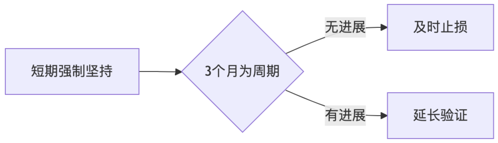

## 案例一 《当时间的赌徒》

观点：一个顶级的思维，恐怖执行力

观点特点：反差描述， 一个几乎偏执的 但是。。。。

做世界赌徒：名称解释-定义解释： 短时间-下重注-不顾一切做

与作者连接：当前还剩1一个新的一年，如果你今年的一些情况，不想让自己荒废；就花点一个月的时间花重注做；

正面观点： 不需要其他方法，不要管理，就是最好的管理，时间上压倒性的投入才能换来要倒性的收获； 

反面观点：太多目标，太多。。。只会损耗， 在补充实时，有很多目标几乎不可能完成全部目标

正面观点： 两种专注，长时间，短时间

观点： 结果和 付出是有延迟；

举例： 死磕到底，

那条路： 一条很难+10年还能有用+还能养活自己的路；


2025.02.19

在深圳，在java技术这条路上，在这条技术职业上走得辛苦。无法掌控八股文。

找不到属于自己的路。


2025.02.20

1. 先尝试做一件事
2. 是否获得正反馈
3. 正反馈导致是否喜欢做这件事情
4. 不断循环和加强
5. 量变到值变-复利产生-更强的正向反馈-长久的反馈
6. 成功


```she

flowchart TD
A[尝试做一件事] --> B{是否获得正反馈?}
B -->|是| C{是否喜欢做这件事?}
C -->|是| D[不断循环和加强]
D --> D
D --> E[量变到质变]
E --> F[复利产生]
F --> G[更强的正向反馈]
G --> H[长久的反馈]
H --> I[成功]
B -->|否| J[结束]
C -->|否| J

```


流程说明：

1. **核心分支逻辑**：

   - 正反馈路径（成功循环）：
     - 正反馈 → 产生兴趣 → 持续投入 → 复利效应 → 成功
   - 无正反馈路径（失败循环）：
     - 无/负反馈 → 被迫坚持 → 情绪积累 → 长期煎熬 → 失败

2. **新增关键机制**：

   - 被动坚持陷阱

     ：无正反馈但受外力（如生存压力/他人期望）驱动时，产生双重负面效应：

     - 行为层面：机械重复难有突破
     - 心理层面：抵触情绪持续叠加

3. **决策关键点**：

   - 获得正反馈后需验证是否发自内心的喜欢（防虚假兴趣）
   - 无正反馈时需要判断是否值得强制坚持（防沉没成本陷阱）

4. **动态平衡建议**：

   

   建议设置明确观察期，避免陷入长期被动坚持状态


```

    A[1. 尝试做一件事] --> B{2. 是否获得正反馈?}
    
    %% 正向路径
    B -->|是| C{3. 是否因此喜欢做这件事?}
    C -->|是| D[4. 持续投入]
    D --> E[5. 量变到质变]
    E --> F[复利效应产生]
    F --> G[更强的正向反馈]
    G --> H[长期持续反馈]
    H --> I[6. 成功]
    
    %% 负向路径
    B -->|否| J{是否不得不做?}
    J -->|是| K[被迫坚持]
    K --> L[负面情绪积累]
    L --> M[长期抵触煎熬]
    M --> N[7. 放弃/失败]
    
    J -->|否| O[直接放弃]
    O --> N
    
    C -->|否| P[失去动力]
    P --> N
```


1. 完整呈现两种结局路径：
   - 绿色路径：正反馈 → 兴趣 → 复利 → 成功
   - 红色路径：负反馈 → 抵触 → 煎熬 → 失败
2. 保留核心决策点：
   - 是否获得正反馈（关键分水岭）
   - 是否真心喜欢（防虚假坚持）
   - 是否被迫继续（防沉没成本）


### 技术

1. 流量+ 技术
2. 流量+ 服务
3. 流量+ 产品


